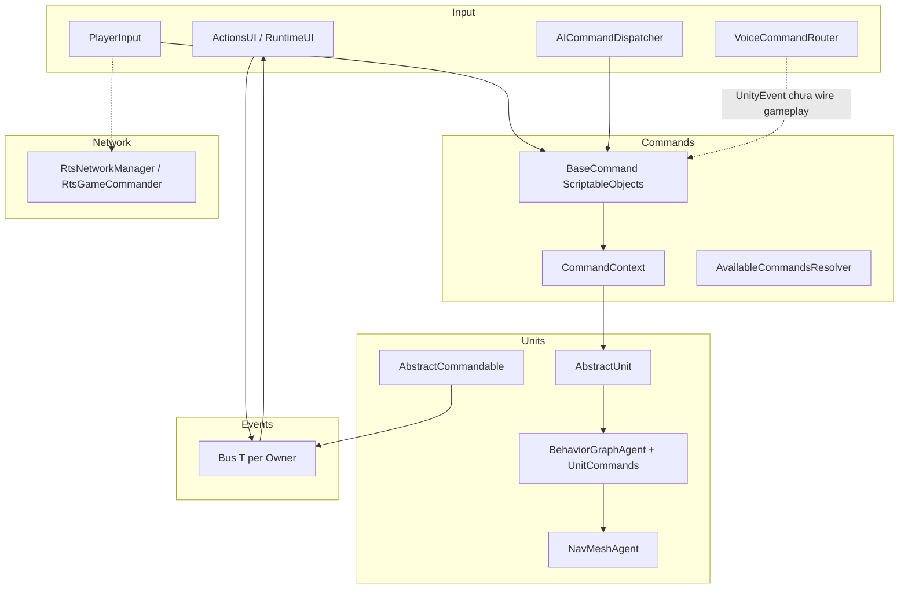
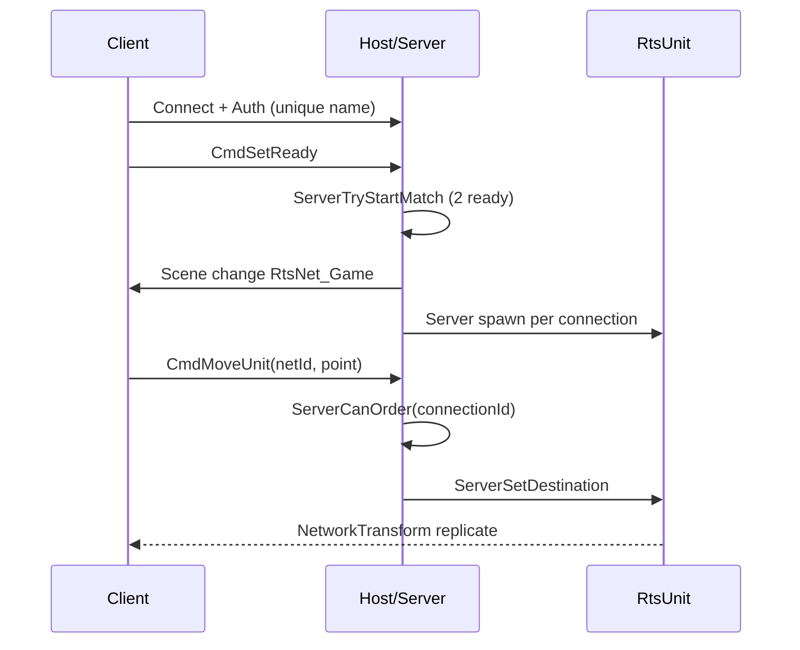
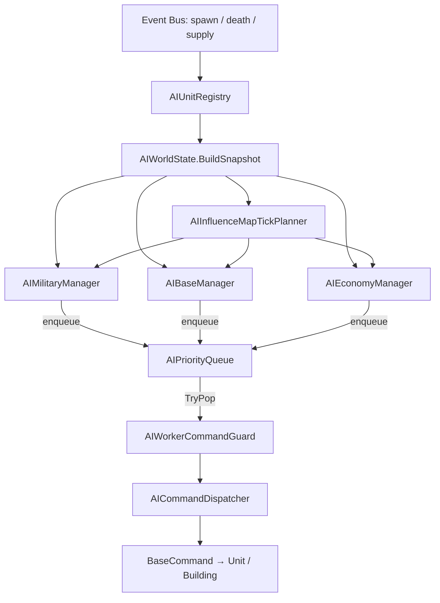
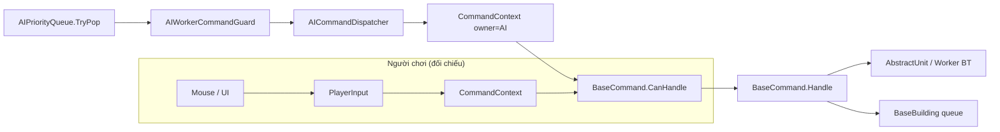

# BÁO CÁO ĐỒ ÁN TỐT NGHIỆP

**Trường:** Đại học Giao thông Vận tải — Khoa Công nghệ Thông tin  
**Đề tài:** Phát triển trò chơi chiến thuật thời gian thực tích hợp điều khiển bằng giọng nói  
**Sinh viên:** Nguyễn Danh Trường — MSSV: 211200969 — Lớp KSCNTT2 — Khóa 62  
**Giảng viên hướng dẫn:** Hoàng Văn Thông  

**Phạm vi tài liệu:** Chương 4 (Cài đặt hệ thống), Chương 5 (Thử nghiệm và đánh giá), Kết luận, Tài liệu tham khảo, Phụ lục.  
**Mã nguồn tham chiếu:** `D:/Unity_3D/UTS`  
**Ngày cập nhật:** 24/05/2026  

---

## Mục lục

- [Chương 4. Cài đặt hệ thống](#chương-4-cài-đặt-hệ-thống)
  - [4.1. Cài đặt cơ chế RTS cốt lõi](#41-cài-đặt-cơ-chế-rts-cốt-lõi)
  - [4.2. Cài đặt hệ thống giọng nói](#42-cài-đặt-hệ-thống-giọng-nói)
  - [4.3. Cài đặt AI Bot (FSM)](#43-cài-đặt-ai-bot-fsm)
  - [4.4. Cài đặt UI (Menu, Lobby, HUD, Voice feedback)](#44-cài-đặt-ui-menu-lobby-hud-voice-feedback)
  - [Kết luận chương 4](#kết-luận-chương-4)
- [Chương 5. Thử nghiệm và đánh giá](#chương-5-thử-nghiệm-và-đánh-giá)
- [Kết luận và hướng phát triển](#kết-luận-và-hướng-phát-triển)
- [Tài liệu tham khảo](#tài-liệu-tham-khảo)
- [Phụ lục](#phụ-lục)
  - [Phụ lục C: Minh họa code tiêu biểu](#phụ-lục-c-minh-họa-code-tiêu-biểu)

---

# CHƯƠNG 4. CÀI ĐẶT HỆ THỐNG

Chương 4 trình bày quá trình hiện thực hóa các thiết kế ở Chương 2 và Chương 3 thành mã nguồn C# chạy trên Unity Engine. Hệ thống được tổ chức theo kiến trúc mô-đun, tách biệt trách nhiệm theo nguyên lý SOLID:

| Phân hệ | Thư mục chính | Vai trò |
|---------|---------------|---------|
| RTS Core | `Assets/Scripts/` | Gameplay: unit, building, command, combat, fog |
| Giọng nói | `Assets/Scripts/SpeechRecognition/` | STT Vosk, fuzzy mapping, router |
| AI Bot | `Assets/Scripts/AI/` | Planner tick, economy/base/military |
| UI | `Assets/Scripts/UI/` | HUD, action panel, event log |
| Mạng LAN MVP | `Assets/3rdParty/RTS_Multiplayer/` | Mirror 2 người, lobby, move sync |
| Cầu nối MP | `Assets/Scripts/Netplay/` | Map team → Owner, local human owner |

Các thành phần giao tiếp qua **Command Pattern** (ScriptableObject), **Event Bus** theo phe (`Bus<T>`) và **Interface** (DIP), tránh phụ thuộc cứng giữa input, logic và hiển thị.

## Kiến trúc tổng quan đã cài đặt



---

## 4.1. Cài đặt cơ chế RTS cốt lõi

### 4.1.1. Chọn đơn vị, lệnh di chuyển / tấn công

#### Mục tiêu cài đặt

Cho phép người chơi chọn một hoặc nhiều đơn vị, phát lệnh di chuyển, tấn công, dừng qua chuột hoặc nút HUD; đồng thời dùng chung pipeline lệnh với AI Bot và (sau khi wire) hệ thống giọng nói.

#### Luồng xử lý chính

**Bước 1 — Chọn đơn vị**

Lớp `PlayerInput` (`Assets/Scripts/Player/PlayerInput.cs`) xử lý toàn bộ input chiến thuật:

- **Click trái:** Raycast ưu tiên `AbstractUnit` gần nhất trên layer `selectableUnitsLayers`.
- **Kéo khung (drag box):** Quy đổi vị trí thế giới sang không gian màn hình, kiểm tra nằm trong `selectionBox` (UI RectTransform).
- **Shift + click:** Chọn bổ sung; thả chuột không giữ Shift → bỏ chọn toàn bộ.
- **Lọc phe:** Chỉ chọn đơn vị thuộc phe người chơi (`Owner`; SP hiện hardcode `Owner.Player1`, MP dùng `LocalHumanOwnerService`).

Khi chọn/bỏ chọn, `AbstractCommandable.Select()` / `Deselect()` phát `UnitSelectedEvent` / `UnitDeselectedEvent` qua Event Bus.

**Bước  - Phát lệnh từ UI**

- `ActionsUI` render nút từ `AvailableCommandsResolver` (override commands + default commands).
- Click nút → `CommandSelectedEvent` → `PlayerInput` kích hoạt ghost (nếu lệnh cần click map) hoặc gọi `ActivateAction`.

**Bước 3 — Click phải (context command)**

`HandleRightClick()` tạo `CommandContext` gồm:

- `AbstractCommandable` đích
- `RaycastHit` (collider, point)
- `UnitIndex` (formation)
- `MouseButton`, `Owner`

Vòng lặp trên `selectedUnits`: `CanHandle` → `Handle` cho từng lệnh khả dụng.

**Bước 4 — Thực thi hành vi cấp thấp**

`AbstractUnit` (`Assets/Scripts/Units/AbstractUnit.cs`) ghi blackboard Unity Behavior Graph:

| Biến blackboard | Ý nghĩa |
|-----------------|---------|
| `Command` | Enum `UnitCommands`: Stop, Move, Attack, Gather, BuildBuilding… |
| `TargetLocation` | Vector3 đích |
| `TargetGameObject` | Mục tiêu động (unit, building, supply) |

Các node C# trong `Assets/Scripts/Behavior/` thực thi NavMesh, gather, build, attack.

#### Các lớp và file quan trọng

| Thành phần | File | Vai trò |
|------------|------|---------|
| Input người chơi | `Player/PlayerInput.cs` | Selection, camera Cinemachine, ghost placement, dispatch |
| Hover cursor | `Player/UnitSelectionHoverCursor.cs` | Phản hồi khi hover unit |
| Hợp đồng chọn | `Units/ISelectable.cs` | Select/Deselect contract |
| Base commandable | `Units/AbstractCommandable.cs` | HP, owner, fog, available commands |
| Lệnh trừu tượng | `Commands/BaseCommand.cs` | SO: CanHandle, Handle, slot, ghost |
| Context | `Commands/CommandContext.cs` | Unit + raycast + index + owner |
| Resolver | `Commands/AvailableCommandsResolver.cs` | Gộp override + default commands |
| Di chuyển | `Commands/MoveCommand.cs` | Điểm / theo unit visible; formation spacing |
| Tấn công | `Commands/AttackCommand.cs` | IDamageable hoặc ground attack |
| Dừng | `Commands/StopCommand.cs` | Hủy hành vi hiện tại |
| Rally | `Commands/RallyAreaCommand.cs` | Điểm tập kết quân |
| HUD hub | `UI/RuntimeUI.cs` | Subscribe Bus, bật/tắt panel |
| Action panel | `UI/Containers/ActionsUI.cs` | Nút lệnh theo slot |

#### Ví dụ mã: MoveCommand

```csharp
// Assets/Scripts/Commands/MoveCommand.cs
public override void Handle(CommandContext context)
{
    AbstractUnit unit = (AbstractUnit)context.Commandable;
    if (context.Hit.collider != null
        && context.Hit.collider.TryGetComponent(out AbstractCommandable commandable)
        && commandable.IsVisible)
    {
        unit.MoveTo(commandable.transform);
        return;
    }
    unit.MoveTo(context.Hit.point);
}
```

#### Di chuyển theo đội hình

Khi chọn nhiều unit, `GroupFormationMoveUtility` và `UnitSquareFormationPlanner` (`Assets/Scripts/Units/Formation/`) phân bổ điểm đích theo lưới vuông:

- Hàng sau (archer) lùi, hàng trước (frontline) tiến.
- Mỗi slot được snap lên NavMesh qua `NavMesh.SamplePosition`.
- Giảm chồng chéo khi di chuyển tập thể.

#### Luồng dữ liệu: lệnh di chuyển chuột

```
Mouse right-click
  → PlayerInput.HandleRightClick()
  → TryDispatchCommandsToUnits() [formation nếu multi-select]
  → MoveCommand.Handle()
  → AbstractUnit.MoveTo(point)
  → BehaviorGraphAgent: Command=Move, TargetLocation=point
  → MoveToTargetLocationAction → NavMeshAgent.SetDestination()
  → Pathfinding + Local Avoidance
  → Arrival → Success → có thể về Stop
```

#### Giải thích SOLID

- **SRP:** `PlayerInput` chỉ thu input và dispatch; logic nghiệp vụ nằm trong `BaseCommand` và `AbstractUnit`.
- **OCP:** Thêm lệnh mới = tạo SO kế thừa `BaseCommand`, không sửa `PlayerInput`.
- **LSP:** Mọi unit kế thừa `AbstractUnit` dùng chung API MoveTo/Attack/Stop.
- **ISP:** Interface nhỏ: `ISelectable`, `IDamageable`, `IAttacker`, `IGatherable`.
- **DIP:** AI dùng chung pipeline qua `AICommandDispatcher`, không phụ thuộc UI.

---

### 4.1.2. Khai thác tài nguyên, xây dựng

#### Mô hình kinh tế

- **Ba loại tài nguyên:** Đá (Stone), Gỗ (Wood), Lương thực (Food).
- **Dân số:** Giới hạn population theo `Owner`.
- **Quản lý:** `Supplies.cs` — dictionary static theo `Owner`; subscribe `SupplyEvent`.
- **Kiểm tra chi phí:** `SupplyAffordability`, `CommandSupplyCostUtility`.
- **HUD:** TextMeshPro cập nhật khi `SupplyEvent` fire.

#### Pipeline thu thập tài nguyên

| Bước | Thành phần | Mô tả |
|------|------------|-------|
| 1 | `GatherableSupply` | Node trên map: `SupplySO` + `Amount`; `IGatherable`, `IHideable` |
| 2 | `GatherCommand` | Click node → gather; click kho khi mang hàng → return |
| 3 | `Worker.Gather()` | Set blackboard + `WorkerGatherAssignmentLock` |
| 4 | `MoveToGatherableSupplyAction` | NavMesh tới node |
| 5 | `GatherSuppliesAction` | Timer = `Supply.BaseGatherTime` × worker multiplier |
| 6 | `FindClosestCommandPostAction` | Tìm điểm nộp gần nhất |
| 7 | `SupplyEvent` | Cộng tài nguyên phe; `SupplyDepletedEvent` khi cạn |

#### Pipeline xây dựng

| Bước | Thành phần | Mô tả |
|------|------------|-------|
| 1 | `BuildBuildingCommand` | Validate cost, tech, `BuildingRestrictionSO` |
| 2 | Ghost preview | `PlayerInput`: material đỏ nếu invalid; probe NavMeshObstacle |
| 3 | `Worker.Build()` | Trừ supplies, set blackboard BuildBuilding |
| 4 | `BuildBuildingAction` | Instantiate/resume site, `BaseBuilding.StartBuilding()` |
| 5 | Hoàn thành | `NavMeshObstacle` bật, mở production/research commands |
| 6 | Pause/Resume | Worker rời → pause; click lại → resume không trừ cost lần 2 |

#### File tham chiếu

| File | Vai trò |
|------|---------|
| `Player/Supplies.cs` | Model + HUD tài nguyên |
| `Environment/GatherableSupply.cs` | Node khai thác |
| `Commands/GatherCommand.cs` | Lệnh gather/return |
| `Commands/BuildBuildingCommand.cs` | Đặt nhà, resume |
| `Commands/BuildingRestrictionSO.cs` | Overlap + NavMesh 4 góc |
| `Units/Worker.cs` | IBuildingBuilder, gather/build state |
| `Units/BaseBuilding.cs` | Construction progress, queue |
| `Utilities/SupplyDepositLocator.cs` | Xác định building nộp hàng |

#### Quy tắc nghiệp vụ đã hiện thực

- Tài nguyên không âm: kiểm tra trước mọi lệnh tiêu hao.
- Mỏ cạn → `SupplyDepletedEvent`, worker idle.
- Xây dừng giữa chừng → progress lưu, có thể resume.
- Hủy xây → `CancelBuildingCommand` hoàn trả theo logic Worker.

---

### 4.1.3. Sản xuất quân, chiến đấu

#### Sản xuất và nghiên cứu

- `BaseBuilding.BuildUnlockable()` — trừ tài nguyên, enqueue tối đa **5** mục (`MAX_QUEUE_SIZE`).
- Coroutine `DoBuildUnits()`: chờ `BuildTime` → spawn `UnitSO.Prefab`, gán `Owner`, `NotifySpawned()`.
- Upgrade: `UpgradeResearchedEvent` → `TechTreeSO` mở khóa dependency → apply lên unit/building sở hữu.
- UI: `UIBuildQueueButton`, `BuildingSelectedUI`, `BuildingBuildingUI`.

#### Tech tree

- `TechTreeSO`: graph phụ thuộc per-`Owner`.
- Unlock: `BuildingSpawnEvent`, `UpgradeResearchedEvent`.
- Lock: `BuildingDeathEvent`, `IsLocked()`, `GetUnmetDependencies()` cho UI gray-out.

#### Pipeline chiến đấu

| Bước | Thành phần | Mô tả |
|------|------------|-------|
| 1 | `AttackCommand` / AI | `IAttacker.Attack()` → Command=Attack |
| 2 | `AttackTargetAction` | Approach qua `CombatTargetGeometryUtility` |
| 3 | Trong tầm | Gây damage theo `AttackConfigSO` cooldown |
| 4 | Ranged | `HomingArrowFlight`, projectile |
| 5 | AoE | `OverlapSphereNonAlloc` |
| 6 | Auto-acquire | `DamageableSensor` → `NearbyEnemies` blackboard |
| 7 | Military AI | `CombatTargetPriorityUtility`, counter-attack |
| 8 | Tower | `BuildingAutoAttack` passive |
| 9 | Death | `UnitDeathController`: disable agent, anim, sink, destroy |

#### File tham chiếu combat

| File | Vai trò |
|------|---------|
| `Units/IAttacker.cs`, `IDamageable.cs` | Combat contracts |
| `Units/AttackConfigSO.cs` | Range, damage, delay, AoE |
| `Behavior/AttackTargetAction.cs` | BT combat loop |
| `Units/BaseMilitaryUnit.cs` | Military specialization |
| `Units/Combat/CombatTargetPriorityUtility.cs` | Sort targets |
| `Units/UnitDeathController.cs` | Death sequence |

---

### 4.1.4. Đồng bộ hành động qua LAN

#### Hiện trạng triển khai

Simulation RTS đầy đủ (`AbstractUnit`, `BaseBuilding`, kinh tế…) **chưa** chuyển sang `NetworkBehaviour`. Lớp Mirror trong `Assets/3rdParty/RTS_Multiplayer` là **MVP hai người chơi**, làm nền tích hợp với game chính qua `OwnerTeamMapping` và `LocalHumanOwnerMirrorBridge`.

#### Luồng phiên chơi mạng



| Bước | Thành phần | Mô tả |
|------|------------|-------|
| 1 | `RtsNetworkManager` | maxConnections=2; lobby→game scene |
| 2 | `RtsUniqueNameAuthenticator` | Tên duy nhất |
| 3 | `RtsLobbyPlayer` | SyncVar: name, team 0/1, ready |
| 4 | `RtsLobbyUI` | Login, host/client, IP, ready, start |
| 5 | `RtsGameSceneSetup` | Team spawn points |
| 6 | `RtsGameInput` | Local raycast → move request |
| 7 | `RtsGameCommander` | `[Command] CmdMoveUnit` |
| 8 | `RtsUnit` | Server authoritative move |
| 9 | `RtsPlayerEconomy` | SyncVar gold stub |

#### Ví dụ mã: Server Command

```csharp
// Assets/3rdParty/RTS_Multiplayer/Scripts/RtsGameCommander.cs
[Command]
public void CmdMoveUnit(uint netId, Vector3 destination)
{
    if (!NetworkServer.spawned.TryGetValue(netId, out NetworkIdentity ni))
        return;
    var unit = ni.GetComponent<RtsUnit>();
    if (unit == null || !unit.ServerCanOrder(connectionToClient.connectionId))
        return;
    unit.ServerSetDestination(destination);
}
```

#### Cầu nối với game chính

| File | Chức năng |
|------|-----------|
| `Netplay/OwnerTeamMapping.cs` | team 0/1 → Owner.Player1/Player2 |
| `Player/LocalHumanOwnerService.cs` | Phe local cho input/fog |
| `Player/LocalHumanOwnerMirrorBridge.cs` | Callback Mirror at load |
| `RtsLocalHumanOwnerNotifier.cs` | DIP hook (no Assembly-CSharp dep) |

#### Mô hình đồng bộ

| Khía cạnh | Cách làm (hiện tại) |
|-----------|---------------------|
| Thẩm quyền | Server authoritative (vị trí unit MVP) |
| Ownership | SyncVar connectionId + player netId |
| RPC | Mirror `[Command]` (move) |
| Replication | SyncVar, NetworkTransformUnreliable |
| RTS đầy đủ | Chưa network — local sim + owner mapping prep |

#### Hướng tích hợp tiếp theo

Theo `docs/plan/PLAN_FOG_MP_LOCAL_VIEW_CACH2.md`:

- Fog per-client theo phe local human owner.
- Đồng bộ selection/command đầy đủ.
- Tắt `AIController` ở phase MP đầu.

---

### 4.1.5. Tìm đường, né va chạm

#### Pathfinding (NavMesh)

- Mọi unit di động: `NavMeshAgent` + `BehaviorGraphAgent` bắt buộc trên `AbstractUnit`.
- BT actions gọi `agent.SetDestination()`:
  - `MoveToTargetLocationAction` — điểm cố định + arrival slack
  - `MoveToTargetGameObjectAction` — follow dynamic target
  - `MoveToGatherableSupplyAction`, `AttackTargetAction`
- `NavMesh.SamplePosition` trong formation planner và building footprint.
- Công trình hoàn thành: `NavMeshObstacle`; đặt móng validate 4 góc walkable (`BuildingRestrictionSO.MustBeFullyOnNavmesh`).

#### Collision Avoidance

| Cơ chế | File / mô tả |
|--------|--------------|
| Obstacle avoidance type | `SetAgentAvoidanceAction` → ObstacleAvoidanceType 0–4 |
| Formation spacing | `UnitSquareFormationPlanner`, `GroupFormationMoveUtility` |
| Approach geometry | `CombatTargetGeometryUtility`, `SupplyDepositApproachUtility` |
| Agent control | `StopAgentAction`, `SetNavMeshAgentEnabledAction` |

#### Luồng pathfinding

```
MoveCommand.Handle()
  → AbstractUnit.MoveTo(destination)
  → BT: MoveToTargetLocationAction
  → ResolveDestinationWorld (NavMesh sample)
  → NavMeshAgent.SetDestination()
  → Unity NavMesh path + local avoidance
  → On arrival: Success
```

---

## 4.2. Cài đặt hệ thống giọng nói

Namespace: `ProjectRTS.SpeechRecognition.Core`, `ProjectRTS.SpeechRecognition.Vosk`.

### 4.2.1. Tích hợp Vosk và thu âm

#### Pipeline tổng quát

```
Microphone
  → UnityMicrophoneSpeechDriver
  → LinearMonoResampler (device rate → 16 kHz PCM16 mono)
  → VoskSpeechRecognitionBackend
  → VoskJsonTextExtractor (partial / final text)
  → VoiceCommandRouter
  → FuzzyVoiceCommandResolver
  → UnityEvent (commandId)
```

#### VoskSpeechRecognitionBackend

**File:** `Assets/Scripts/SpeechRecognition/Vosk/VoskSpeechRecognitionBackend.cs`

| Tính năng | Mô tả |
|-----------|-------|
| Model path | `StreamingAssets/VoskModels/vosk-model-vn-0.4` (default) |
| Sample rate | 16 kHz PCM16 |
| Grammar mode | `VoiceCommandProfile.BuildVoskGrammarJson()` — giới hạn từ vựng |
| Fallback | Grammar fail → free-form recognizer + LogWarning |
| Init errors | LogError thiếu model; LogException on failure |
| Streaming | `AppendPcm16`, `Flush`; events partial/final |

**Plugin native:** `Assets/3rdParty/Plugins/Vosk.dll`, `Windows/x86_64/libvosk.dll`.

**Lưu ý triển khai:** Model Vosk **không** có trong repo Git; phải tải và giải nén vào `StreamingAssets` khi build.

#### UnityMicrophoneSpeechDriver

**File:** `Assets/Scripts/SpeechRecognition/Core/UnityMicrophoneSpeechDriver.cs`

- `Microphone.Start`, đọc ring buffer trong `Update`.
- Downmix stereo → mono (average channels).
- Resample → 16 kHz qua `LinearMonoResampler` / `StreamingLinearResampler`.
- Lỗi: không device → Warning + disable; Start null → Error + disable.
- `OnDisable`: `Microphone.End`, `backend.Flush()`.

#### Abstraction (DIP)

| Interface / base | Vai trò |
|------------------|---------|
| `ISpeechRecognitionBackend` | Contract STT |
| `SpeechRecognitionBackendBehaviour` | MonoBehaviour base + events |
| `VietnameseSpeechDefaults` | Default model path VN |

Gameplay **không** import trực tiếp namespace `Vosk` ngoài backend class.

---

### 4.2.2. Parser tiếng Việt

#### Thiết kế vs hiện thực

| Khía cạnh | Thiết kế (Ch.2) | Hiện thực (code) |
|-----------|-----------------|------------------|
| Dataset | 35 intent + slot (`unit_type`, `location`…) | `docs/voice-command-dataset.vi.json` |
| Parser runtime | Slot/intent NLU | **Fuzzy match** primary + aliases |
| Normalization | Synonym, number words | `VoiceCommandProfile.NormalizeForMatch` |
| Threshold | Grammar + parser | `MinSimilarity` default **0.72** |

#### Các bước xử lý văn bản

1. **STT** — Vosk trả JSON `{ "partial": "..." }` hoặc `{ "text": "..." }`.
2. **Trích xuất** — `VoskJsonTextExtractor` (regex, không Json.NET).
3. **Chuẩn hóa** — trim, lowercase, collapse whitespace.
4. **Fuzzy match** — `FuzzyVoiceCommandResolver.TryResolve()`:
   - Duyệt mọi `(CommandId, Phrase)` từ primary + aliases.
   - Tính `StringSimilarity.NormalizedSimilarity` (Levenshtein).
   - Lấy max nếu ≥ `MinSimilarity`.
5. **Kết quả** — `commandId` + `similarity01` hoặc fail.

#### Ví dụ mã: Fuzzy resolve

```csharp
// FuzzyVoiceCommandResolver.TryResolve — tóm tắt logic
public bool TryResolve(string recognizedText, out string commandId, out float similarity01)
{
  // Normalize recognizedText
  // foreach candidate: similarity = NormalizedSimilarity(text, phrase)
  // if max >= profile.MinSimilarity → commandId = best id
}
```

#### Nạp dữ liệu lệnh

- Runtime: `VoiceCommandDatasetFile.LoadFromResources("VoiceCommands/rts_voice_commands_standard_vi")`.
- Schema runtime: `{ schemaVersion, minSimilarity, commands[] }` với `CommandId`, `PrimaryPhrase`, `Aliases[]`.
- `VoiceCommandRouter._loadDatasetFromResourcesOnAwake` import vào Profile trước khi build fuzzy list và grammar Vosk.

**Gap:** `Assets/Resources/` có thể trống — cần export JSON từ dataset thiết kế sang Resources trước khi chạy in-game.

#### Hướng mở rộng parser

- Module slot extraction từ `normalization.synonyms`, `number_words` trong JSON.
- Map intent → `BaseCommand` + tham số (raycast, unit filter).
- Hybrid: grammar Vosk cho keyword + fuzzy cho alias.

---

### 4.2.3. Command mapping

#### VoiceCommandRouter

**File:** `Assets/Scripts/SpeechRecognition/Core/VoiceCommandRouter.cs`

| UnityEvent | Khi nào fire |
|------------|--------------|
| `_onCommandMatched(string commandId)` | Final text khớp |
| `_onCommandMatchedWithScore(string, float)` | Final + similarity |
| `_onNoCommandMatch(string text)` | Final không khớp |
| Partial (optional) | `_resolvePartialsForPreview` — preview UI only |

#### Grammar Vosk

`VoiceCommandProfile.BuildVoskGrammarJson()` — sorted unique phrases → JSON array cho `VoskRecognizer(model, 16000f, grammarJson)`.

#### Mapping sang gameplay (trạng thái)

| Lớp | Trạng thái |
|-----|------------|
| Data + STT + fuzzy | **Đã cài** |
| UnityEvent hooks | **Đã cài** |
| Adapter → PlayerInput / Bus | **Chưa có C#** — wire Inspector hoặc `VoiceToGameplayAdapter` |

#### Bảng mapping tiêu biểu (canonical_command → gameplay)

| canonical_command | Hành vi gameplay dự kiến |
|-------------------|--------------------------|
| `chon_toan_bo_quan` | Select all military |
| `chon_dan_ranh` | Select idle workers |
| `chon_theo_loai_don_vi` | Filter by unit type (slot) |
| `di_chuyen_toi` | MoveCommand + location slot |
| `tan_cong_muc_tieu` | AttackCommand |
| `dung_lai` | StopCommand |
| `thu_thap_tai_nguyen` | GatherCommand |
| `xay_cong_trinh` | BuildBuildingCommand |
| `huan_luyen_don_vi` | BuildUnitCommand |
| `nghien_cuu_cong_nghe` | ResearchUpgradeCommand |

---

### 4.2.4. Xử lý lỗi và phản hồi UI

| Cơ chế | File | Hành vi |
|--------|------|---------|
| Không khớp lệnh | `VoiceCommandRouter._onNoCommandMatch` | UnityEvent |
| Khớp lệnh | `_onCommandMatched*` | UnityEvent + score |
| Debug STT | `SpeechRecognitionDebugLogger` | Console `[Speech partial/final]` |
| Vosk partial log | `_logPartialToConsole` | Optional `[Vosk partial]` |
| Lỗi model | `VoskSpeechRecognitionBackend` | LogError + không init |
| Lỗi micro | `UnityMicrophoneSpeechDriver` | Warning/Error, disable component |
| UI in-game | Chưa script riêng | Wire → TMP / `GameEventLogUI` (Ch.3) |

#### Partial preview

`_resolvePartialsForPreview = true` chỉ nên dùng để hiển thị text đang nhận diện trên HUD; mặc định **không** dispatch lệnh từ partial (tránh double-fire).

#### Thiết kế phản hồi UI (theo Ch.3)

- **Success:** text xanh + commandId.
- **No match:** text đỏ + gợi ý thử lại.
- **Low confidence:** vàng nếu score gần ngưỡng.
- Tích hợp `GameEventLog.Post` cho lịch sử lệnh voice.

---

## 4.3. Cài đặt AI Bot (FSM)

### Lưu ý kiến trúc

Thiết kế Chương 2 mô tả **FSM** (Idle, Gather, Build, Train, Attack, Defend). Mã nguồn triển khai:

| Tầng | Cơ chế | Vị trí |
|------|--------|--------|
| Chiến lược (macro) | Tick planner + priority queue + domain managers | `Assets/Scripts/AI/` |
| Vi mô (micro) | Unity Behavior Graph + `UnitCommands` | Prefab + `Assets/Scripts/Behavior/` |

Không có class `IState` / `StateMachine` riêng; các **phase chiến lược** (economy → base → military) emerge từ planner + config, tương đương FSM ở mức trừu tượng.

### 4.3.1. AIController — điều phối tick

Thiết kế mô hình máy trạng thái hữu hạn **không** sử dụng lớp `StateMachine` riêng biệt; thay vào đó các giai đoạn chiến lược (kinh tế, căn cứ, quân sự) được hình thành từ bộ lập kế hoạch và các cấu hình tương ứng (`AIEconomySettings`, `AIBaseSettings`, `AIMilitarySettings`).

**File:** `Assets/Scripts/AI/Core/AIController.cs`

#### [Vị trí chèn minh họa — Hình 4.7] Sơ đồ luồng dữ liệu AIController



**Caption (Word):** *Hình 4.7 — Sơ đồ luồng hoạt động của trình điều khiển AI: từ Event Bus cập nhật registry, trích xuất snapshot thế giới, qua các bộ quản lý chuyên biệt và hàng đợi ưu tiên, kết thúc tại bộ điều phối lệnh.*

**Mô tả hình:** Sơ đồ thể hiện kiến trúc **macro** của Bot: `AIUnitRegistry` lắng nghe sự kiện spawn/death trên Event Bus để duy trì bộ nhớ đệm unit, building và node tài nguyên theo phe, tránh quét toàn bộ scene mỗi nhịp. Tại mỗi tick, `AIWorldState` dựng `AIWorldStateSnapshot` — bản ghi trạng thái tức thời (tài nguyên, dân số, danh sách thực thể). Snapshot được đưa vào `AIInfluenceMapTickPlanner` để tính vector mối đe dọa và tiềm năng kinh tế trên bản đồ ảnh hưởng. Ba domain manager (`AIMilitaryManager`, `AIBaseManager`, `AIEconomyManager`) sinh các **intent** (ý định lệnh) và đẩy vào `AIPriorityQueue`. Hàng đợi trích xuất intent theo **priority band** (Critical → Background); mỗi intent được `AIWorkerCommandGuard` kiểm tra (ví dụ bỏ qua lệnh gather lỗi thời) trước khi `AICommandDispatcher` gọi cùng pipeline `BaseCommand` như người chơi.

---

#### [Vị trí chèn minh họa — Hình 4.7a] Nhịp tick và snapshot thế giới

**File:** `Assets/Scripts/AI/Core/AIController.cs` (dòng 18–20, 84–111)  
**Đoạn mã:** Phụ lục C.7 — phần 1 (xem bên dưới).

**Caption (Word):** *Hình 4.7a — Vòng lặp nhịp cập nhật AI: chu kỳ mặc định 0,65 giây, phe `Owner.AI2`, và hàm `Tick()` trích xuất snapshot từ registry (`Assets/Scripts/AI/Core/AIController.cs`, dòng 84–111).*

**Mô tả hình:** Đoạn mã minh họa **điều phối thời gian** của Bot. Trường `tickInterval` (mặc định 0,65 s) hoặc giá trị từ `AIDifficultySO` quyết định tần suất ra quyết định — tránh tốn CPU so với `Update()` từng frame. Trong `Update()`, khi `Time.time` vượt ngưỡng `nextTickTime`, controller gọi `Tick()`. Hàm `Tick()` là điểm vào duy nhất của một nhịp chiến lược: (1) `worldState.BuildSnapshot(registry, aiOwner)` gom dữ liệu phe AI từ cache registry; (2) `RunPlannerDispatch(snapshot)` chạy planner và dispatch lệnh; (3) tùy chọn `PostAiStatusToGameEventIfNeeded` đăng một dòng trạng thái lên khung sự kiện game (`GameEventLog`, category AI) thay vì spam log gather. Thiết kế này tách **nhịp quyết định** (macro) khỏi **hành vi unit** (micro, Behavior Graph).

---

#### [Vị trí chèn minh họa — Hình 4.7b] Bản đồ ảnh hưởng và enqueue intent

**File:** `Assets/Scripts/AI/Core/AIController.cs` (dòng 159–190)  
**Đoạn mã:** Phụ lục C.7 — phần 2.

**Caption (Word):** *Hình 4.7b — `RunPlannerDispatch`: tính bản đồ ảnh hưởng và đẩy intent theo thứ tự Quân sự → Căn cứ → Kinh tế vào hàng đợi ưu tiên (`AIController.cs`, dòng 159–190).*

**Mô tả hình:** Khối mã `RunPlannerDispatch` mô tả **giai đoạn lập kế hoạch** trong một tick. Đầu tiên hàng đợi được `Clear()` và index planner tăng; `RecoverWorkersFromStaleGather` giải phóng worker kẹt lệnh gather tại node đã cạn. Resolver cấu hình runtime (`AIBaseRuntimeConfig`, `AIEconomyRuntimeConfig`) và `AIInfluenceMapTickPlanner.Build(...)` cung cấp ngữ cảnh không gian — danh sách véc-tơ đe dọa (`influenceThreatScratch`) và kinh tế (`influenceEconomicScratch`) phục vụ quyết định scout, tấn công hay mở rộng căn cứ. Ba manager enqueue **theo thứ tự cố định**: `militaryManager` (quân sự) trước, `baseManager` (căn cứ — train worker, xây dựng, nghiên cứu) tiếp theo, `economyManager` (kinh tế — gather, corral, thực phẩm hoang) cuối cùng. Thứ tự enqueue không thay thế **priority band** bên trong intent (ví dụ phòng thủ Critical 900 vẫn được pop trước scout Background 100 nhờ `AIPriorityQueue.TryPop` sort theo `AICommandIntent.Priority`).

**Bổ sung (registry / Event Bus):** `AIUnitRegistry` (`Assets/Scripts/AI/State/AIUnitRegistry.cs`, dòng 10–11, 68–76) subscribe `Bus<UnitSpawnEvent>`, `Bus<BuildingSpawnEvent>`, … để cập nhật cache — có thể chụp thêm làm Hình 4.7b-phụ nếu cần minh họa “trạm sự kiện”.

---

#### [Vị trí chèn minh họa — Hình 4.7c] Pop hàng đợi, guard và dispatcher

**File:** `Assets/Scripts/AI/Core/AIController.cs` (dòng 192–224)  
**Đoạn mã:** Phụ lục C.7 — phần 3.

**Caption (Word):** *Hình 4.7c — Vòng lặp pop intent: `AIWorkerCommandGuard` lọc lệnh không hợp lệ; `AICommandDispatcher` gửi `BaseCommand` tới unit hoặc building (`AIController.cs`, dòng 192–224).*

**Mô tả hình:** Vòng `while (priorityQueue.TryPop(...))` là **bước thực thi** sau lập kế hoạch. Mỗi intent pop ra trải qua `AIWorkerCommandGuard.ShouldEnqueue` — lớp bảo vệ tránh gán lệnh xây dựng/gather xung đột lên cùng worker (ví dụ worker đang mang hàng hoặc builder đã được reserve). Intent bị từ chối có thể kích hoạt dọn tracker (`AIInfraBuildOrderTracker`, `AIConstructionAssignment`). Intent hợp lệ được phân nhánh: entity là `AbstractUnit` → `TryDispatchSpecificCommand` (move, attack, gather, build…); entity là `BaseBuilding` → `DispatchBuildingCommand` (train unit, research). Dispatcher **không** đi qua `PlayerInput` hay UI — gọi trực tiếp `BaseCommand.Handle(CommandContext)`, đảm bảo Bot tuân cùng luật game với người chơi (LSP/DIP). Đây là điểm nối giữa tầng chiến lược (planner) và tầng vi mô (Behavior Graph trên prefab unit).

---

**Mỗi tick (`tickInterval`, default ~0.65s):**

1. `registry` — cache unit/building qua Event Bus.
2. `worldState.BuildSnapshot(registry, aiOwner)` — default `Owner.AI2`.
3. `AIInfluenceMapTickPlanner` — threat/economic vectors.
4. Enqueue intents: Military → Base → Economy (priority bands).
5. `AIPriorityQueue.TryPop` → `AICommandDispatcher` + `AIWorkerCommandGuard`.
6. Optional: `GameEventLog.Post` status line (`AIPlannerStatusFormatter`).

**Settings serialized:**

- `AIEconomySettings`, `AIBaseSettings`, `AIMilitarySettings`
- `AIDifficultySO` — tick interval, attack threshold, worker cap, fog fairness
- Flags: `dispatchEconomyIntents`, `dispatchBaseIntents`, `dispatchMilitaryIntents`

### 4.3.2. Các bộ quản lý chuyên biệt

Ba domain manager tách trách nhiệm theo **SRP**: mỗi manager chỉ sinh `AICommandIntent` cho lĩnh vực của mình rồi đẩy vào `AIPriorityQueue` chung. Priority cụ thể nằm trong `AIEconomyPriority`, `AIBasePriority`, `AIMilitaryPriority` (ánh xạ tới các dải `AIPriorityBands` trong báo cáo).

| Manager | Trách nhiệm | Phase tương đương FSM |
|---------|-------------|------------------------|
| `AIEconomyManager` | Tỷ lệ gather, corral, thức ăn hoang, kho xa | Gather / Economy |
| `AIBaseManager` | Train worker, chuỗi Store→Corral→Forge→Barrack→Tower, research | Build / Train |
| `AIMilitaryManager` | Vòng phòng thủ, rally, attack wave, scout, mở rộng | Attack / Defend / Patrol |

**Dải ưu tiên (tóm tắt):**

| Dải (báo cáo) | Điểm gốc | Ví dụ trong code |
|---------------|----------|------------------|
| Thiết yếu | 900 | `AIBasePriority.BuildStoreHouse` (900), `AIMilitaryPriority.AttackThreatNearCc` (955) |
| Cao | 700 | `AIBasePriority.TrainWorker` (710) |
| Bình thường | 500 | `AIEconomyPriority.ReturnSupplies` (550), `AIMilitaryPriority.TrainBarrack` (540) |
| Thấp | 300 | `AIMilitaryPriority.PatrolExpandMap` (250) |
| Nền | 100 | `AIEconomyPriority.GatherVisibleSupply` (400)* — gather dưới infra |

*\*Trong mã thực tế, gather (400) cao hơn số 100 của band “Nền” trong bảng trừu tượng Ch.3; các hằng domain cụ thể ưu tiên tương đối chính xác hơn so với một bảng 5 mức cố định.*

---

#### [Vị trí chèn minh họa — Hình 4.17] Bộ quản lý kinh tế — enqueue intent

**File:** `Assets/Scripts/AI/Managers/AIEconomyManager.cs` (dòng 34–83)  
**Đoạn mã:** Phụ lục C.9.1

**Caption (Word):** *Hình 4.17 — `AIEconomyManager.EnqueueIntents`: điều tiết gather worker, corral, kho xa và săn thú hoang (`AIEconomyManager.cs`, dòng 34–83).*

**Mô tả hình:** Đoạn mã minh họa **bộ quản lý kinh tế** — lớp chỉ lo pipeline thu thập và cân bằng tài nguyên. Đầu vào là `AIWorldStateSnapshot` (số worker, mỏ visible trong fog, supplies) và `AIInfluenceMapTickContext` (vị trí cụm kinh tế xa để quyết định Store). Luồng xử lý: (1) `AIEconomyConfigResolver` suy ra tỷ lệ đá/gỗ/lương thực theo map; (2) tùy chu kỳ refresh, `AIWorkerGatherRefreshPlanner` gán lại mỏ cho worker; (3) `EnqueueWorkerGatherAndReturn` phân slot gather theo planner (40/40/20 hoặc 70/30 khi hết mỏ food); (4) `AIEconomyCorralPlanner` thêm Corral khi thiếu food; (5) `EnqueueRemoteStoreBuildIfNeeded` xây kho xa CC khi influence map chỉ cụm tài nguyên ở xa; (6) `AIEconomyWildFoodPlanner.EnqueueHuntIntents` gửi worker săn `WildAnimal` với priority `HuntWildAnimalForFood` (410). Mỗi intent được `queue.Enqueue` — không dispatch trực tiếp, giữ **OCP** khi thêm planner kinh tế mới.

---

#### [Vị trí chèn minh họa — Hình 4.18] Bộ quản lý căn cứ — train, xây dựng, nghiên cứu

**File:** `Assets/Scripts/AI/Managers/AIBaseManager.cs` (dòng 32–48, 107–146)  
**Đoạn mã:** Phụ lục C.9.2

**Caption (Word):** *Hình 4.18 — `AIBaseManager`: huấn luyện công nhân tại Civil Central và xây chuỗi công trình cốt lõi (`AIBaseManager.cs`, dòng 32–48, 107–146).*

**Mô tả hình:** **Bộ quản lý căn cứ** điều phối mở rộng hạ tầng và dân số. Hàm `EnqueueIntents` gọi ba nhánh: `EnqueueTrainWorkerIfNeeded` (train worker tại CC khi chưa đủ `TargetWorkerCount` và còn reserve tài nguyên), `EnqueueNextScheduledBuildingIfNeeded` (một công trình mỗi tick theo build order Store → Corral → Forge → Barrack → Tower; có nhánh ưu tiên infra quân sự khi `AIMilitaryExpansionPlanner` yêu cầu), và `EnqueueForgeResearchIfNeeded` (vòng nghiên cứu Forge qua `AIForgeResearchTierPlanner`). Ví dụ train worker enqueue intent với `AIBasePriority.TrainWorker` (710 — dải **Cao**), entity là `CivilCentral`, command là `BuildUnitCommand` worker — cùng SO với người chơi. Placement xây dựng dùng `AIInfraBuildUtility` + influence map để chọn vị trí an toàn gần hoặc xa CC.

---

#### [Vị trí chèn minh họa — Hình 4.19] Bộ quản lý quân sự và hằng số priority

**File:** `Assets/Scripts/AI/Managers/AIMilitaryManager.cs` (dòng 48–76, 515–548);  
**File bổ sung:** `AIMilitaryPriority.cs`, `AIBasePriority.cs`, `AIEconomyPriority.cs`  
**Đoạn mã:** Phụ lục C.9.3

**Caption (Word):** *Hình 4.19 — `AIMilitaryManager`: quét mối đe dọa quanh nhà chính, phòng thủ và các dải priority quân sự (`AIMilitaryManager.cs`, dòng 48–76, 515–548).*

**Mô tả hình:** **Bộ quản lý quân sự** ưu tiên an toàn Civil Central trước tấn công macro. `EnqueueIntents` đồng bộ trí nhớ CC địch, thu quân (`CollectMilitaryUnits`), quét hostiles trong `DefenseRadius` (`AIMilitaryHostileScanner`), đồng thời lấy vector đe dọa từ influence map nếu có. Chế độ `defenseRingMode` kích hoạt vòng phòng thủ mở rộng: recovery kinh tế, counter-attack trong operational leash. Hàm `EnqueueDefenseIntents` gán `AttackCommand` cho unit gần mối đe dọa nhất với priority `AIMilitaryPriority.AttackThreatNearCc - assigned` (955 trở xuống — dải **Thiết yếu**). Có thể chụp thêm một panel **priority constants** (`AIMilitaryPriority`: Defend 960, Rally 395, Patrol 250) làm phần dưới cùng ảnh để minh họa bảng dải ưu tiên mục 4.3.2.

**Planners tiêu biểu (~40 files trong `AI/Managers/`):**

- `AIMilitaryRallyCombatPlanner`, `AIMilitaryRallyPlanner`
- `AIEconomyWildFoodPlanner`, `AIEconomyFoodGatherUtility`
- `AIForgeResearchTierPlanner`, `AIMilitaryEnemyTracker`
- `AIMilitaryMapExplorationUtility`, `AIInfluenceMap`

---

### 4.3.3. Bộ điều phối lệnh (AICommandDispatcher)

**File:** `Assets/Scripts/AI/Core/AICommandDispatcher.cs`

Trình điều phối lệnh của máy hoạt động **tương tự luồng đầu vào người chơi** (`PlayerInput.TryDispatchCommandsToUnits`) nhưng **bỏ qua UI và EventBus lệnh**: không chọn unit bằng chuột, không raise `CommandSelectedEvent`, không hiển thị Actions panel.

Cơ chế gọi trực tiếp `BaseCommand.CanHandle(CommandContext)` → `BaseCommand.Handle(CommandContext)` trên unit/building thuộc `Owner` của AI. Planner đã chọn sẵn command SO → dùng `TryDispatchSpecificCommand`; trường hợp tổng quát (probe lệnh khả dụng) → `DispatchUnitContext`.



**Ba điểm vào chính:**

| Method | Entity | Dùng khi |
|--------|--------|----------|
| `TryDispatchSpecificCommand` | `AbstractUnit` | Planner đã chọn `GatherCommand`, `AttackCommand`, … |
| `DispatchBuildingCommand` | `BaseBuilding` | Train worker, research Forge |
| `TryDispatchFormationMove` | Nhiều unit | Di chuyển đội hình (dùng `GroupFormationMoveUtility`) |

Cùng tập `ScriptableObject` lệnh với người chơi → Bot tuân **cost, tech lock, fog visible, NavMesh** trong từng `BaseCommand` (LSP/DIP).

---

#### [Vị trí chèn minh họa — Hình 4.20] Dispatch lệnh lên unit — CanHandle → Handle

**File:** `Assets/Scripts/AI/Core/AICommandDispatcher.cs` (dòng 10–12, 71–96)  
**Đoạn mã:** Phụ lục C.10.1

**Caption (Word):** *Hình 4.20 — `AICommandDispatcher.TryDispatchSpecificCommand`: tạo `CommandContext` phe AI và gọi `BaseCommand.Handle` (`AICommandDispatcher.cs`, dòng 71–96).*

**Mô tả hình:** Đoạn mã cốt lõi của bộ điều phối — mirror `PlayerInput` nhưng không qua UI. Kiểm tra `unit.Owner == owner` đảm bảo AI không điều khiển unit phe khác. Với `Worker`, `PassesWorkerDispatchGuard` lọc gather/build/stop trùng với `AIWorkerCommandGuard` ở tầng queue. `CommandContext` mang `Owner` AI (constructor 5 tham số), `RaycastHit` từ planner, và `MouseButton.Right` mặc định. Luồng: `CanHandle` → `Handle` — cùng contract với người chơi (dòng 680–699 trong `PlayerInput.cs`). Khác biệt: người chơi duyệt `GetAvailableCommands`; AI planner truyền thẳng `BaseCommand` đã resolve.

---

#### [Vị trí chèn minh họa — Hình 4.21] Dispatch lệnh lên building — train / research

**File:** `Assets/Scripts/AI/Core/AICommandDispatcher.cs` (dòng 169–188)  
**Đoạn mã:** Phụ lục C.10.2

**Caption (Word):** *Hình 4.21 — `DispatchBuildingCommand`: lệnh train/research trên công trình như nút Actions UI, không qua EventBus (`AICommandDispatcher.cs`, dòng 173–188).*

**Mô tả hình:** Khi intent pop từ queue có `Entity` là `BaseBuilding` (ví dụ Civil Central train worker, Forge research), `AIController` gọi `DispatchBuildingCommand`. Method kiểm tra ownership building, tạo `CommandContext(owner, building, hit)`, validate `CanHandle` (chi phí, tech, population) rồi `Handle` — kích hoạt queue sản xuất/nghiên cứu giống click UI. Không publish sự kiện lệnh lên Bus; gameplay side-effect nằm trong `BuildUnitCommand` / `ResearchUpgradeCommand` như người chơi.

---

#### [Vị trí chèn minh họa — Hình 4.22] Nối từ hàng đợi ưu tiên → dispatcher

**File:** `Assets/Scripts/AI/Core/AIController.cs` (dòng 192–224)  
**Đoạn mã:** Phụ lục C.10.3 (trùng C.7.3 — có thể dùng lại ảnh 4.7c hoặc crop chỉ nhánh dispatch)

**Caption (Word):** *Hình 4.22 — `AIController` chuyển intent đã pop sang `AICommandDispatcher` theo loại entity (`AIController.cs`, dòng 212–224).*

**Mô tả hình:** Minh họa **điểm nối** giữa planner và gameplay: sau `AIWorkerCommandGuard`, intent hợp lệ phân nhánh unit vs building. Unit → `TryDispatchSpecificCommand` với command SO cụ thể từ manager; building → `DispatchBuildingCommand`. Đây là bước cuối của tick AI trước khi Behavior Graph trên prefab nhận blackboard (`Command=Move/Gather/Attack/Build`). So sánh: người chơi đi `PlayerInput` → raycast → selection → dispatch; AI đi `AIPriorityQueue` → guard → dispatcher — **cùng đích** `BaseCommand.Handle`.

---

### 4.3.4. Sandbox và kiểm thử AI

| Asset | Mô tả |
|-------|-------|
| `Assets/Scenes/AI_Sandbox.unity` | Scene test độc lập |
| `AISandboxWinLoseChecklist` | Win/lose Civil Central |
| `docs/AI_SANDBOX_CHECKLIST.md` | Checklist gameplay AI |
| `docs/HUONG_DAN_CHAY_AI.md` | Gắn AI scene chính |
| `AIDifficulty_Easy/Medium/Hard` | Tick, attack, worker cap |

**Win condition:** Phá Civil Central phe AI → log CHIẾN THẮNG.  
**Lose condition:** Civil Central Player1 bị phá → log THUA.

### Giải thích SOLID (AI)

- **SRP:** `AIController` chỉ tick orchestrate; economy/base/military tách manager.
- **OCP:** Thêm planner mới enqueue vào queue, không sửa dispatcher.
- **DIP:** Dispatcher phony thuộc `BaseCommand` abstraction, không phụ thuộc UI.

---

## 4.4. Cài đặt UI (Menu, Lobby, HUD, Voice feedback)

### 4.4.1. Menu và luồng vào game

**Build Settings** (`ProjectSettings/EditorBuildSettings.asset`):

| Scene | Path | Vai trò |
|-------|------|---------|
| Lobby MP | `Assets/3rdParty/RTS_Multiplayer/Scenes/RtsNet_Lobby.unity` | Entry LAN |
| Net game | `Assets/3rdParty/RTS_Multiplayer/Scenes/RtsNet_Game.unity` | Match 2 người |
| SP / PvAI | `Assets/Scenes/Game 1.unity` | Single-player + AI |
| Sample | `Assets/Scenes/SampleScene.unity` | Test |

**SP/PvAI:** Load scene trực tiếp — chưa module `MainMenu` C# riêng; thiết kế Ch.3 có màn hình khởi động (wire trong Editor).

### 4.4.2. Lobby LAN

| Component | File | Chức năng |
|-----------|------|-----------|
| Lobby UI | `RtsLobbyUI.cs` | Singleton; login → lobby; ready; start; status |
| Lobby player | `RtsLobbyPlayer.cs` | SyncVar name, team, ready |
| Chat | `RtsLobbyChat.cs` | Chat lobby |
| Network manager | `RtsNetworkManager.cs` | Session, scene flow, spawn |
| Scene builder | `Editor/RtsNetSceneBuilder.cs` | Procedural UI setup |

**UX đã cài:**

- Nhập username, chọn Host/Client, địa chỉ IP.
- Chuẩn hóa `126.0.0.1` → `127.0.0.1`.
- Ready toggle; host start khi đủ ready.
- Disconnect → `ShowLoginAgain()`.

### 4.4.3. HUD trong trận (Single-player / PvAI)

**Hub:** `RuntimeUI.cs` — subscribe `Bus<>`:

| Event | Panel phản ứng |
|-------|----------------|
| UnitSelected / Deselected | ActionsUI, Single/Multi unit panel |
| Building selected | BuildingSelectedUI, build queue |
| SupplyEvent | Supplies HUD |
| UnitLoad/Unload | UnitTransportUI |
| UpgradeResearched | Refresh command lock state |

**Containers** (`Assets/Scripts/UI/Containers/`):

- `ActionsUI`, `BuildingSelectedUI`, `SingleUnitSelectedUI`, `MultiUnitSelectionUI`
- `UnitIconUI`, `UnitTransportUI`, `UnitStatsPanelUI`

**Components** (`Assets/Scripts/UI/Components/`):

- `UIActionButton`, `UIUnitButton`, `UIBuildQueueButton`, `ProgressBar`, `Tooltip`, `UnitWorldHealthBar`

**Game Event Log:**

- `GameEventLogUI` — scrollable log.
- AI status từ `AIController.postAiStatusToGameEvent`.

**Minimap:** `Assets/Scripts/Minimap/` — controller, render camera, fog reference.

**Player input:** Camera pan/zoom/rotate qua Cinemachine trên `PlayerInput`.

### 4.4.4. HUD Multiplayer MVP

| Component | Mô tả |
|-----------|-------|
| `RtsGoldHud.cs` | Hiển thị gold local từ `RtsPlayerEconomy` SyncVar |

### 4.4.5. Voice feedback

Theo thiết kế Ch.3 — panel nhật ký giọng nói:

| Trạng thái | Hiển thị đề xuất |
|------------|------------------|
| Đang nghe | Icon mic + waveform/pulse |
| Partial | Text xám (preview) |
| Match success | Text xanh + commandId |
| No match | Text đỏ + gợi ý |

**Cài đặt:** Gắn `VoiceCommandRouter` events trong Inspector → TextMeshPro hoặc `GameEventLog.Post`. **Không** hardcode trong router (SRP).

---

## Kết luận chương 4

Chương 4 đã hiện thực hóa:

1. **Lõi RTS** — selection, command pattern, kinh tế 3 tài nguyên, xây dựng, production queue, combat, tech tree, fog, formation, NavMesh.
2. **Giọng nói offline** — Vosk VN + micro driver + resampler + fuzzy resolver + grammar + router events.
3. **AI Bot PvE** — planner-based với economy/base/military managers, sandbox test.
4. **UI** — Runtime HUD, LAN lobby, event log; voice feedback qua wire Inspector.
5. **LAN MVP** — Mirror 2 người, server authoritative move, owner mapping bridge.

**Hạng mục còn lại:** adapter voice→gameplay, parser slot đa tham số, đồng bộ RTS đầy đủ qua mạng, Main Menu C# thống nhất, Resources JSON lệnh voice trong build.

---

# CHƯƠNG 5. THỬ NGHIỆM VÀ ĐÁNH GIÁ

## 5.1. Môi trường và kịch bản kiểm thử

### 5.1.1. Môi trường phần cứng – phần mềm

**Bảng 5.1 — Cấu hình máy thử nghiệm**

| Hạng mục | Thông số |
|----------|----------|
| HĐH | Windows 10/11 64-bit |
| CPU | `[Điền khi test]` |
| RAM | ≥ 8 GB (khuyến nghị 16 GB) |
| GPU | `[Điền khi test]` |
| Ổ cứng | SSD (load StreamingAssets Vosk) |
| Microphone | Headset/USB, driver ổn định, 16 kHz+ |
| Unity | LTS (theo ProjectSettings) |
| .NET | Theo Unity embedded |
| Model Vosk | `vosk-model-vn-0.4` trong StreamingAssets |
| Mạng LAN | 2 PC cùng subnet hoặc 2 client localhost |

**Phần mềm bổ trợ đo latency:**

- OBS / bandicam timestamp (video sync).
- Unity Profiler (CPU frame, GC).
- Log timestamp trong `SpeechRecognitionDebugLogger` (tùy chọn bật).

### 5.1.2. Kịch bản kiểm thử

**Bảng 5.2 — Ma trận test case**

| Mã | Nhóm | Kịch bản | Tiêu chí pass | Scene |
|----|------|----------|---------------|-------|
| TC-G01 | Gameplay | Box select 5 worker, move formation | 5 unit di chuyển, không stack | Game 1 |
| TC-G02 | Gameplay | Gather wood → deposit Store | Stone/Wood/Food tăng đúng | Game 1 |
| TC-G03 | Gameplay | Build Store, train Warrior | Queue chạy, unit spawn | Game 1 |
| TC-G04 | Gameplay | Attack enemy until death | HP=0, death anim, destroy | Game 1 |
| TC-G05 | Gameplay | Tower auto-attack trong tầm | Projectile/fire, damage | Game 1 |
| TC-G06 | Gameplay | Tech unlock sau research | Command mở khóa | Game 1 |
| TC-AI01 | AI | Bot gather → build barrack → train | Log AI status thay đổi | AI_Sandbox |
| TC-AI02 | AI | Attack wave khi đủ quân | Quân AI di chuyển về phía player | AI_Sandbox |
| TC-AI03 | AI | Win — phá Civil Central AI | Log CHIẾN THẮNG | AI_Sandbox |
| TC-AI04 | AI | Lose — nhà chính Player1 phá | Log THUA | AI_Sandbox |
| TC-V01 | Voice | 35 intent × 3 lần × 2 người nói | Accuracy ≥ 90% | Game 1 + mic |
| TC-V02 | Voice | Câu ngoài grammar | `_onNoCommandMatch` fire | |
| TC-V03 | Voice | Đo latency E2E 20 mẫu | Mean < 1000 ms | |
| TC-V04 | Voice | Grammar ON vs OFF | So sánh accuracy | |
| TC-N01 | LAN | Host + Client join, ready, start | Vào RtsNet_Game cả 2 | RtsNet_Lobby |
| TC-N02 | LAN | Client move unit, host quan sát | Vị trí khớp visual | RtsNet_Game |
| TC-N03 | LAN | Client disconnect | Login panel hiện lại | |
| TC-N04 | LAN | Duplicate username | Auth reject | |
| TC-P01 | Perf | 50 unit + AI tick + fog | FPS ≥ 30 | Game 1 |
| TC-P02 | Perf | Voice ON + gameplay | Không drop FPS > 10% | |

### 5.1.3. Quy trình test voice (chi tiết)

1. Bật `SpeechRecognitionDebugLogger` + wire UI feedback.
2. Import JSON lệnh vào `Resources/VoiceCommands/`.
3. Đặt model Vosk trong StreamingAssets.
4. Calibrate mic gain (Windows Sound Settings).
5. Mỗi câu test: nói rõ, nghỉ 1s, ghi `{expected, actual, score, pass}`.
6. Lặp 3 lần/câu, 2 speaker (nam/nữ hoặc 2 accent).
7. Tính accuracy, rejection rate, latency.

---

## 5.2. Đánh giá hệ thống giọng nói

### 5.2.1. Độ chính xác nhận diện

**Công thức:**

- **Intent Accuracy** = (Số lần đúng commandId) / (Tổng lần thử) × 100%
- **False Accept Rate** = Khớp sai intent / Tổng
- **Rejection Rate** = Không khớp / Tổng (mong muốn cao với câu ngoài grammar)

**Bảng 5.3 — Kết quả theo nhóm intent `[Điền khi test]`**

| Nhóm | Số intent | Số lần thử | Đúng | Sai | Không khớp | Accuracy (%) |
|------|-----------|------------|------|-----|------------|--------------|
| Chọn unit (3) | 3 | | | | | |
| Di chuyển / combat (8) | 8 | | | | | |
| Kinh tế / xây dựng (8) | 8 | | | | | |
| Production / tech (4) | 4 | | | | | |
| Control group / camera (5) | 5 | | | | | |
| Ally / game control (7) | 7 | | | | | |
| **Tổng** | **35** | | | | | **≥ 90%** |

**Yếu tố ảnh hưởng:**

- Grammar Vosk bật → giảm false accept.
- `MinSimilarity` cao → tăng rejection, giảm false accept.
- Nhiễu phòng, nhạc game → giảm accuracy.
- Fuzzy Levenshtein bù lỗi chính tả nhỏ ("dân ranh" vs "dân rảnh").

### 5.2.2. Độ trễ xử lý

**Điểm đo:**

- **T0:** Kết thúc phát âm (manual clap hoặc VAD threshold).
- **T1:** Vosk emit final text.
- **T2:** `VoiceCommandRouter` fire `_onCommandMatched`.
- **T3:** Unit bắt đầu animation/move (sau khi wire adapter).

**Bảng 5.4 — Latency breakdown `[Điền khi test]`**

| Giai đoạn | Mean (ms) | Std (ms) | Min | Max |
|-----------|-----------|----------|-----|-----|
| T0 → T1 (Vosk final) | | | | |
| T1 → T2 (Fuzzy resolve) | | | | |
| T2 → T3 (Gameplay dispatch) | | | | |
| **T0 → T3 (E2E)** | | | | **< 1000** |

**Mục tiêu đề tài (Ch.2 NFR):** E2E < 1 giây trong phòng yên tĩnh.

### 5.2.3. So sánh với điều khiển chuột–phím

**Bảng 5.5 — So sánh định tính**

| Tiêu chí | Chuột–phím | Giọng nói |
|----------|------------|-----------|
| Chọn nhiều unit nhanh | ★★★★★ (box select) | ★★☆☆☆ (cần intent rõ) |
| Lệnh macro ("chọn dân rảnh") | ★★☆☆☆ (nhiều click) | ★★★★☆ (một câu) |
| Định vị không gian chính xác | ★★★★★ (click map) | ★★☆☆☆ (cần slot location) |
| Train / research / stop | ★★★☆☆ | ★★★★☆ |
| APM / tải nhận thức | Cao khi đa nhiệm | Giảm thao tác tay |
| Phụ thuộc môi trường | Thấp | Mic, accent, ồn |
| Offline / LAN | N/A | Vosk offline — phù hợp LAN |

**Bảng 5.6 — So sánh định lượng thao tác (ví dụ) `[Điền khi test]`**

| Tác vụ | Số click/phím (KB+M) | Số câu voice | Thời gian KB+M (s) | Thời gian voice (s) |
|--------|----------------------|--------------|--------------------|--------------------|
| Chọn 5 worker rảnh | | 1 | | |
| Train 1 warrior | | 1 | | |
| Stop toàn selection | | 1 | | |
| Move selection tới điểm | 1 click | 1 + slot* | | |

*Slot location chưa wire — voice thua KB+M cho tác vụ spatial.

**Kết luận:** Voice bổ trợ lệnh **cấu trúc, lặp lại**; chuột tối ưu **định vị không gian** cho đến khi parser slot hoàn thiện.

---

## 5.3. Đánh giá gameplay RTS

**Bảng 5.7 — Checklist chức năng vs yêu cầu Ch.2**

| ID | Yêu cầu | Kết quả | Ghi chú |
|----|---------|---------|---------|
| FR-G1 | Quản lý tài nguyên Stone/Wood/Food | ✅ Đạt | `Supplies`, `SupplyEvent` |
| FR-G2 | Xây dựng + validate vị trí | ✅ Đạt | `BuildingRestrictionSO` |
| FR-G3 | Production queue ≤ 5 | ✅ Đạt | `BaseBuilding` |
| FR-G4 | Combat + HP + death | ✅ Đạt | `AttackTargetAction`, `UnitDeathController` |
| FR-G5 | Pathfinding NavMesh | ✅ Đạt | NavMeshAgent + BT |
| FR-G6 | Tech tree / upgrade | ✅ Đạt | `TechTreeSO` |
| FR-G7 | Fog of war | ✅ Đạt | `FogVisibilityManager`; MP đang mở rộng |
| FR-G8 | Win/lose Civil Central | ✅ Đạt | Sandbox checklist |
| FR-G9 | Formation move | ✅ Đạt | Square formation |
| FR-G10 | Transport unit | ⚠️ Một phần | AirTransport, load commands |

**Bảng 5.8 — FPS `[Điền khi test]`**

| Scenario | Unit count | AI | Fog | Avg FPS | Min FPS |
|----------|------------|-----|-----|---------|---------|
| Idle base | 10 | Off | On | | |
| Mid game | 30 | On | On | | |
| Large fight | 50+ | On | On | | |

**Mục tiêu:** 30–60 FPS trên máy test tiêu chuẩn.

---

## 5.4. Đánh giá độ ổn định mạng LAN

**Phạm vi:** MVP — move sync + gold stub; chưa full RTS network.

**Bảng 5.9 — LAN stability `[Điền khi test]`**

| Chỉ số | Mục tiêu | Kết quả | Pass? |
|--------|----------|---------|-------|
| Join success rate (10 lần) | 100% | | |
| Start match 2 ready | 100% | | |
| Visual desync sau 5 phút | Không lệch > 0.5m | | |
| RTT LAN (ping tool) | < 50 ms | | |
| Disconnect recovery | UI login lại | | |
| Crash on bad packet | Không crash | | |
| Duplicate name auth | Reject | | |

**Quan sát định tính:**

- Server authoritative ngăn client teleport cheat (MVP).
- `NetworkTransformUnreliable` — chấp nhận jitter nhẹ trên LAN.
- Full desync test cần phase network hóa `AbstractUnit`.

---

## 5.5. Tổng hợp kết quả

**Bảng 5.10 — Tổng hợp định lượng**

| Hạng mục | Mục tiêu đề tài | Kết quả | Đạt? |
|----------|-----------------|---------|------|
| Voice accuracy (VN) | ≥ 90% | `[ ]%` | `[ ]` |
| Voice latency E2E | < 1 s | `[ ] ms` | `[ ]` |
| FPS gameplay | 30–60 | `[ ]` | `[ ]` |
| LAN 2P stable (MVP) | No crash/desync | `[ ]` | `[ ]` |
| AI PvE end-to-end | Gather + attack | `[ ]` | `[ ]` |
| Vòng lặp gather→build→combat | Xuyên suốt | `[ ]` | `[ ]` |

### Hình ảnh và video minh họa (đề xuất)

| Mã | Nội dung |
|----|----------|
| Hình 5.1 | HUD + resource bar + action panel |
| Hình 5.2 | Game Event Log + AI status |
| Hình 5.3 | Lobby Ready → Start |
| Hình 5.4 | Voice feedback success/error |
| Hình 5.5 | Profiler FPS combat scene |
| Hình 5.6 | 2 client LAN — cùng vị trí unit |
| Video 5.1 | Trận PvAI sandbox đến win |
| Video 5.2 | Demo 10 lệnh voice tiêu biểu |
| Video 5.3 | LAN move sync 2 máy |

---

## Kết luận chương 5

Hệ thống đáp ứng vòng lặp RTS cốt lõi và Bot PvE ở mức sandbox production-ready cho SP. Pipeline giọng nói offline hoạt động độc lập với fuzzy mapping và grammar Vosk tùy chọn. LAN MVP chứng minh Client–Server Mirror cho session 2 người. **Số liệu định lượng** (accuracy, latency, FPS) cần hoàn tất trên máy test theo bảng trên trước khi nộp báo cáo cuối.

---

# KẾT LUẬN VÀ HƯỚNG PHÁT TRIỂN

## Kết luận

Đồ án **"Phát triển trò chơi chiến thuật thời gian thực tích hợp điều khiển bằng giọng nói"** đã đạt được các kết quả chính:

1. **Nền RTS hoàn chỉnh ở mức MVP phát hành nội bộ** — Command Pattern, Event Bus owner-scoped, Behavior Graph execution, kinh tế ba tài nguyên, xây dựng, hàng đợi sản xuất, combat, tech tree, fog of war, minimap, formation movement.

2. **Pipeline giọng nói tiếng Việt offline** — Tích hợp Vosk API, thu âm Unity, resample 16 kHz, fuzzy command resolver (Levenshtein), grammar-constrained recognition, module tách biệt theo SOLID/DIP.

3. **AI Bot PvE** — Kiến trúc planner tick + priority queue với economy/base/military managers; kiểm thử qua `AI_Sandbox` và win/lose Civil Central.

4. **Giao diện** — HUD runtime (`RuntimeUI`), LAN lobby (`RtsLobbyUI`), game event log; thiết kế voice feedback sẵn sàng wire.

5. **Mạng LAN** — Mirror 2 người, server authoritative move sync, authenticator tên, cầu nối Owner cho tích hợp sâu với game chính.

Đề tài góp phần chứng minh **tính khả thi** điều khiển RTS bằng giọng nói tiếng Việt trong môi trường offline/LAN, hướng tới giảm tải thao tác cơ học (APM) cho các lệnh có cấu trúc.

## Hạn chế

| # | Hạn chế | Mức độ |
|---|---------|--------|
| 1 | Parser voice chưa slot-filling đầy đủ 35 intent | Trung bình |
| 2 | Adapter voice → gameplay chưa có trong C# | Cao (wire thủ công) |
| 3 | Multiplayer chưa sync full RTS simulation | Cao (MVP only) |
| 4 | AI chiến lược là planner, không map 1:1 FSM diagram | Thấp (mô tả) |
| 5 | Model Vosk + Resources JSON không trong repo | Triển khai |
| 6 | Chưa Main Menu C# thống nhất SP/MP | Thấp |
| 7 | Một số class trung tâm còn nhiều trách nhiệm (`RuntimeUI`, `Supplies`) | Bảo trì |

## Hướng phát triển

### Ngắn hạn

- Hoàn thiện `VoiceToGameplayAdapter` map 20–30 lệnh core → `BaseCommand`.
- Export `voice-command-dataset.vi.json` → Resources runtime format.
- UI panel voice feedback trong `Game 1.unity`.
- Đo và điền số liệu Ch.5 trên máy test thực.

### Trung hạn

- NetworkBehaviour hóa `AbstractUnit`, `BaseBuilding`, `SupplyEvent`.
- Fog per-client multiplayer (plan CACH2).
- Parser slot: location, unit_type, resource_type.
- Main Menu: mic test, SP/PvAI/LAN selection.

### Dài hạn

- Đa ngôn ngữ (model Vosk đa locale).
- AI hội thoại / LLM on-device cho lệnh tự nhiên (ngoài grammar).
- Matchmaking online, replay, spectator.
- Cân bằng unit/building mở rộng nội dung thương mại.
- Tách `Supplies` model khỏi HUD view (SRP refactor).

---

# TÀI LIỆU THAM KHẢO

> **Quy ước trích dẫn (theo *Quy định về cách trình bày trong quyển báo cáo TTCM*, Khoa CNTT — UGTVT):**
> - Hệ **Vancouver**: trích dẫn trong bài bằng **[số]** (ngoặc vuông), ví dụ [8] hoặc [8, 45–47]; nhiều nguồn: [3],[8],[12].
> - Danh mục **sắp xếp theo thứ tự lần đầu trích dẫn** trong TTCM; chỉ liệt kê tài liệu **đã trích dẫn** trong bài.
> - Tên sách/tạp chí **in nghiêng** trong Word; tài liệu nước ngoài **giữ nguyên văn**.
> - **Hạn chế** website, đồ án khác, sách giáo khoa; website bắt buộc ghi **URL** và **ngày truy cập**.
> - Hình/sơ đồ lấy nguồn ngoài: chú thích *Nguồn: …* và phải có trong danh mục này.

---

1. Hoàng Văn Thông (2025). *Hướng dẫn thực hiện thực tập chuyên môn và quy định trình bày báo cáo*, Khoa Công nghệ thông tin, Trường Đại học Giao thông Vận tải.

2. Gamma, E., Helm, R., Johnson, R., Vlissides, J. (1994). *Design Patterns: Elements of Reusable Object-Oriented Software*, Addison-Wesley, Boston.

3. Martin, R. C. (2017). *Clean Architecture: A Craftsman's Guide to Software Structure and Design*, Prentice Hall, Boston.

4. Martin, R. C. (2002). *Agile Software Development, Principles, Patterns, and Practices*, Prentice Hall, Upper Saddle River.

5. Booch, G., Rumbaugh, J., Jacobson, I. (2005). *The Unified Modeling Language User Guide*, 2nd ed., Addison-Wesley, Boston.

6. MindX (2025). Hiểu về Activity Diagram trong ITBA, <https://mindx.edu.vn/blog/hieu-ve-activity-diagram-trong-itba>, truy cập ngày 24/05/2026.

7. Millington, I., Funge, J. (2019). *Artificial Intelligence for Games*, 3rd ed., CRC Press, Boca Raton.

8. Levenshtein, V. I. (1966). Binary codes capable of correcting deletions, insertions, and reversals. *Soviet Physics Doklady*, 10(8), 707–710.

9. Fowler, M. (2002). *Patterns of Enterprise Application Architecture*, Addison-Wesley, Boston.

10. Unity Technologies (2026). *Unity Manual*, <https://docs.unity3d.com/Manual/index.html>, truy cập ngày 24/05/2026.

11. Unity Technologies (2026). AI Navigation (NavMesh), <https://docs.unity3d.com/Manual/nav-NavigationSystem.html>, truy cập ngày 24/05/2026.

12. Unity Technologies (2026). *Unity Behavior* Package Documentation, <https://docs.unity3d.com/Packages/com.unity.behavior@latest>, truy cập ngày 24/05/2026.

13. Unity Technologies (2026). *Input System* Package Documentation, <https://docs.unity3d.com/Packages/com.unity.inputsystem@latest>, truy cập ngày 24/05/2026.

14. Unity Technologies (2026). ScriptableObject, <https://docs.unity3d.com/Manual/class-ScriptableObject.html>, truy cập ngày 24/05/2026.

15. Pohl, K., Rupp, C. (2015). *Requirements Engineering Fundamentals*, 2nd ed., Rocky Nook, San Rafael.

16. Alpha Cephei Inc. (2026). Vosk API, <https://alphacephei.com/vosk/>, truy cập ngày 24/05/2026.

17. Alpha Cephei Inc. (2026). Vosk Models — Vietnamese, <https://alphacephei.com/vosk/models>, truy cập ngày 24/05/2026.

18. Alphacep et al. (2026). vosk-api, <https://github.com/alphacep/vosk-api>, truy cập ngày 24/05/2026.

19. Povey, D. et al. (2011). The Kaldi Speech Recognition Toolkit. *IEEE Workshop on Automatic Speech Recognition and Understanding (ASRU)*, Waikoloa, IEEE, 1–4.

20. Mirror Networking (2026). Mirror Documentation, <https://mirror-networking.com/docs/>, truy cập ngày 24/05/2026.

21. vis2k (2026). Mirror — open source networking for Unity, <https://github.com/MirrorNetworking/Mirror>, truy cập ngày 24/05/2026.

22. Sommerville, I. (2016). *Software Engineering*, 10th ed., Pearson, Boston.

23. Nguyễn Danh Trường (2026). *Tài liệu kỹ thuật dự án UTS* (RTS_TECHNICAL_REFERENCE, TAI_LIEU_KY_THUAT_DAY_DU, HUONG_DAN_CHAY_AI, AI_SANDBOX_CHECKLIST), mã nguồn dự án UTS, Khoa Công nghệ thông tin, Trường Đại học Giao thông Vận tải.

24. GameDev.tv (2024). *Unity RTS Course Materials* — mẫu mã nguồn ban đầu (URTS), tài liệu đào tạo trực tuyến.

25. Rabiner, L., Juang, B. H. (1993). *Fundamentals of Speech Recognition*, Prentice Hall, Englewood Cliffs.

26. Pressman, R. S., Maxim, B. R. (2019). *Software Engineering: A Practitioner's Approach*, 9th ed., McGraw-Hill, New York.

27. Object Management Group (2017). *Unified Modeling Language (UML), Version 2.5.1*, <https://www.omg.org/spec/UML/2.5.1/>, truy cập ngày 24/05/2026.

28. Trường Đại học Giao thông Vận tải, Khoa Công nghệ thông tin (2025). *Quy định về cách trình bày trong quyển báo cáo thực tập chuyên môn*, tài liệu hành chính nội bộ.

---

## Gợi ý ánh xạ trích dẫn theo chương (để đồng bộ số [n] khi hoàn thiện Word)

| Chương / nội dung | Nguồn gợi ý | Số TLTK |
|-------------------|-------------|---------|
| Mở đầu, quy trình TTCM | [1], [28] | 1, 28 |
| Cơ sở lý thuyết — Command Pattern, SOLID | [2], [3], [4], [9] | 2–4, 9 |
| UML, Activity Diagram, phân tích quy trình | [5], [6], [27] | 5, 6, 27 |
| Phân tích yêu cầu, Use Case | [15], [22], [26] | 15, 22, 26 |
| AI game / Bot RTS | [7] | 7 |
| Fuzzy matching / Levenshtein | [8] | 8 |
| Unity, NavMesh, Behavior Graph | [10]–[14] | 10–14 |
| Nhận dạng giọng nói — Vosk, Kaldi | [16]–[19], [25] | 16–19, 25 |
| Mạng LAN — Mirror | [20], [21] | 20, 21 |
| Tài liệu kỹ thuật & triển khai dự án | [23], [24] | 23, 24 |

**Lưu ý khi nộp:** Nếu trong Word bạn trích dẫn [6] (MindX) cho Activity Diagram ở Chương 2, hãy đảm bảo sơ đồ có chú thích *Nguồn: [6]* hoặc *Nguồn: MindX [6]*. Chỉnh lại **thứ tự số** nếu lần xuất hiện đầu tiên trong bản Word khác với bảng trên — quy định khoa yêu cầu **số TLTK = thứ tự trích dẫn thực tế**, không phải chủ đề.

---

# PHỤ LỤC

## Phụ lục A: Danh sách lệnh giọng nói (35 intent)

Nguồn: `docs/voice-command-dataset.vi.json` — version 1.0.0, language vi-VN.

| STT | intent_id | canonical_command | required_slots |
|-----|-----------|-------------------|----------------|
| 1 | SELECT_ALL_ARMY | chon_toan_bo_quan | — |
| 2 | SELECT_IDLE_VILLAGERS | chon_dan_ranh | — |
| 3 | SELECT_UNIT_TYPE | chon_theo_loai_don_vi | unit_type |
| 4 | MOVE_TO_LOCATION | di_chuyen_toi | location |
| 5 | ATTACK_MOVE_TO_LOCATION | tan_cong_di_chuyen_toi | location |
| 6 | ATTACK_TARGET | tan_cong_muc_tieu | target |
| 7 | FOCUS_FIRE | tap_trung_hoa_luc_vao | target |
| 8 | STOP_CURRENT_ACTION | dung_lai | — |
| 9 | HOLD_POSITION | giu_vi_tri | — |
| 10 | PATROL_BETWEEN_POINTS | tuan_tra_tu_A_den_B | point_a, point_b |
| 11 | RETREAT_TO_LOCATION | rut_ve | location |
| 12 | GATHER_RESOURCE | thu_thap_tai_nguyen | resource_type |
| 13 | RETURN_RESOURCES | mang_tai_nguyen_ve_kho | — |
| 14 | BUILD_STRUCTURE | xay_cong_trinh | structure_type |
| 15 | BUILD_WALL | xay_tuong_tu_A_den_B | point_a, point_b |
| 16 | REPAIR_STRUCTURE | sua_cong_trinh | target |
| 17 | CANCEL_CONSTRUCTION | huy_xay_dung | — |
| 18 | TRAIN_UNIT | huan_luyen_don_vi | unit_type |
| 19 | SET_RALLY_POINT | dat_diem_tap_ket | location |
| 20 | RESEARCH_TECH | nghien_cuu_cong_nghe | tech_name |
| 21 | AGE_UP | len_doi | — |
| 22 | CREATE_CONTROL_GROUP | tao_nhom_dieu_khien | group_number |
| 23 | SELECT_CONTROL_GROUP | chon_nhom_dieu_khien | group_number |
| 24 | ADD_TO_CONTROL_GROUP | them_vao_nhom_dieu_khien | group_number |
| 25 | CAMERA_GO_TO_LOCATION | dua_camera_toi | location |
| 26 | PING_MAP | ping_vi_tri | location |
| 27 | ALLY_ATTACK | yeu_cau_dong_minh_tan_cong | — |
| 28 | ALLY_DEFEND | yeu_cau_dong_minh_phong_thu | — |
| 29 | ALLY_SEND_RESOURCE | yeu_cau_gui_tai_nguyen | resource_type, amount |
| 30 | GAME_PAUSE | tam_dung_game | — |
| 31 | GAME_RESUME | tiep_tuc_game | — |
| 32 | GAME_SPEED_CONTROL | dieu_chinh_toc_do_game | speed |
| 33 | SAVE_GAME | luu_game | — |
| 34 | SURRENDER | dau_hang | — |

**Ghi chú:** Runtime fuzzy resolver hiện map theo `CommandId` + phrase/alias; slot chưa extract — phase 2 cần module parser bổ sung.

### Ví dụ câu (intent SELECT_IDLE_VILLAGERS)

- "Chọn dân đang rảnh."
- "Tìm và chọn tất cả dân không làm gì."
- "Chọn những dân đang đứng yên."

### Synonym normalization (từ dataset)

| Từ nói | Chuẩn hóa |
|--------|-----------|
| linh | quan |
| dao | nhom |
| nha | cong_trinh |
| danh | tan_cong |
| rut | lui |
| thit, food | luong_thuc |

---

## Phụ lục B: Bộ test case và kết quả

### B.1. Voice test cases

| ID | Input (tiếng Việt) | Expected commandId | Pass | Score | Ghi chú |
|----|-------------------|-------------------|------|-------|---------|
| V-001 | "chọn dân rảnh" | chon_dan_ranh | `[ ]` | | |
| V-002 | "chọn toàn bộ quân" | chon_toan_bo_quan | `[ ]` | | |
| V-003 | "dừng lại" | dung_lai | `[ ]` | | |
| V-004 | "tấn công nhà chính" | tan_cong_muc_tieu | `[ ]` | | |
| V-005 | "thu thập gỗ" | thu_thap_tai_nguyen | `[ ]` | | |
| V-006 | "xây nhà kho" | xay_cong_trinh | `[ ]` | | |
| V-007 | "huấn luyện bộ binh" | huan_luyen_don_vi | `[ ]` | | |
| V-008 | "hello world" | (no match) | `[ ]` | | Rejection |
| V-009 | "chon dan ranh" (không dấu) | chon_dan_ranh | `[ ]` | | Fuzzy |
| V-010 | "di chuyển đến điểm a" | di_chuyen_toi | `[ ]` | | Slot phase 2 |

### B.2. Gameplay test cases

| ID | Steps | Expected | Pass |
|----|-------|----------|------|
| G-001 | Box select 5 workers | 5 selected | `[ ]` |
| G-002 | Right-click ground | Units move formation | `[ ]` |
| G-003 | Worker gather → deposit | Resources increase | `[ ]` |
| G-004 | Build Store valid spot | Building progresses 100% | `[ ]` |
| G-005 | Train warrior from Barrack | Unit spawns at rally | `[ ]` |
| G-006 | Attack until enemy HP=0 | Enemy destroyed | `[ ]` |

### B.3. AI test cases

| ID | Steps | Expected | Pass |
|----|-------|----------|------|
| AI-001 | Play AI_Sandbox 10 min | Bot gathers + builds | `[ ]` |
| AI-002 | Destroy enemy Civil Central | Win log | `[ ]` |
| AI-003 | Lose player Civil Central | Lose log | `[ ]` |

### B.4. LAN test cases

| ID | Steps | Expected | Pass |
|----|-------|----------|------|
| N-001 | Host + Client ready start | Both in game scene | `[ ]` |
| N-002 | Client move unit | Host sees sync | `[ ]` |
| N-003 | Client disconnect | Login UI | `[ ]` |

---

## Phụ lục C: Minh họa code tiêu biểu

Phụ lục này liệt kê **8 đoạn mã tiêu biểu** trích trực tiếp từ project `D:/Unity_3D/UTS`, dùng chèn vào báo cáo Word (font Consolas/Courier New, cỡ 10–11). Mỗi đoạn kèm **đường dẫn file**, **dòng tham chiếu** và **giải thích ngắn** để làm caption hình.

**Quy ước caption trong Word:**

> *Hình X.X — [Mô tả ngắn] (`đường/dẫn/File.cs`, dòng a–b)*

### Bảng tra nhanh: mục báo cáo → file minh họa

| Mục báo cáo | File | Đoạn minh họa (dòng) | Hình gợi ý |
|-------------|------|----------------------|------------|
| 4.1.1 Command Pattern | `Assets/Scripts/Commands/MoveCommand.cs` | C.1 (17–30) | Hình 4.1 |
| 4.1.1 Behavior Graph | `Assets/Scripts/Units/AbstractUnit.cs` | C.2 (141–147) | Hình 4.2 |
| 4.1.1 Event-driven UI | `Assets/Scripts/EventBus/Bus.cs` | C.3 (24) | Hình 4.3 |
| 4.2.2 Parser tiếng Việt | `Assets/Scripts/SpeechRecognition/Core/FuzzyVoiceCommandResolver.cs` | C.4 (47–82) | Hình 4.4 |
| 4.2.1 Tích hợp Vosk | `Assets/Scripts/SpeechRecognition/Vosk/VoskSpeechRecognitionBackend.cs` | C.5 (88–116) | Hình 4.5 |
| 4.2.4 Phản hồi voice | `Assets/Scripts/SpeechRecognition/Core/VoiceCommandRouter.cs` | C.6 (95–117) | Hình 4.6 |
| 4.3.1 AIController | `Assets/Scripts/AI/Core/AIController.cs` | C.7 (84–111, 159–224) | Hình 4.7, 4.7a–c |
| 4.3.2 Domain managers | `Assets/Scripts/AI/Managers/AIEconomyManager.cs` (+ Base, Military) | C.9 (34–83, 32–146, 48–76) | Hình 4.17–4.19 |
| 4.3.3 AICommandDispatcher | `Assets/Scripts/AI/Core/AICommandDispatcher.cs` | C.10 (71–96, 173–188) | Hình 4.20–4.22 |
| 4.1.4 Đồng bộ LAN | `Assets/3rdParty/RTS_Multiplayer/Scripts/RtsGameCommander.cs` | C.8 (12–21) | Hình 4.8 |

**Không minh họa thêm:** Các file dài như `PlayerInput.cs` (~1000 dòng) — chỉ trích method; code Mirror mẫu trong `Assets/3rdParty/Mirror/Examples/` không thuộc đề tài; adapter voice→gameplay chưa có trong repo.

---

### C.1. Command Pattern — xử lý lệnh di chuyển

**File:** `Assets/Scripts/Commands/MoveCommand.cs` (dòng 17–30)  
**Mục báo cáo:** 4.1.1 — Lệnh di chuyển tách khỏi input; `Handle()` nhận `CommandContext` và gọi API unit.

```csharp
public override void Handle(CommandContext context)
{
    AbstractUnit unit = (AbstractUnit)context.Commandable;

    if (context.Hit.collider != null
        && context.Hit.collider.TryGetComponent(out AbstractCommandable commandable)
        && commandable.IsVisible)
    {
        unit.MoveTo(commandable.transform);
        return;
    }

    unit.MoveTo(context.Hit.point);
}
```

**SOLID:** OCP — thêm lệnh mới bằng SO kế thừa `BaseCommand`, không sửa `PlayerInput`.

---

### C.2. Behavior Graph — gán lệnh Move qua blackboard

**File:** `Assets/Scripts/Units/AbstractUnit.cs` (dòng 141–147)  
**Mục báo cáo:** 4.1.1 / 4.1.5 — Lệnh cấp cao chỉ set biến graph; BT node (`MoveToTargetLocationAction`) thực thi NavMesh.

```csharp
public virtual void MoveTo(Vector3 position)
{
    graphAgent.SetVariableValue("TargetLocation", position);
    graphAgent.SetVariableValue<GameObject>("TargetGameObject", null);
    graphAgent.SetVariableValue("Command", UnitCommands.Move);
    SpawnMovementDestinationCursorAt(position);
}
```

---

### C.3. Event Bus — phát sự kiện theo phe

**File:** `Assets/Scripts/EventBus/Bus.cs` (dòng 7–24)  
**Mục báo cáo:** 4.1.1 / 4.4.3 — UI (`RuntimeUI`, `Supplies`) subscribe `OnEvent[Owner]`; gameplay raise event không phụ thuộc HUD.

```csharp
public static class Bus<T> where T : IEvent
{
    public delegate void Event(T args);
    public static Dictionary<Owner, Event> OnEvent = new()
    {
        { Owner.Player1, null },
        { Owner.Player2, null },
        // ... AI2–AI7, Invalid, Unowned
    };

    public static void Raise(Owner owner, T evt) => OnEvent[owner]?.Invoke(evt);
}
```

---

### C.4. Parser tiếng Việt — fuzzy match Levenshtein

**File:** `Assets/Scripts/SpeechRecognition/Core/FuzzyVoiceCommandResolver.cs` (dòng 47–82)  
**Mục báo cáo:** 4.2.2 — Chuẩn hóa text STT, so khớp với primary/alias, ngưỡng `MinSimilarity` (mặc định 0.72).

```csharp
public bool TryResolve(string recognizedText, out string commandId, out float similarity01)
{
    commandId = null;
    similarity01 = 0f;
    if (string.IsNullOrWhiteSpace(recognizedText) || _candidates.Count == 0)
        return false;

    var input = VoiceCommandProfile.NormalizeForMatch(recognizedText);
    if (input.Length == 0)
        return false;

    var bestSim = 0f;
    string bestId = null;
    foreach (var (cid, phrase) in _candidates)
    {
        var sim = StringSimilarity.NormalizedSimilarity(input, phrase);
        if (sim > bestSim)
        {
            bestSim = sim;
            bestId = cid;
        }
    }

    if (bestId != null && bestSim >= _profile.MinSimilarity)
    {
        commandId = bestId;
        similarity01 = bestSim;
        return true;
    }

    return false;
}
```

---

### C.5. Tích hợp Vosk — stream PCM và partial/final

**File:** `Assets/Scripts/SpeechRecognition/Vosk/VoskSpeechRecognitionBackend.cs` (dòng 88–116)  
**Mục báo cáo:** 4.2.1 — Nhận PCM16 16 kHz từ microphone driver; phát partial khi đang nói, final khi kết thúc câu.

```csharp
public override void AppendPcm16(short[] buffer, int sampleCount)
{
    if (!_initialized || _recognizer == null || buffer == null || sampleCount <= 0)
        return;

    if (_recognizer.AcceptWaveform(buffer, sampleCount))
    {
        var json = _recognizer.Result();
        if (VoskJsonTextExtractor.TryGetText(json, out var text) && !string.IsNullOrWhiteSpace(text))
            RaiseFinal(text.Trim());
    }
    else
    {
        var json = _recognizer.PartialResult();
        if (VoskJsonTextExtractor.TryGetPartial(json, out var text) && !string.IsNullOrWhiteSpace(text))
            RaisePartial(text.Trim());
    }
}
```

**Triển khai:** Model đặt tại `StreamingAssets/VoskModels/vosk-model-vn-0.4`.

---

### C.6. Command mapping — router và phản hồi lỗi

**File:** `Assets/Scripts/SpeechRecognition/Core/VoiceCommandRouter.cs` (dòng 95–117)  
**Mục báo cáo:** 4.2.3 / 4.2.4 — Khớp lệnh fire `UnityEvent`; không khớp gọi `_onNoCommandMatch` (wire tới UI).

```csharp
private void TryEmit(string text, bool isFinal)
{
    if (_resolver == null || string.IsNullOrWhiteSpace(text))
        return;

    if (!_resolver.TryResolve(text, out var commandId, out var sim))
    {
        if (isFinal)
            _onNoCommandMatch?.Invoke(text);
        return;
    }

    if (isFinal || _resolvePartialsForPreview)
    {
        _onCommandMatched?.Invoke(commandId);
        _onCommandMatchedWithScore?.Invoke(commandId, sim);
    }
}
```

**Lưu ý:** `_onCommandMatched` chưa nối C# tới `PlayerInput` — wire trong Inspector hoặc adapter riêng.

---

### C.7. AI Bot — tick planner và dispatch lệnh

**File:** `Assets/Scripts/AI/Core/AIController.cs`  
**Mục báo cáo:** 4.3.1 — Mỗi tick: snapshot thế giới → influence map → managers enqueue intent → priority queue → `AIWorkerCommandGuard` → `AICommandDispatcher` (cùng `BaseCommand` với người chơi).

**Scene test:** `Assets/Scenes/AI_Sandbox.unity`.

---

#### C.7.1 — Nhịp tick và snapshot *(Hình 4.7a)*

**Dòng:** 18–20, 84–111

```csharp
[SerializeField] private Owner aiOwner = Owner.AI2;
[SerializeField] private float tickInterval = 0.65f;

private void Update()
{
    if (Time.time < nextTickTime)
        return;

    float interval = difficultyProfile != null
        ? difficultyProfile.TickInterval : tickInterval;
    nextTickTime = Time.time + interval;
    Tick();
}

public void Tick()
{
    AIWorldStateSnapshot snapshot =
        worldState.BuildSnapshot(registry, aiOwner);

    RunPlannerDispatch(snapshot);
    PostAiStatusToGameEventIfNeeded(snapshot);
}
```

**Caption:** *Hình 4.7a — Chu kỳ tick AI và trích xuất snapshot phe máy (`AIController.cs`, dòng 84–111).*

---

#### C.7.2 — Influence map và enqueue *(Hình 4.7b)*

**Dòng:** 159–190

```csharp
private void RunPlannerDispatch(AIWorldStateSnapshot snapshot)
{
    priorityQueue.Clear();
    plannerTickIndex++;
    RecoverWorkersFromStaleGather(snapshot);

    AIInfluenceMapTickContext influence = AIInfluenceMapTickPlanner.Build(
        snapshot, baseConfig, economyConfig.RemoteClusterMinDistance,
        influenceMap, influenceThreatScratch, influenceEconomicScratch);

    if (dispatchMilitaryIntents)
        militaryManager.EnqueueIntents(snapshot, priorityQueue,
            influence, influenceThreatScratch, difficulty);

    if (dispatchBaseIntents)
        baseManager.EnqueueIntents(snapshot, priorityQueue,
            influence, difficulty);

    if (dispatchEconomyIntents)
        economyManager.EnqueueIntents(snapshot, priorityQueue,
            influence, plannerTickIndex);
}
```

**Caption:** *Hình 4.7b — Lập kế hoạch: bản đồ ảnh hưởng và enqueue Quân sự → Căn cứ → Kinh tế (`AIController.cs`, dòng 159–190).*

---

#### C.7.3 — Pop queue, guard, dispatcher *(Hình 4.7c)*

**Dòng:** 192–224

```csharp
while (priorityQueue.TryPop(out AICommandIntent intent))
{
    if (!AIWorkerCommandGuard.ShouldEnqueue(intent))
        continue;

    if (intent.Command is not BaseCommand command)
        continue;

    if (intent.Entity is AbstractUnit unit)
        commandDispatcher.TryDispatchSpecificCommand(
            unit, command, intent.Hit, intent.UnitIndex, intent.MouseButton);
    else if (intent.Entity is BaseBuilding building)
        commandDispatcher.DispatchBuildingCommand(
            building, command, intent.Hit);
}
```

**Caption:** *Hình 4.7c — Thực thi intent: guard worker và dispatch lệnh (`AIController.cs`, dòng 192–224).*

**Ghi chú priority:** `AIPriorityQueue.TryPop` sort theo `AICommandIntent.Priority` (`AIPriorityBands`: Critical 900 … Background 100) — xem `Assets/Scripts/AI/Strategy/AIPriorityQueue.cs`.

---

### C.9. AI Bot — domain managers và priority

**Mục báo cáo:** 4.3.2 — Ba bộ quản lý chuyên biệt enqueue intent vào hàng đợi ưu tiên chung.

---

#### C.9.1 — AIEconomyManager *(Hình 4.17)*

**File:** `Assets/Scripts/AI/Managers/AIEconomyManager.cs` (dòng 34–83)

```csharp
public void EnqueueIntents(
    AIWorldStateSnapshot snapshot,
    AIPriorityQueue queue,
    in AIInfluenceMapTickContext influence = default,
    int plannerTickIndex = 0)
{
  AIEconomyRuntimeConfig config = AIEconomyConfigResolver.Resolve(snapshot, manualOverrides);

  if (isGatherRefreshTick)
      AIWorkerGatherRefreshPlanner.EnqueueRefreshIntents(snapshot, queue);

  EnqueueWorkerGatherAndReturn(snapshot, queue, config, plannerTickIndex, ref gatherCommand);

  AIEconomyCorralPlanner.TryEnqueueExtraCorral(
      snapshot, queue, config, manualOverrides, influence, plannerTickIndex);

  EnqueueRemoteStoreBuildIfNeeded(snapshot, queue, config, influence, ref storeBuildCommand);

  if (!ShouldSkipWildFoodWhenNoMines(hasFoodMines))
      AIEconomyWildFoodPlanner.EnqueueHuntIntents(
          snapshot, queue, config, manualOverrides, GetEconomyAnchor(snapshot));
}
```

**Caption:** *Hình 4.17 — Bộ quản lý kinh tế: gather, corral, kho xa, săn thú hoang (`AIEconomyManager.cs`, dòng 34–83).*

---

#### C.9.2 — AIBaseManager *(Hình 4.18)*

**File:** `Assets/Scripts/AI/Managers/AIBaseManager.cs` (dòng 32–48, 107–146)

```csharp
public void EnqueueIntents(
    AIWorldStateSnapshot snapshot,
    AIPriorityQueue queue,
    in AIInfluenceMapTickContext influence = default,
    AIDifficultyRuntimeOverlay difficulty = default)
{
    AIBaseRuntimeConfig config = AIBaseConfigResolver.Resolve(snapshot, manualOverrides, difficulty);

    EnqueueTrainWorkerIfNeeded(snapshot, queue, config);
    EnqueueNextScheduledBuildingIfNeeded(snapshot, queue, config, ccPosition, influence);
    EnqueueForgeResearchIfNeeded(snapshot, queue, config);
}

// Train worker — priority 710 (dải Cao)
queue.Enqueue(new AICommandIntent(
    AIBasePriority.TrainWorker,
    AIManagerIds.Base,
    cc,
    trainCommand,
    AIHitUtility.AtPoint(cc.transform.position),
    mouseButton: MouseButton.Right));
```

**Caption:** *Hình 4.18 — Bộ quản lý căn cứ: train worker và chuỗi xây dựng/nghiên cứu (`AIBaseManager.cs`, dòng 32–48, 107–146).*

---

#### C.9.3 — AIMilitaryManager + priority *(Hình 4.19)*

**File:** `Assets/Scripts/AI/Managers/AIMilitaryManager.cs` (dòng 48–76, 515–548)

```csharp
public void EnqueueIntents(
    AIWorldStateSnapshot snapshot,
    AIPriorityQueue queue,
    in AIInfluenceMapTickContext influence = default,
    List<Vector3> sharedThreatPositions = null,
    AIDifficultyRuntimeOverlay difficulty = default)
{
    CollectMilitaryUnits(snapshot, militaryScratch);

    int threatCount = AIMilitaryHostileScanner.CollectThreatsNearCivilCentral(
        snapshot.Owner, ccPosition, config.DefenseRadius,
        config.RequireVisibleTargets, threatScratch);

    AIInfluenceMap.CollectThreatPositionsFromSnapshot(
        snapshot, snapshot.Owner, config.DefenseRadius * 1.5f,
        config.RequireVisibleTargets, threatPositionScratch);

    EnqueueDefenseIntents(snapshot, queue, config, ccPosition);
    // … train Barrack, tower line, rally, attack wave …
}

private void EnqueueDefenseIntents(...)
{
    queue.Enqueue(new AICommandIntent(
        AIMilitaryPriority.AttackThreatNearCc - assigned,  // 955 — Thiết yếu
        AIManagerIds.Military,
        unit, attack, hit, mouseButton: MouseButton.Right));
}
```

**Priority constants (chụp thêm panel):**

```csharp
// AIMilitaryPriority.cs
public const int AttackThreatNearCc = 955;
public const int TrainBarrack = 540;
public const int PatrolExpandMap = 250;

// AIBasePriority.cs
public const int BuildStoreHouse = 900;
public const int TrainWorker = 710;

// AIEconomyPriority.cs
public const int HuntWildAnimalForFood = 410;
public const int GatherVisibleSupply = 400;
```

**Caption:** *Hình 4.19 — Bộ quản lý quân sự: quét đe dọa, phòng thủ CC và hằng số priority (`AIMilitaryManager.cs`, dòng 48–76, 515–548).*

**SOLID:** SRP — mỗi manager một domain; OCP — thêm planner mới không sửa `AIController`; DIP — intent mang `BaseCommand` abstraction.

---

### C.10. AI Bot — bộ điều phối lệnh (AICommandDispatcher)

**Mục báo cáo:** 4.3.3 — Gọi trực tiếp `BaseCommand.Handle` trên unit/building phe AI, không qua UI/EventBus.

**File:** `Assets/Scripts/AI/Core/AICommandDispatcher.cs`

---

#### C.10.1 — TryDispatchSpecificCommand *(Hình 4.20)*

**Dòng:** 71–96

```csharp
public bool TryDispatchSpecificCommand(
    AbstractUnit unit,
    BaseCommand command,
    RaycastHit hit,
    int unitIndex = 0,
    MouseButton mouseButton = MouseButton.Right)
{
    if (unit == null || command == null || unit.Owner != owner)
        return false;

    if (unit is Worker worker && !PassesWorkerDispatchGuard(worker, command, hit))
        return false;

    CommandContext context = new(owner, unit, hit, unitIndex, mouseButton);
    if (!command.CanHandle(context))
        return false;

    command.Handle(context);
    return true;
}
```

**Caption:** *Hình 4.20 — Dispatch lệnh unit: `CommandContext` + `CanHandle` + `Handle` (`AICommandDispatcher.cs`, dòng 71–96).*

**Đối chiếu người chơi** (`PlayerInput.cs`, dòng 680–699): cùng pattern `CanHandle` → `Handle`; khác ở nguồn command (UI chọn vs planner SO).

---

#### C.10.2 — DispatchBuildingCommand *(Hình 4.21)*

**Dòng:** 173–188

```csharp
public bool DispatchBuildingCommand(
    BaseBuilding building, BaseCommand command, RaycastHit hit = default)
{
    if (building == null || command == null || building.Owner != owner)
        return false;

    CommandContext context = new(owner, building, hit);
    if (!command.CanHandle(context))
        return false;

    command.Handle(context);
    return true;
}
```

**Caption:** *Hình 4.21 — Dispatch lệnh building: train/research (`AICommandDispatcher.cs`, dòng 173–188).*

---

#### C.10.3 — AIController gọi dispatcher *(Hình 4.22)*

**File:** `Assets/Scripts/AI/Core/AIController.cs` (dòng 212–224)

```csharp
if (intent.Entity is AbstractUnit unit)
    commandDispatcher.TryDispatchSpecificCommand(
        unit, command, intent.Hit, intent.UnitIndex, intent.MouseButton);
else if (intent.Entity is BaseBuilding building)
    commandDispatcher.DispatchBuildingCommand(building, command, intent.Hit);
```

**Caption:** *Hình 4.22 — Nối intent từ priority queue sang dispatcher (`AIController.cs`, dòng 212–224).*

**SOLID:** LSP — mọi `BaseCommand` dùng chung cho human/AI; DIP — dispatcher phụ thuộc abstraction `BaseCommand`, không phụ thuộc UI.

---

### C.8. Đồng bộ LAN — Server Authoritative move

**File:** `Assets/3rdParty/RTS_Multiplayer/Scripts/RtsGameCommander.cs` (dòng 12–21)  
**Mục báo cáo:** 4.1.4 — Client gửi `[Command]`; server kiểm tra ownership rồi mới cập nhật vị trí unit.

```csharp
[Command]
public void CmdMoveUnit(uint netId, Vector3 destination)
{
    if (!NetworkServer.spawned.TryGetValue(netId, out NetworkIdentity ni))
        return;
    var unit = ni.GetComponent<RtsUnit>();
    if (unit == null || !unit.ServerCanOrder(connectionToClient.connectionId))
        return;
    unit.ServerSetDestination(destination);
}
```

**Phạm vi MVP:** Chỉ sync move + gold stub; full RTS chưa `NetworkBehaviour`.

---

### Gợi ý hình ảnh bổ sung (không phải code)

| Hình | Nội dung chụp | Scene / vị trí |
|------|---------------|----------------|
| Hình 4.9 | Inspector Worker + Behavior Graph | Prefab Worker |
| Hình 4.10 | Lobby Ready → Start | `RtsNet_Lobby.unity` |
| Hình 4.11 | HUD + Game Event Log AI | `Game 1.unity` hoặc `AI_Sandbox.unity` |
| Hình 4.12 | Console log `[Speech final]` / Vosk | Play mode + mic |
| Hình 4.17 | `AIEconomyManager.EnqueueIntents` | `AIEconomyManager.cs` 34–83 |
| Hình 4.18 | `AIBaseManager` train + build | `AIBaseManager.cs` 32–146 |
| Hình 4.19 | `AIMilitaryManager` defense + priority | `AIMilitaryManager.cs` + `*Priority.cs` |
| Hình 4.20 | `TryDispatchSpecificCommand` | `AICommandDispatcher.cs` 71–96 |
| Hình 4.21 | `DispatchBuildingCommand` | `AICommandDispatcher.cs` 173–188 |
| Hình 4.22 | AIController → dispatcher | `AIController.cs` 212–224 |

---

## Phụ lục D: Inventory file mã nguồn chính

| Thư mục | Số file .cs (ước lượng) | Nội dung |
|---------|-------------------------|----------|
| `Commands/` | ~20 | Move, Attack, Gather, Build, Research… |
| `Units/` | ~40+ | AbstractUnit, Worker, BaseBuilding, combat |
| `Behavior/` | ~25 | BT action nodes |
| `Player/` | ~15 | PlayerInput, Supplies, Fog |
| `AI/` | ~50 | Controller, managers, planners |
| `SpeechRecognition/` | 14 | Core + Vosk |
| `UI/` | ~25 | RuntimeUI, containers, components |
| `3rdParty/RTS_Multiplayer/` | ~15 | Mirror MVP |
| `EventBus/` + `Events/` | ~20 | Messaging |

---

*Tài liệu được sinh từ mã nguồn và tài liệu thiết kế tại `D:/Unity_3D/UTS`. Khi refactor lớn, cập nhật các bảng tra cứu và trạng thái triển khai cho khớp.*
