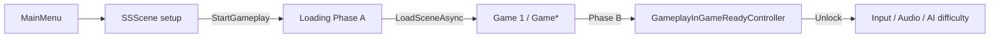
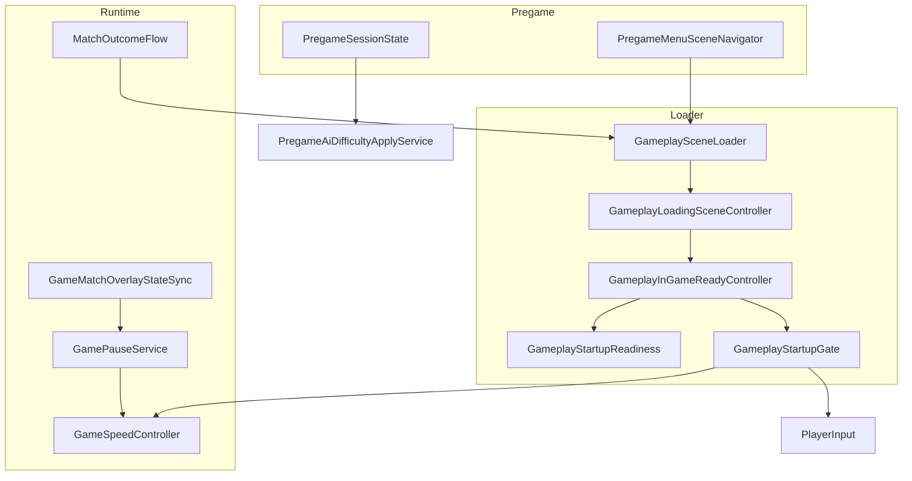

# Hướng dẫn module `Assets/Scripts/Game`

Tài liệu mô tả **chức năng** và **cách hoạt động** của từng script trong module Game: luồng scene (menu → loading → trận), cổng khóa input, pause/tốc độ, và kết thúc trận.

**Namespace gốc:** `GameDevTV.RTS.Game` (Startup: `GameDevTV.RTS.Game.Startup`, Pregame: `GameDevTV.RTS.Game.Pregame`)

---

## 1. Tổng quan kiến trúc

Module Game **không** chứa logic combat/unit. Trách nhiệm chính:

| Trách nhiệm | Mô tả |
|-------------|--------|
| **Pregame** | Menu, setup map/độ khó, chọn SP/MP, điều hướng scene trước trận |
| **Startup / Loading** | Load map qua scene `Loading`, chờ spawn Civil Central, mở khóa gameplay |
| **Runtime match** | Pause, tốc độ simulation, đồng bộ overlay MP, thoát trận |

### Luồng scene (offline PvAI)



### Hai phase loading

| Phase | Scene | Tiến độ thanh | Việc chính |
|-------|--------|----------------|------------|
| **A** | `Loading` | 0% → **85%** | Load file scene (offline) hoặc chờ host đổi scene (MP) |
| **B** | Map gameplay | **85%** → 100% | Chờ `LocalOwner` + Civil Central, tối thiểu `minReadySeconds` |

Trong Phase B, `GameplayStartupGate.Lock()` — `PlayerInput`, hotkey, một phần audio **không** chạy cho đến khi `Unlock()`.

### Thư mục

```
Assets/Scripts/Game/
├── Startup/          # Loading, cổng unlock, nhận diện scene gameplay
│   └── Editor/       # Menu Unity tạo Loading.unity + Build Settings
├── Pregame/          # Menu, session state, navigator
├── GamePauseService.cs
├── GameSpeedController.cs
├── GameMatchOverlayStateSync.cs
└── MatchOutcomeFlow.cs
```

(`Game/Loading/` — thư mục trống, không có script.)

---

## 2. Startup — nhận diện scene

### `GameplayStartupScenes.cs`

**SRP:** Phân loại scene có phải **map chơi RTS** hay không (tránh áp loading/input lên menu/lobby).

#### `IsGameplayScene(Scene scene)`

1. Scene không hợp lệ / chưa load → `false`.
2. **Blacklist tên:** `RtsNet_Lobby`, `MainMenu`, `SSScene`, `Loading` → `false`.
3. **Whitelist tên:** `RtsNet_Game` hoặc tên bắt đầu `Game` (vd. `Game 1`) → `true`.
4. Scene khác: chỉ xét nếu là **active scene**, và có một trong:
   - `RtsUtsGameSceneSetup`
   - `PvAiGameSceneSetup`
   - `LocalHumanOwnerBootstrap`
   - `RtsNetGameSceneBootstrap`

#### `IsActiveGameplayScene()`

Gọi `IsGameplayScene(SceneManager.GetActiveScene())`.

#### `IsLoadingScene(Scene scene)`

`scene.name == "Loading"`.

**Ai dùng:** `GameplaySceneLoader`, `GameplayInGameReadyController`, `PlayerInput`, `AudioBootstrap`, spawn PvAI/Netplay, v.v.

---

## 3. Startup — API load scene

### `GameplaySceneLoader.cs` (static)

**SRP:** Điểm vào duy nhất để vào map qua scene `Loading`.

#### State nội bộ

| Field / property | Ý nghĩa |
|------------------|---------|
| `pendingTargetScene` | Tên scene đích (vd. `Game 1`) |
| `pendingUseNetworkHandoff` | `true` = MP: host đổi scene, client chờ |
| `enteredGameplayFromLoader` | Đã vào map từ loader (tránh redirect vòng lặp) |
| `loadFlowActive` | Đang trong luồng load |
| `PhaseAProgressCap` | **0.85f** — trần thanh Phase A |

#### `RequestLoad(string targetScene, LoadSceneMode mode)`

- Gọi từ menu offline, `PregameMenuSceneNavigator`, `GameplaySceneLoadRequest`, `MatchOutcomeFlow`.
- Set pending, `PvAiOfflineSessionPrep.OnGameplayLoadRequested()`, tắt nhạc menu.
- Nếu **đã** ở `Loading` → `GameplayLoadingSceneController.StartPendingLoadOnActiveScene()`.
- Ngược lại → `SceneManager.LoadScene("Loading")`.

#### `BeginNetworkGameplayLoad(string targetScene)`

- Mirror host: set `pendingUseNetworkHandoff = true`, không `LoadScene` ngay từ đây.
- Đăng ký qua `RtsNetworkSceneLoadHooksRegistration` → `RtsNetworkManager` gọi khi cần.

#### `MarkGameplayEntered()` / `CompleteLoadFlow()` / `ClearPending()`

- **Mark:** Phase A xong, scene gameplay đã active.
- **Complete:** Kết thúc toàn bộ flow (sau Phase B).
- **Clear:** Xóa pending target.

#### `RedirectDirectGameplayScenePlay()` (`RuntimeInitializeOnLoadMethod`)

Khi **Play trực tiếp** scene `Game*` trong Editor (không qua menu):

- Nếu là gameplay scene, chưa có flow load, không phải MP client → tự `RequestLoad(active.name)` để luôn đi qua `Loading`.

---

### `GameplaySceneLoaderHost.cs`

**SRP:** `DontDestroyOnLoad` host chạy coroutine — **sống sót** khi `LoadSceneAsync(Single)` **hủy** scene `Loading`.

- `Ensure()` — singleton `GameplaySceneLoaderHost`.
- `Run(IEnumerator)` — `StartCoroutine` trên host.

`GameplayLoadingSceneController` và `GameplayInGameReadyController` chạy coroutine/UI trên host này.

---

### `GameplaySceneLoadRequest.cs`

**SRP:** Component gắn UI (nút Play) gọi loader.

- `LoadTargetScene()` — dùng `targetScene` SerializeField (mặc định `Game 1`).
- `LoadSceneByName(string)` — load scene tùy tên.

Wire vào `UnityEvent` trên MainMenu nếu cần.

---

## 4. Startup — Phase A (scene Loading)

### `GameplayLoadingSceneController.cs`

**SRP:** Trên scene `Loading.unity` — thực hiện Phase A.

**Inspector:** `minLoadingSeconds` (mặc định 2s), `GameplayLoadingSceneView`.

#### `Start()`

- Không có `HasPendingTarget` → warning, dừng.
- `GameplaySceneLoaderHost.Ensure()` → chuyển view lên host (tránh mất UI khi unload Loading).
- Chạy `RunLoadingPhaseA()`.

#### `RunOfflineAsyncLoad`

1. `LoadSceneAsync(target, Single)`, `allowSceneActivation = false` đến khi progress ≥ 0.9.
2. Chờ thêm `minLoadingSeconds` (UI kết hợp tiến độ file + thời gian).
3. `allowSceneActivation = true` → scene gameplay active.
4. `MarkGameplayEntered()` → `GameplayInGameReadyController.BeginFromLoaderHost()`.

#### `RunNetworkHandoff`

- **Host:** sau `minLoadingSeconds` → `RtsNetworkManager.ServerChangeSceneFromLoading(target)`.
- **Client:** chờ active scene khác `Loading`.
- Sau đó giống offline: Mark + Begin Phase B.

#### `StartPendingLoadOnActiveScene()`

Khi đã ở Loading và vừa set pending (không reload Loading lần nữa).

---

### `GameplayLoadingSceneView.cs`

**SRP:** UI overlay loading (không dùng ProgressBar mask).

- `SetStatus(string)` — TMP status.
- `SetProgress01(float)` — `Image.fillAmount` (Filled horizontal).
- `CreateRuntime(Transform parent)` — tạo Canvas overlay nếu scene thiếu UI (sortingOrder 20000).

---

## 5. Startup — Phase B (trong map)

### `GameplayStartupReadiness.cs` (static)

**SRP:** Đánh giá **nội dung** đã sẵn sàng chơi chưa (cho thanh 85%→100%).

#### `TryEvaluate(startedUnscaledTime, out contentProgress, out statusMessage, out timedOut)`

Thứ tự kiểm tra:

| Bước | Điều kiện | Progress (gợi ý) | Message |
|------|-----------|------------------|---------|
| MP chưa connect | `NetworkClient.active && !isConnected` | 0.12 | Đang kết nối… |
| Gán local owner | `MpLocalOwnerSceneSync.EnsureLocalOwnerInitialized` | 0.28–0.35 | Đang gán phe… |
| Human player | `HumanFogVisionUtility.IsHumanPlayer` | 0.45 | Chờ phe người chơi… |
| Offline spawn | `PvAiOfflineSpawnCoordinator.TryEnsureHumanBaseSpawned` | — | — |
| Civil Central | `HasLocalCivilCentral` | **1.0** | Sẵn sàng |
| Chưa CC | — | 0.72 | Đang spawn căn cứ… |

**Timeout:** 30 giây (`TimeoutSeconds`) — khi hết giờ vẫn chưa CC, `timedOut = true` nhưng Phase B vẫn có thể **mở game** (cưỡng bức).

---

### `GameplayInGameReadyController.cs`

**SRP:** Phase B trên `GameplaySceneLoaderHost` (component tạo runtime sau Phase A).

**Inspector:** `minReadySeconds` (mặc định 3s).

#### `BeginFromLoaderHost()`

Chỉ khi `IsActiveGameplayScene()` — add component lên host.

#### `BeginReadyWait()`

- `GameplayStartupGate.Lock()`
- Dừng nhạc menu (`AudioAccess.TryStopMusic`)
- Thanh ở 85%, status "Đang khởi tạo trận đấu…"

#### `TickReadyPhase()` (mỗi frame)

- Gọi `GameplayStartupReadiness.TryEvaluate`
- Map `contentProgress` → thanh **85%–100%** (kết hợp `minReadySeconds`)
- Khi **content ready** và đủ `minReadySeconds` → `FinishReadyPhase()`

#### `FinishReadyPhase()`

1. Destroy overlay loading view.
2. **`GameplayStartupGate.Unlock()`** — bật input/audio.
3. `PregameAiDifficultyApplyService.TryApply()` — áp độ khó AI offline.
4. `AudioAccess.TryStartGameplayMusic()`
5. `GameplaySceneLoader.CompleteLoadFlow()`
6. `MpPlayerPresentationDirector.RefreshFromLocalOwner()`
7. `LocalHumanCameraSpawnFocus.RequestRefocusForLocalHuman()`
8. Destroy self; cleanup host nếu không còn component khác.

---

### `GameplayStartupGate.cs` (static)

**SRP:** Cổng **“gameplay đã mở”** — **không** đụng `Time.timeScale` (pause dùng `GamePauseService`).

| API | Hành vi |
|-----|---------|
| `IsGameplayUnlocked` | Mặc định `true`; Phase B set `false` khi Lock |
| `Lock()` | Chặn input/audio phụ thuộc gate |
| `Unlock()` | Mở + event `Unlocked` |
| `ForceUnlock()` | Giống Unlock (bỏ qua idempotent check) |

**Tiêu thụ:** `PlayerInput.Update` (return sớm nếu locked), `AudioBootstrap`, `LocalHumanHotkeyGate`, `GameSpeedController` (apply speed sau unlock).

---

### `RtsNetworkSceneLoadHooksRegistration.cs`

**SRP:** Bridge assembly — gán delegate MP trước scene load.

```csharp
RtsNetworkSceneLoadHooks.BeginNetworkGameplayLoad = GameplaySceneLoader.BeginNetworkGameplayLoad;
```

Chạy `BeforeSceneLoad` — `ProjectRTS.Netplay` gọi hook thay vì reference trực tiếp `GameplaySceneLoader` (tránh vòng phụ thuộc asmdef).

---

### `Editor/GameplayLoadingSceneSetupEditor.cs`

**SRP:** Công cụ Editor setup project.

**Menu:** `ProjectRTS/Game/★ Setup Loading Scene + Build Settings`

- Tạo/cập nhật `Assets/Scenes/Loading.unity` + `GameplayLoadingSceneController`.
- Build Settings: MainMenu, Loading, Game 1, RtsNet_Lobby, RtsNet_Game.

**Menu:** `ProjectRTS/Game/Open Loading Scene`

---

## 6. Pregame — trước Loading

### `PregamePlayMode.cs`

Enum:

- `SinglePlayer` — PvAI offline.
- `Multiplayer` — lobby Mirror.

---

### `PregameSessionState.cs` (static)

**SRP:** Bộ nhớ **tạm** lựa chọn menu/setup (không persist disk).

| Property | Mặc định | Ghi chú |
|----------|----------|---------|
| `PlayMode` | SinglePlayer | SP / MP |
| `SelectedMapIndex` | 0 | Index map trên UI |
| `SelectedDifficulty` | Medium | AI offline |
| `SelectedGameplayScene` | `"Game 1"` | Scene load qua Loading |

**API:**

- `SetPlayMode` — khi vào SSScene.
- `SetSelectedDifficulty` — UI chọn độ khó.
- `ConfigureSinglePlayer(map, difficulty, scene)` — trước Start SP.
- `ConfigureMultiplayer(map, scene)` — host lobby.
- `ResetToDefaults()`

**Ai đọc sau khi vào map:** `PregameAiDifficultyApplyService` (độ khó AI).

---

### `PregameMenuSceneNavigator.cs` (static)

**SRP:** Chuyển scene **menu/setup/lobby** — **không** qua Loading.

| Method | Scene |
|--------|--------|
| `LoadMainMenu()` | MainMenu |
| `LoadSetup(mode)` | SSScene + `SetPlayMode` |
| `LoadLobby()` | RtsNet_Lobby |

#### `StartGameplay(sceneName)`

Luồng **bắt đầu trận offline**:

1. `EnsureOfflineNetworkStopped()` — StopHost/Client nếu session MP còn sót.
2. `RtsLocalHumanOwnerNotifier.ClearCachedTeamIndex()`
3. `PvAiOfflineSessionPrep.OnGameplayLoadRequested()` + `PrepareLocalHumanOwner()`
4. `GameplaySceneLoader.RequestLoad(sceneName)`

---

### `PregameApplicationQuit.cs` (static)

- Editor: `EditorApplication.isPlaying = false`
- Build: `Application.Quit()`

Gắn nút Thoát menu/setup.

---

## 7. Runtime — Pause & tốc độ

### `GamePauseService.cs` (static)

**SRP:** Điều khiển `Time.timeScale` — tách **pause chia sẻ MP** và **pause local Settings**.

| Cờ | Nguồn |
|----|--------|
| `_sharedSimulationPaused` | Menu pause / dialog đầu hàng (đồng bộ MP) |
| `_localSettingsPaused` | Mở Settings chỉ trên máy local |

**Logic:** `RefreshSimulationTime()` — nếu bất kỳ cờ pause → `timeScale = 0`, event `PauseStateChanged`. Ngược lại → `ApplySimulationSpeed` qua `GameSpeedController` hoặc trực tiếp `Time.timeScale`.

| API | Mục đích |
|-----|----------|
| `ApplySharedPause` / `ApplyLocalSettingsPause` | Set từng loại pause |
| `ApplySharedSpeed` | Tốc độ đồng bộ MP |
| `Pause()` / `Resume()` / `ResumeAtSpeed` | UI overlay |
| `ForceResumeForSceneChange` | Reset trước đổi scene (defeat) |

---

### `GameSpeedController.cs` (MonoBehaviour)

**SRP:** Preset tốc độ simulation (`Time.timeScale` + `fixedDeltaTime`).

- **Singleton** `Instance` trên scene gameplay.
- Preset Inspector: 0.5x, 1x, 1.5x, 2x (và `maxSpeed` clamp).
- Phím (tùy chọn): Numpad+ / Numpad- toggle fast/normal.
- Subscribe `GameplayStartupGate.Unlocked` → chỉ apply speed khi đã unlock.
- `ApplyPresetSpeed` bỏ qua khi `GamePauseService.IsPaused`.

UI in-game gọi `ApplyPresetSpeed` / `GetPresetScale(index)`.

---

### `GameMatchOverlayStateSync.cs` (NetworkBehaviour)

**SRP:** Đồng bộ **overlay in-game** giữa 2 client MP (pause, panel, tốc độ, dialog đầu hàng). **Settings chỉ local** — không qua lớp này.

**SyncVar:** `sharedPanel`, `sharedPaused`, `sharedSpeedScale`, `sharedSpeedPresetIndex`, `sharedSurrenderDialog`.

| API | Hành vi |
|-----|---------|
| `EnsureServerInstance()` | Server spawn trên `GameplayMapCoreMarker` |
| `RequestSharedPanel` / `RequestSharedSpeed` | Client → Command |
| `RequestSurrenderConfirmed` | Rpc kết thúc trận |

Hook SyncVar → `InGameOverlayMenuController.ApplyRemoteSharedState`.

---

## 8. Kết thúc trận

### `MatchOutcomeFlow.cs` (static)

**SRP:** Load scene sau **đầu hàng / thua**.

`LoadDefeatScene(sceneName)`:

1. `GamePauseService.ForceResumeForSceneChange()`
2. Mặc định `MainMenu` nếu không truyền scene.
3. Kiểm tra scene có trong Build Settings.
4. Nếu đang ở Loading → `LoadScene` trực tiếp; ngược lại → `GameplaySceneLoader.RequestLoad` (qua Loading).

---

## 9. Sơ đồ phụ thuộc (tóm tắt)



---

## 10. Checklist tích hợp / debug

### Setup lần đầu

1. Menu Unity: **ProjectRTS → Game → ★ Setup Loading Scene + Build Settings**
2. Trên `RtsNetworkManager`: gán scene Loading (theo comment editor).
3. Nút Start offline: gọi `PregameMenuSceneNavigator.StartGameplay` hoặc `GameplaySceneLoadRequest`.

### Play trực tiếp `Game 1` trong Editor

`RedirectDirectGameplayScenePlay` tự chuyển qua Loading — **bình thường**.

### Input không hoạt động sau vào map

- Kiểm tra `GameplayStartupGate.IsGameplayUnlocked` (Console / breakpoint sau Phase B).
- Kiểm tra Civil Central local đã spawn (`GameplayStartupReadiness`).
- Xem log timeout Phase B.

### MP không qua Loading

- `BeginNetworkGameplayLoad` phải được gọi từ netplay.
- Host: `ServerChangeSceneFromLoading` trong Phase A.

### Pause / speed

- Pause overlay → `GamePauseService.ApplySharedPause`.
- Settings local → `ApplyLocalSettingsPause` only.
- MP → thay đổi speed/pause qua `GameMatchOverlayStateSync`.

---

## 11. Bảng tra nhanh file → vai trò

| File | Loại | Vai trò một dòng |
|------|------|------------------|
| `GameplayStartupScenes.cs` | static | Scene nào là gameplay / loading |
| `GameplaySceneLoader.cs` | static | API vào Loading → map |
| `GameplaySceneLoaderHost.cs` | MB | DontDestroyOnLoad chạy coroutine |
| `GameplaySceneLoadRequest.cs` | MB | Nút UI gọi RequestLoad |
| `GameplayLoadingSceneController.cs` | MB | Phase A trên Loading.unity |
| `GameplayLoadingSceneView.cs` | MB | Thanh % + status loading |
| `GameplayStartupReadiness.cs` | static | CC + owner đã sẵn sàng? |
| `GameplayInGameReadyController.cs` | MB | Phase B, Unlock gate |
| `GameplayStartupGate.cs` | static | Khóa/mở input & audio gameplay |
| `RtsNetworkSceneLoadHooksRegistration.cs` | static | Hook MP → BeginNetworkGameplayLoad |
| `GameplayLoadingSceneSetupEditor.cs` | Editor | Tạo Loading + Build Settings |
| `PregameSessionState.cs` | static | Lưu map/độ khó/mode |
| `PregamePlayMode.cs` | enum | SP / MP |
| `PregameMenuSceneNavigator.cs` | static | Menu ↔ setup ↔ lobby ↔ Start |
| `PregameApplicationQuit.cs` | static | Thoát game |
| `GamePauseService.cs` | static | timeScale pause (shared/local) |
| `GameSpeedController.cs` | MB | Preset 0.5x–2x |
| `GameMatchOverlayStateSync.cs` | Net | Sync overlay MP |
| `MatchOutcomeFlow.cs` | static | Load scene sau defeat |

---

## 12. Liên kết tài liệu khác

- Module tổng: [Assets-Scripts-By-Module.md](./Assets-Scripts-By-Module.md) — mục **M1 khởi động & scene**
- Netplay spawn / owner: `Assets/Scripts/Netplay/`, `Assets/Scripts/PvAI/`
- UI pregame/lobby: `Assets/Scripts/UI/Pregame/`

*Tài liệu sinh từ mã nguồn `Assets/Scripts/Game` — cập nhật khi thêm script mới vào module.*
