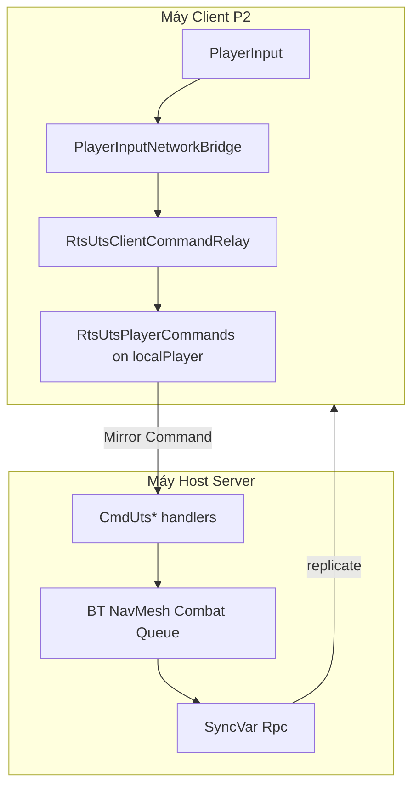
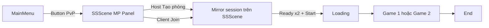

# Hướng dẫn kỹ thuật Multiplayer (MP) — Debug & sửa lỗi

Tài liệu này mô tả **code MP hiện tại** (Mirror LAN 2 người, map **Game 1 / Game 2**) để bạn tra cứu nhanh khi fix bug lúc chơi thật.

> **Không dùng** `RtsNet_Game` trong flow chính — đó chỉ là sandbox cũ. Map thật: `Assets/Scenes/Game 1.unity`, `Assets/Scenes/Game 2.unity`.

---

## 1. Tóm tắt kiến trúc

| Nguyên tắc | Chi tiết |
|------------|----------|
| **Server authoritative** | Spawn, combat, gather, build/train, tech, tài nguyên — chỉ **server/host** quyết định |
| **Pure client** | Chỉ gửi input → `Command` → nhận `SyncVar` / `Rpc` → cập nhật fog/HUD/animation |
| **Host = P1** | `NetworkServer.active && NetworkClient.active` → team 0 → `Owner.Player1` |
| **Client = P2** | `NetworkClient` thuần (không server) → team 1 → `Owner.Player2` |
| **Tách assembly** | `ProjectRTS.Netplay` (lobby/Mirror) ↔ `Assembly-CSharp` (gameplay) qua **static hooks** |



---

## 2. Luồng scene (bắt buộc đúng thứ tự)

### Flow chính (từ menu game — **khuyến nghị**)

Lobby MP nằm **trên `SSScene`**, không cần mở scene `RtsNet_Lobby` riêng khi chơi bình thường.

```
MainMenu.unity
    → Button PvP
SSScene.unity (chế độ Multiplayer — MP Panel)
    → Host: Tạo phòng (CreateHostRoom)  |  Client: chọn phòng / nhập IP → Join
    → Chọn map (Game 1 / Game 2) — host đổi map, client đồng bộ qua SyncVar
    → Cả hai Ready → Host: Bắt đầu trận (ServerTryStartMatch)
Loading.unity
    → Phase A — chờ load đồng bộ
Game 1.unity hoặc Game 2.unity
    → Spawn CC + worker 2 phe, chơi
End.unity
    → Thắng / thua / đầu hàng / disconnect forfeit
```



### Scene & component quan trọng

| Scene | Vai trò | Component chính |
|-------|---------|-----------------|
| `Assets/Scenes/MainMenu.unity` | Menu gốc | `MainMenuUIController` — nút **PvE** / **PvP** |
| `Assets/Scenes/SSScene.unity` | Setup + **lobby MP** | `PregameSetupUIController`, `PregameMpLobbyCoordinator`, `RtsLobbyUI`, `RtsNetworkManager` |
| `Assets/Scenes/Loading.unity` | Chuyển cảnh MP | `GameplayLoadingSceneController` |
| `Assets/Scenes/Game 1.unity` / `Game 2.unity` | Map thật | `RtsUtsGameSceneSetup`, `RtsNetGameSceneBootstrap` |
| `Assets/Scenes/End.unity` | Kết quả trận | `EndSceneOutcomeController` |

### `RtsNetworkManager` trên SSScene (Inspector)

| Field | Giá trị hiện tại | Ý nghĩa |
|-------|------------------|---------|
| `offlineScene` | `SSScene` | Khi thoát host/client về setup |
| `lobbyScene` | `SSScene` | Lobby = chính scene setup (không nhảy scene khác) |
| `loadingScene` | `Loading` | Trung gian trước map |
| `gameScene` | `Game 1` (mặc định) | Fallback; host đổi map trong UI → `RtsLobbyRoomMapSync` |
| `maxConnections` | `2` | LAN 2 người |

### File điều phối (pregame → gameplay)

| Bước | File chính | Ghi chú |
|------|------------|---------|
| MainMenu → SSScene | `PregameMenuSceneNavigator.LoadSetup(Multiplayer)` | `MainMenuUIController.OnMultiplayerClicked` |
| Tạo phòng host | `RtsLobbyUI.CreateHostRoom()` | Nút **Tạo phòng** — `PregameSetupUIController.OnCreateRoomClicked` |
| Đồng bộ map lobby | `PregameMpLobbyCoordinator` | Host chọn map; client chỉ xem + Ready |
| Start trận | `RtsNetworkManager.ServerTryStartMatch()` | Nút **Bắt đầu trận** khi cả hai Ready |
| Chặn qua Loading | `RtsNetworkManager.ServerChangeScene` | Tự chèn `Loading` trước `gameScene` |
| Handoff Loading | `GameplayLoadingSceneController` + `GameplaySceneLoader` | Host: `ServerChangeSceneFromLoading` |
| Vào map | `RtsNetworkManager.OnServerSceneChanged` | `RtsNetSceneUtility.IsActiveGameplayMapScene()` |
| Bootstrap map | `RtsNetGameSceneBootstrap` | Owner, presentation, **đăng ký prefab client P2** |
| Spawn gameplay | `RtsMatchServerSpawnOrchestrator` | Cần **2 connection** + lobby identity |

### `RtsNet_Lobby` (legacy / dự phòng)

- Scene `Assets/3rdParty/RTS_Multiplayer/Scenes/RtsNet_Lobby.unity` vẫn trong Build Settings.
- Chỉ dùng khi `PregameSetupUIController` **không** tìm thấy `RtsLobbyUI` trên MP Panel → `PregameMenuSceneNavigator.LoadLobby()`.
- **Không** Play thẳng `Game 1` / `Game 2` để test MP.

**Lỗi thường gặp:** Play trực tiếp scene `Game 1` → không có session Mirror → log `[MP] Chưa có session Mirror` sau ~2s.  
**Cách đúng:** Play từ **`MainMenu`** → **PvP** → lobby trên **SSScene**.

---

## 3. Hai assembly & hooks (quan trọng khi compile / refactor)

### `ProjectRTS.Netplay.asmdef`

- Chỉ reference Mirror — **không** được `using GameDevTV.*` trực tiếp trong file trong folder này.
- Ví dụ: `RtsNetworkManager` gọi forfeit qua `RtsServerGameplayNotifier.NotifyPlayerDisconnectedForfeit`.

### Hooks đăng ký (`BeforeSceneLoad`)

| Hook | Đăng ký tại | Mục đích |
|------|-------------|----------|
| `RtsNetworkSceneLoadHooks.BeginNetworkGameplayLoad` | `RtsNetworkSceneLoadHooksRegistration` | MP qua Loading |
| `RtsServerGameplayNotifier.OnMatchSceneLoaded` | `RtsMatchServerSpawnOrchestrator` | Spawn CC/worker |
| `RtsServerGameplayNotifier.OnPlayerDisconnectedForfeit` | `RtsNetworkSceneLoadHooksRegistration` | Thắng khi đối thủ rời |
| `RtsMatchSceneClientNotifier.OnGameSceneLoaded` | `MpLocalOwnerSceneSync` | Gán P1/P2 presentation |
| `RtsLocalHumanOwnerNotifier.OnLocalTeamIndex` | `LocalHumanOwnerMirrorBridge` | Lobby → `LocalHumanOwnerService` |
| `PlayerInputNetworkBridge.*` | `RtsUtsClientCommandRelay` | Client relay lệnh |

**Quy tắc:** Thêm logic game vào Assembly-CSharp; Netplay chỉ giữ Mirror shell + hooks.

---

## 4. Gán P1 / P2 (LocalOwner)

### Chuỗi runtime

```
RtsPlayerSlotRegistry.AssignOrGet(conn)     // conn 1 → slot 0, conn 2 → slot 1
    → RtsLobbyPlayer.ServerInitSlot
    → SyncVar playerTeamIndex

OnStartLocalPlayer / HookTeam
    → RtsLocalHumanOwnerNotifier.NotifyLocalTeamIndex
    → LocalHumanOwnerMirrorBridge
    → LocalHumanOwnerService.SetLocalOwner(Player1 | Player2)

Vào Game scene
    → MpLocalOwnerSceneSync.RefreshAfterGameSceneLoad()
    → MpPlayerPresentationDirector.Apply(localOwner)
```

### `MpLocalOwnerSceneSync.ResolveLocalTeamIndex()`

| Máy | Kết quả |
|-----|---------|
| Pure client | Luôn **1** (P2) — workaround SyncVar lệch trên clone |
| Host | `localPlayer.RtsLobbyPlayer.PlayerTeamIndex` (thường **0**) |

### Kiểm tra nhanh trong Play Mode

| Inspector / log | P1 (host) | P2 (client) |
|-----------------|-----------|-------------|
| `LocalHumanOwnerService.LocalOwner` | `Player1` | `Player2` |
| Rig active | `player1Rig` | `player2Rig` |
| `RtsUtsNetworkEntity.UtsOwner` trên unit mình | khớp LocalOwner | khớp LocalOwner |

### File liên quan

- `LocalHumanOwnerService.cs` — singleton owner
- `LocalCommandableOwnership.cs` — **ưu tiên `UtsOwner` SyncVar** khi chọn unit (fix P2 không chọn được)
- `MpPlayerPresentationDirector.cs` — fog + HUD + shared `PlayerInput`

---

## 5. Điều khiển & relay lệnh (client → server)

### Khi nào relay?

```csharp
// PlayerInputNetworkBridge.ShouldRelayCommands
NetworkClient.active && NetworkClient.isConnected && !NetworkServer.active
```

→ **Chỉ pure client** relay. Host chạy lệnh local trên server.

### Luồng

```
PlayerInput (click / hotkey / voice*)
    → IsOwnedByLocalPlayer → LocalCommandableOwnership.IsOwnedByLocalHuman
    → PlayerInputNetworkBridge.TryRelay*
    → RtsUtsClientCommandRelay
    → RtsUtsPlayerCommands.RequestUts* → [Command] CmdUts*
    → Server: TryResolveCommandable + ServerCanAcceptOrdersFrom(connectionId)
```

### Bảng Command Mirror

| Hành động người chơi | Request API | Command server |
|----------------------|-------------|----------------|
| Di chuyển | `RequestUtsMove` | `CmdUtsMoveUnit` |
| Dừng | `RequestUtsStop` | `CmdUtsStop` |
| Gather | `RequestUtsGather` | `CmdUtsGather` |
| Attack | `RequestUtsAttack` (+ `targetNetId`) | `CmdUtsAttack` |
| Đặt nhà | `RequestUtsBuild` | `CmdUtsBuildBuilding` |
| Train / research | `RequestUtsEnqueueUnlockable` | `CmdUtsEnqueueUnlockable` |
| Hủy đặt nhà worker | `RequestUtsCancelWorkerBuild` | `CmdUtsCancelWorkerBuild` |

Server build/train: `RtsUtsGameplayCommandServer` + `RtsUnlockableAssetCatalog`.

### Điều kiện relay thành công

1. Unit có `NetworkIdentity` + `RtsUtsNetworkEntity`
2. `IsCommandableByLocalHuman == true` (`utsOwner == LocalOwner`)
3. `NetworkClient.localPlayer` có `RtsUtsPlayerCommands`
4. Server: `serverOwnerConnectionId == connectionToClient.connectionId`

---

## 6. Simulation gate (client không chạy gameplay)

`RtsNetplaySimulationGate.ApplyToSpawnedEntity` trên **pure client** tắt:

- `BehaviorGraphAgent`
- `NavMeshAgent`
- `BuildingAutoAttack` (tháp)

`RtsNetplaySession`:

| Flag | Ý nghĩa |
|------|---------|
| `ShouldRunAuthoritativeGameplay` | Spawn / queue / Instantiate — server only |
| `ShouldApplyCombatDamage` | Damage — server only |
| `IsPureClient` | Client thuần |

**Triệu chứng:** Client thấy unit “đứng im” nhưng HUD/fog đúng → **bình thường**; state thật ở server, mirror qua Rpc/SyncVar.

---

## 7. Đồng bộ combat / chết / nhà

### `RtsUtsNetworkCombatSync`

| SyncVar | Hook client |
|---------|-------------|
| `syncCurrentHealth` | `ApplyNetworkHealthSnapshot` |
| `syncMaxHealth` | idem |
| `syncMarkedDead` | `ExecuteNetworkDeathPresentation` |

**Server:** `HandleTakeDamage` → HP ≤ 0 → `HandleAuthoritativeDeath`  
- Unit: animation Die → delay → `NetworkServer.Destroy`  
- Building: presentation → `NetworkServer.Destroy` → `OnDestroy` → `BuildingDeathEvent`

### `UnitHealth.cs` (thanh máu world)

- `SyncHealth` phải **null-safe** (`progressBar` null → bỏ qua).
- **NullRef tại đây** làm gián đoạn chuỗi damage → nhà/CC “không chết”.

### `RtsUtsNetworkBuildingSync`

- Queue train/research, tiến độ xây — SyncList + SyncVar tên SO.

### Tài nguyên & tech

| Component | Vai trò |
|-----------|---------|
| `RtsUtsSupplyStateSync` | stone/wood/food/population P1+P2 |
| `RtsUtsTechStateRelay` | upgrade / building spawn-death tech |
| `RtsGatherableSupplyNetworkSync` | lượng mỏ trên map |

---

## 8. Kết thúc trận

| Trigger | Server | Client |
|---------|--------|--------|
| CC bị phá | `MatchOutcomeDetector` → `GameMatchOverlayStateSync.RequestMatchEndFromCivilCentralDestroyed` | Rpc → `ApplyNetworkCivilCentralDestroyed` → scene **End** |
| Đầu hàng | `CmdConfirmSurrender` | `RpcEndMatchFromSurrender` |
| Disconnect in-game | `OnServerDisconnect` → forfeit hook | Rpc cùng pipeline |

**Chống trùng:** `GameMatchOverlayStateSync.s_serverMatchEndSent` + `MatchOutcomeDetector.matchEnded`  
**Reset trận mới:** `ResetMatchEndBroadcast()` + `ResetForNewMatch()` trong bootstrap / `ResetMatchRegistration`.

---

## 9. Presentation (fog / HUD / minimap)

```
LocalHumanOwnerService
    → LocalHumanPresentationRefresh
    → MpPlayerPresentationDirector.Apply(Player1 | Player2)
        ├── player1Rig / player2Rig (MpPlayerPresentationRig)
        ├── FactionFogPresentation (RT vision P1/P2)
        ├── FactionHudBinder (supplies, minimap fog)
        └── Shared PlayerInput + Main Camera
```

**Sau spawn replicate:** `MpFogVisionSpawnRefresh` retry ~60 frame (P2 hay bị fog đen / unit trễ).

### Log lỗi presentation P2

| Log | Cách sửa |
|-----|----------|
| `player2Rig NULL` | Menu `ProjectRTS/Netplay/★ Auto-Wire MP Prefabs & Scene` |
| `RT sai (cần *P2*)` | `★ Prepare Game 2 Scene` hoặc Auto-Wire |
| `Vision mask sai` | Chạy `Setup MP Presentation` trên map |

---

## 10. Yêu cầu scene & prefab

### Build Settings (tối thiểu MP)

| Thứ tự gợi ý | Scene |
|--------------|-------|
| 0 | `MainMenu` |
| 1 | `Loading` |
| 2 | `SSScene` |
| 3 | `Game 1` |
| 4 | `Game 2` |
| 5 | `End` |
| (tùy chọn) | `RtsNet_Lobby`, `RtsNet_Game` — legacy / sandbox |

**Play MP:** mở scene **`MainMenu`** (index 0), không Play thẳng `Game 1`.

### `GameplayMapCore` trên Game 1/2

- `RtsUtsGameSceneSetup` — spawn points, CC/worker prefab, `unlockableCatalog`
- `RtsNetGameSceneBootstrap`
- `MpPlayerPresentationDirector` + **2×** `MpPlayerPresentationRig` (P1/P2)
- `PvAiGameSceneBootstrap` — **tắt khi** `NetworkServer.active`
- `GameMatchOverlayStateSync` + `NetworkIdentity` (spawn từ server nếu thiếu)

### Prefab unit/building MP

- `NetworkIdentity`
- `RtsUtsNetworkEntity`
- `RtsUtsNetworkCombatSync`
- **Unit** (worker, quân): `NetworkTransformUnreliable` trên prefab (hoặc factory thêm khi spawn)
- **Building** (nhà): **không** cần `NetworkTransform` — nhà tĩnh; tiến độ xây qua `RtsUtsNetworkBuildingSync`. Factory **gỡ** NT runtime trước spawn (`StripBuildingNetworkTransform`)
- Nhà train: thêm `RtsUtsNetworkBuildingSync` (factory tự thêm nếu thiếu)
- Đăng ký spawn: host `EnsureAllGameplayPrefabsRegistered` + pure client `EnsureClientGameplayPrefabsRegistered` (catalog từ `RtsUtsGameSceneSetup`)

### Lệnh build MP (P2)

| Bước | Client P2 | Server |
|------|-----------|--------|
| Chọn worker + ghost | `RtsUtsClientCommandRelay.TryRelayActivate` | — |
| Relay | `RequestUtsBuild` → `CmdUtsBuildBuilding` | `RtsUtsGameplayCommandServer.TryExecuteBuild` |
| Validation | Ghost `AllRestrictionsPass` (UI) | `BuildPlacementValidation` (tech + placement) |
| Presentation | `RpcMirrorBuildPresentation`, `RpcNotifyBuildingConstructStarted` (gỡ ghost) | `Worker.Build` + BT `BuildBuildingAction` spawn |
| Spawn nhà client | Cần prefab trong `NetworkClient` registry | `NetworkServer.Spawn` |

### Lobby `RtsNetworkManager` (trên SSScene)

- `gameScene` mặc định: **Game 1** (host vẫn đổi map trong lobby)
- `maxConnections = 2`

---

## 11. Menu Editor (setup một lần)

| Menu | Tác dụng |
|------|----------|
| `ProjectRTS/Pregame/Wire SSScene MP Lobby UI` | Gắn `RtsLobbyUI` + Ready/Start trên **SSScene** MP Panel |
| `ProjectRTS/Netplay/★ Auto-Wire MP Prefabs & Scene (one-click)` | Prefab network + catalog Game 1 & 2 + lobby spawn |
| `ProjectRTS/Netplay/★ Prepare Game 1 Scene` | Wire presentation + core |
| `ProjectRTS/Netplay/★ Prepare Game 2 Scene` | idem map 2 |
| `ProjectRTS/Netplay/Setup MP Presentation` | Fog P1/P2, director, HUD |
| `ProjectRTS/Netplay/Fix Duplicate NetworkIdentity on Prefabs` | Dọn NI trùng |

Sau Auto-Wire + Wire SSScene (nếu mới clone project): **Save All**, commit scene nếu cần.

---

## 12. Ma trận triệu chứng → nguyên nhân → file cần mở

| Triệu chứng | Nguyên nhân thường gặp | File kiểm tra đầu tiên |
|-------------|------------------------|-------------------------|
| P2 không chọn được unit | `Owner` prefab ≠ `UtsOwner`; LocalOwner sai | `LocalCommandableOwnership`, `MpLocalOwnerSceneSync` |
| P2 click nhưng không di chuyển | Relay fail / Command null / không `IsCommandableByLocalHuman` | `RtsUtsClientCommandRelay`, `RtsUtsPlayerCommands` |
| Host OK, client không build/train | Catalog thiếu / P2 chưa `RegisterPrefab` | `EnsureClientGameplayPrefabsRegistered`, `RtsUnlockableAssetCatalog` |
| `Failed to spawn assetId=...` trên P2 | Client thiếu prefab nhà trong Mirror registry | `RtsUtsServerEntityFactory.EnsureClientGameplayPrefabsRegistered` |
| NullRef `NetworkTransformUnreliable` khi xây nhà | NT runtime trên building / lệch server-client | `StripBuildingNetworkTransform` — nhà không dùng NT |
| P2 build: tiền trừ nhưng không thấy nhà | Server spawn OK, client không replicate | Kiểm tra spawn prefab + Console P2 |
| Không spawn CC/worker | Chưa đủ 2 Ready / thiếu spawn points | `RtsMatchServerSpawnOrchestrator`, `RtsUtsGameSceneSetup` |
| Spawn chỉ 1 phe | `MatchSpawnCompleted` sớm / 1 connection | Log `[RtsMatchServerSpawnOrchestrator]` |
| Màn hình P2 đen / fog sai | `player2Rig` / RT P2 | `MpPlayerPresentationDirector` |
| Damage không trừ máu | Client đang gây damage (bị chặn) — cần server | `RtsUtsNetworkCombatSync`, server log |
| NullRef `UnitHealth.SyncHealth` | `progressBar` null trên Health Bar child | `UnitHealth.cs`, prefab CC/building |
| CC không chết nhưng HP 0 | Exception trong `OnHealthUpdated` subscribers | `UnitHealth`, `UnitWorldHealthBar` |
| Trận kết thúc 2 lần / 2 kết quả | Rpc match end trùng | `GameMatchOverlayStateSync`, `MatchOutcomeDetector` |
| `Client Send: not connected` | Gửi packet sau disconnect | Bình thường lúc thoát — bỏ qua |
| CS0246 `GameDevTV` trong Netplay | `using` game code trong asmdef Netplay | `RtsNetworkManager` — dùng hooks |

---

## 13. Checklist test MP (2 máy LAN)

### Trước khi test

- [ ] Build Settings: `MainMenu`, `SSScene`, `Loading`, `Game 1`, `Game 2`, `End`
- [ ] Đã chạy **Auto-Wire** trên Game 1 & 2
- [ ] Đã chạy **Wire SSScene MP Lobby UI** (nếu nút Ready/Start lobby lỗi)
- [ ] Firewall cho phép port Mirror (mặc định 7777)

### Vào lobby (từ MainMenu)

- [ ] **Play** scene `MainMenu` (host máy chính)
- [ ] **PvP** → vào `SSScene`, panel **MP** hiện
- [ ] Host: chọn map → **Tạo phòng**
- [ ] Client (ParrelSync hoặc build): **MainMenu → PvP** → Join IP host (vd. `localhost` / LAN)
- [ ] Cả hai **Ready**
- [ ] Host: **Bắt đầu trận** → qua **Loading** → vào map đã chọn

### Lobby (trên SSScene — không cần RtsNet_Lobby)

### Host (P1)

- [ ] Chọn worker → move / gather / build
- [ ] Train unit / research
- [ ] Attack unit địch
- [ ] Pause / tốc độ — đồng bộ client

### Client (P2)

- [ ] `LocalOwner = Player2`
- [ ] Chọn **worker của P2** (không phải P1)
- [ ] Move / gather / attack / build / train
- [ ] Fog + minimap + supplies đúng phe
- [ ] Không điều khiển được unit P1 (đúng thiết kế)

### Kết thúc

- [ ] Phá CC địch → **một** lần chuyển End
- [ ] Đầu hàng → cả hai thấy kết quả
- [ ] Client thoát giữa trận → host thắng forfeit

---

## 14. Catalog file MP (tra cứu nhanh)

### Pregame (`Assets/Scripts`)

| File | 1 dòng |
|------|--------|
| `MainMenuUIController.cs` | PvE / PvP → `LoadSetup` |
| `PregameSetupUIController.cs` | SSScene: map, AI panel, MP panel, Tạo phòng |
| `PregameMpLobbyCoordinator.cs` | Host/client quyền chọn map trong lobby |
| `PregameMenuSceneNavigator.cs` | `LoadMainMenu`, `LoadSetup`, `StartGameplay` (PvE) |
| `PregameMapSelectScrollBinder.cs` | Catalog map trên SSScene |
| `PregameSessionState.cs` | PlayMode, map index, scene gameplay đã chọn |

### Netplay shell (`ProjectRTS.Netplay`)

| File | 1 dòng |
|------|--------|
| `RtsNetworkManager.cs` | Session 2 người, scene, disconnect forfeit |
| `RtsLobbyPlayer.cs` | Tên, team, Ready, map host SyncVar |
| `RtsPlayerSlotRegistry.cs` | Slot 0/1 theo connectionId |
| `RtsNetSceneUtility.cs` | Nhận diện Game 1/2 gameplay |
| `RtsServerGameplayNotifier.cs` | Hooks spawn / forfeit |
| `RtsNetworkSceneLoadHooks.cs` | Hook Loading MP |

### Gameplay MP (`Assets/Scripts/Netplay`)

| File | 1 dòng |
|------|--------|
| `RtsNetGameSceneBootstrap.cs` | Bootstrap map: owner, server sync, presentation |
| `MpLocalOwnerSceneSync.cs` | Gán P1/P2 sau load scene |
| `RtsUtsClientCommandRelay.cs` | Client → Command |
| `RtsUtsPlayerCommands.cs` | Mirror Commands gameplay |
| `RtsUtsGameplayCommandServer.cs` | Server build/train/research |
| `RtsUtsNetworkEntity.cs` | SyncVar owner + quyền lệnh |
| `RtsUtsNetworkCombatSync.cs` | HP / chết authoritative |
| `RtsUtsNetworkBuildingSync.cs` | Queue + tiến độ xây |
| `RtsUtsServerEntityFactory.cs` | Spawn + đăng ký prefab host/client; gỡ NT building |
| `BuildPlacementValidation.cs` | Server validate tech + vị trí đặt nhà |
| `RtsMatchServerSpawnOrchestrator.cs` | Spawn CC/worker 2 phe |
| `RtsNetplaySession.cs` | Flag server/client/combat |
| `RtsNetplaySimulationGate.cs` | Tắt BT/NavMesh client |
| `LocalCommandableOwnership.cs` | Resolve owner MP cho input |
| `MpPlayerPresentationDirector.cs` | Rig P1/P2 fog/HUD |
| `MpFogVisionSpawnRefresh.cs` | Retry fog sau spawn |
| `RtsMpSceneRuntimeEnsurer.cs` | Auto-wire lúc Play |
| `RtsUtsSupplyStateSync.cs` | Sync tài nguyên |
| `RtsUtsTechStateRelay.cs` | Sync tech Rpc |
| `RtsGatherableSupplyNetworkSync.cs` | Sync lượng mỏ |

### Game systems liên quan

| File | 1 dòng |
|------|--------|
| `GameMatchOverlayStateSync.cs` | Pause/speed/overlay + Rpc end match |
| `MatchOutcomeDetector.cs` | CC destroyed → scene End |
| `PlayerInput.cs` | Input + relay bridge |
| `PlayerInputNetworkBridge.cs` | DIP relay |
| `LocalHumanOwnerService.cs` | LocalOwner singleton |
| `FactionVisibilityUpdater.cs` | Ẩn địch theo fog |
| `UnitHealth.cs` | Thanh máu world (null-safe) |

### Editor

| File | 1 dòng |
|------|--------|
| `SsSceneMpLobbySetupEditor.cs` | Wire SSScene MP Lobby UI |
| `RtsMpNetworkAutoSetupEditor.cs` | One-click wire MP |
| `RtsNetGameSceneSetupEditor.cs` | Prepare Game 1/2 |
| `GameplayMapSceneSetupApplicator.cs` | Core map PvE+PvP |

---

## 15. Ghi chú refactor / mở rộng

1. **Không** import `GameDevTV.*` vào script trong `Assets/3rdParty/RTS_Multiplayer/Scripts/` — dùng hook.
2. Mọi prefab spawn runtime phải có trong `NetworkManager.spawnPrefabs` **trước** `NetworkServer.Spawn`.
3. Lệnh mới: thêm `Cmd` + `Request` trong `RtsUtsPlayerCommands`, relay trong `RtsUtsClientCommandRelay`, guard server trong `RtsUtsGameplayCommandServer` nếu cần.
4. Presentation client: ưu tiên Rpc mirror (`RtsUtsNetworkEntity`) thay vì chạy gameplay trên client.
5. Map mới: copy pattern **Game 1** — `GameplayMapCore` + Auto-Wire + thêm Build Settings.

---

## 16. Liên kết tài liệu khác

- `TAI_LIEU_KY_THUAT_DAY_DU.md` — toàn bộ chức năng game (PvE + systems)
- `RTS_TECHNICAL_REFERENCE.md` — tra Feature → File
- `Game-Module-Guide.md` — module tổng quan
- `urts-architecture-map.md` — class diagram chi tiết

---

*Cập nhật theo codebase: Mirror LAN, luồng **MainMenu → SSScene (lobby) → Loading → Game 1/2**, server-authoritative UTS. Khi sửa bug MP, ưu tiên log tag `[RtsMatchServerSpawnOrchestrator]`, `[MpPlayerPresentationDirector]`, `[P2 Fog]`, `[RtsUtsServerEntityFactory]`, `[RtsLobbyUI]`.*
