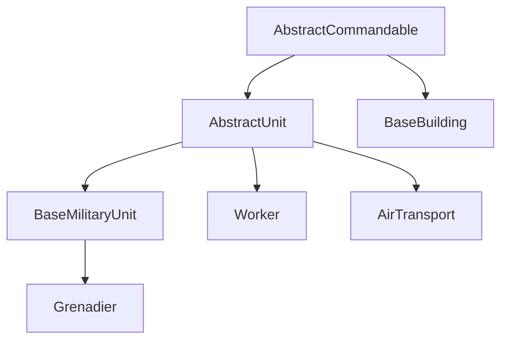

# UTS / GameDevTV RTS — Tài liệu kỹ thuật mã nguồn

Tài liệu này mô tả **cấu trúc code hiện có** trong `Assets/Scripts` để khi **sửa hoặc thêm chức năng** bạn tra được **file và luồng** nhanh nhất.

- **Namespace gameplay chính:** `GameDevTV.RTS.*`
- **Giọng nói (STT):** `ProjectRTS.SpeechRecognition.Core` và `GameDevTV.RTS.SpeechRecognition` (Vosk)
- **Unity packages liên quan:** AI Navigation, Unity Behavior (`BehaviorGraphAgent`), Cinemachine, Input System, URP (theo `Packages/manifest.json`)

---

## 1. Mục lục tra cứu nhanh (Feature → File)

| Muốn làm gì | Bắt đầu từ đâu |
|-------------|----------------|
| Thêm / sửa **lệnh UI** (nút hành động, click map) | `Commands/BaseCommand.cs`, từng `*Command.cs`, `Player/PlayerInput.cs`, `UI/Containers/ActionsUI.cs` |
| **Click phải** (context command theo raycast) | `Player/PlayerInput.cs` → `HandleRightClick`, `GetAvailableCommands` |
| **Chọn unit / vùng chọn** | `Player/PlayerInput.cs` → `HandleDragSelect`, `ISelectable` |
| **Di chuyển tập** (formation vòng tròn) | `Commands/MoveCommand.cs` |
| **Hành vi unit** (gather, build, attack…) | `Units/AbstractUnit.cs` (blackboard `UnitCommands`), graph **Unity Behavior** trên prefab; node tùy chỉnh trong `Behavior/*.cs` |
| **Máu, chết, damage** | `Units/AbstractCommandable.cs`, `Units/DamageableSensor.cs`, events `UnitDeathEvent` |
| **Sở hữu / phe** | `Units/Owner.cs`, mọi `Bus<>.Raise(..., Owner.xxx)` |
| **Nhà, hàng đợi sản xuất** | `Units/BaseBuilding.cs`, `Units/BuildingSO.cs`, UI `BuildingSelectedUI`, `BuildingBuildingUI`, `BuildingUnderConstructionUI` |
| **Worker xây nhà / gather** | `Units/Worker.cs`, `Behavior/BuildBuildingAction.cs`, `GatherSuppliesAction.cs`, … |
| **Vận tải / load unload** | `Units/AirTransport.cs`, `ITransporter`, `ITransportable`, `Commands/LoadUnitCommand.cs`, … |
| **Tài nguyên (minerals/gas)** | `Player/Supplies.cs`, `Events/SupplyEvent.cs`, `Environment/SupplySO.cs`, `Environment/GatherableSupply.cs` |
| **Cây công nghệ / upgrade** | `TechTree/TechTreeSO.cs`, `TechTree/UnlockableSO.cs`, `UpgradeSO`, events `UpgradeResearchedEvent` |
| **Fog of war (ẩn unit ngoài tầm nhìn)** | `Player/FogVisibilityManager.cs`, `Units/AbstractCommandable.cs` (`IHideable`, `VisionTransform`) |
| **HUD tổng** | `UI/RuntimeUI.cs` |
| **Camera RTS** | `Player/PlayerInput.cs` (pan/zoom/rotate), `Player/CameraConfig.cs`, Cinemachine refs trên `PlayerInput` |
| **Con trỏ di chuyển** | `Movement/MovementCursor.cs` (global namespace) |
| **Minimap** | **Chưa có code** — chỉ khung UI trong `Assets/UI/Runtime UI UGUI.prefab` (`Minimap Container` / `Minimap Mask` / `Minimap`); object `Minimap` hiện chỉ có `RectTransform` + `CanvasRenderer`, chưa gắn `RawImage`/camera RT; kế hoạch xem `docs/detailed-game-development-plan.md` (Phase 8). |
| **Ràng buộc đặt nhà** | `Commands/BuildingRestrictionSO.cs` |
| **Giọng nói** | `SpeechRecognition/Core/VoiceCommandRouter.cs`, `Vosk/VoskSpeechRecognitionBackend.cs`, `VoiceCommandProfile` |
| **Scatter prefab (Editor)** | `MapTools/Editor/QuickPrefabScatterWindow.cs` |

---

## 2. Kiến trúc tổng quan

### 2.1 Luồng dữ liệu chính

1. **Người chơi** tương tác qua `PlayerInput` (Input System) và UI (`RuntimeUI`, `ActionsUI`).
2. **Lệnh** là `ScriptableObject` kế thừa `BaseCommand`: `CanHandle` / `Handle` nhận `CommandContext` (unit + raycast hit + index).
3. **Đơn vị** (`AbstractUnit`) điều khiển AI qua **`BehaviorGraphAgent`** + biến blackboard (`Command`, `TargetLocation`, `TargetGameObject`, …).
4. **Sự kiện gameplay** phát qua **`Bus<T>.Raise(Owner, evt)`** — UI và hệ thống khác đăng ký `OnEvent[Owner]`.
5. **Fog** (`FogVisibilityManager`) đọc render texture camera fog, gọi `IHideable.SetVisible` cho object không phải Player1.

### 2.2 Phân lớp Unit / Building (kế thừa)

- **`AbstractCommandable`:** chọn/bỏ chọn, máu, owner, lệnh có sẵn (`AvailableCommands`), vision decal, `IHideable` (renderer/particle).
- **`AbstractUnit`:** `NavMeshAgent`, `BehaviorGraphAgent`, `MoveTo` / `Attack` / `Stop` → set blackboard `UnitCommands`.
- **`BaseBuilding`:** queue `UnlockableSO`, tiến độ xây, `NavMeshObstacle`, spawn unit từ `BuildingSO`.

---

## 3. Event bus (`EventBus/Bus.cs`)

- **Kiểu:** `Bus<T>` static, generic `T : IEvent`.
- **Kênh theo phe:** `OnEvent` là `Dictionary<Owner, Event>` — luôn `Raise`/`+=` đúng `Owner` (thường `Player1` cho người chơi).
- **Đăng ký toàn phe:** `RegisterForAll` / `UnregisterForAll` (dùng trong `FogVisibilityManager`, `Supplies.Awake`, `TechTreeSO.OnEnable`).

**Khi thêm event mới:** tạo struct/class implement `IEvent` trong `Events/`, nơi xảy ra gameplay gọi `Bus<YourEvent>.Raise(owner, new ...)`, UI/system khác `+=` trong `Awake` và `-=` trong `OnDestroy`.

### 3.1 Bảng sự kiện (`Assets/Scripts/Events`)

| Event | Gợi ý nơi Raise / Subscribe |
|-------|-----------------------------|
| `UnitSelectedEvent` / `UnitDeselectedEvent` | `AbstractCommandable.Select/Deselect`; `PlayerInput`, `RuntimeUI` |
| `UnitSpawnEvent` / `UnitDeathEvent` | `AbstractUnit.Start` / `OnDestroy`; nhiều hệ thống |
| `BuildingSpawnEvent` / `BuildingDeathEvent` | `BaseBuilding`; `TechTreeSO`, `FogVisibilityManager` |
| `SupplyEvent` | Trừ/cộng tài nguyên (nhà, gather…); `Supplies` |
| `SupplySpawnEvent` / `SupplyDepletedEvent` | `GatherableSupply`; `FogVisibilityManager` |
| `CommandSelectedEvent` | `ActionsUI` click → `PlayerInput` ghost / activate |
| `UpgradeResearchedEvent` | Nghiên cứu upgrade; `AbstractCommandable`, `TechTreeSO`, `RuntimeUI` |
| `UnitLoadEvent` / `UnitUnloadEvent` | Vận tải; `RuntimeUI` |
| `PlaceholderSpawnEvent` / `PlaceholderDestroyEvent` | Ghost xây nhà; `FogVisibilityManager` |

---

## 4. Hệ lệnh (`Commands/`)

### 4.1 `ICommand` / `BaseCommand`

- **`ICommand`:** `CanHandle`, `Handle`, `IsSingleUnitCommand`.
- **`BaseCommand` (SO):** `Name`, `Icon`, `Slot`, `RequiresClickToActivate`, `IsSingleUnitCommand`, `GhostPrefab`, `Restrictions[]`, `IsLocked` / `IsAvailable`, `AllRestrictionsPass`, `IsHitColliderVisible`.

### 4.2 `CommandContext`

- Gồm: `AbstractCommandable`, `RaycastHit`, `UnitIndex` (formation), `MouseButton`, `Owner`.
- Dùng cho mọi `Handle` / `IsLocked` khi UI hoặc input build context.

### 4.3 Danh sách asset lệnh (tra file)

| File | Vai trò ngắn |
|------|----------------|
| `MoveCommand.cs` | Di chuyển; formation vòng; MoveTo unit visible |
| `StopCommand.cs` | Dừng |
| `AttackCommand.cs` | Tấn công |
| `GatherCommand.cs` | Thu thập supply |
| `BuildBuildingCommand.cs` | Đặt nhà (Worker) |
| `BuildUnitCommand.cs` | Train từ nhà (`IUnlockableCommand`) |
| `ResearchUpgradeCommand.cs` | Nghiên cứu |
| `LoadUnitCommand.cs` / `LoadIntoCommand.cs` / `UnloadAllUnitsCommand.cs` | Vận tải |
| `CancelBuildingCommand.cs` | Hủy xây (Worker) |
| `OverrideCommandsCommand.cs` | Nhóm lệnh thay thế slot (dùng trong `GetAvailableCommands`) |
| `BuildingRestrictionSO.cs` | Kiểm tra vị trí đặt (overlap + NavMesh) |

**Thêm lệnh mới:** `CreateAssetMenu` class mới kế `BaseCommand` → gán vào `AvailableCommands` trên prefab/commandable → (nếu cần click map) `PlayerInput.ActivateAction` đã lặp selected units và gọi `Handle`. Đăng ký UI: slot `Slot` khớp `ActionsUI` / `UIActionButton`.

---

## 5. Đơn vị & AI (`Units/`)

### 5.1 `AbstractCommandable`

- **Clone SO:** `Awake` gọi `UnitSO.Clone()` — mỗi instance có bản stats riêng.
- **Vision:** `Start` scale `VisionTransform` từ `SightConfig`, chỉ **active** khi `Owner == Player1` (chủ yếu cho fog/reveal).
- **Upgrade:** nghe `UpgradeResearchedEvent`, `Apply` nếu `UnitSO.Upgrades` chứa upgrade đó.
- **Chết:** `TakeDamage` → `CurrentHealth == 0` → `Die()` → `Destroy`.

### 5.2 `AbstractUnit`

- **Bắt buộc:** `NavMeshAgent`, `BehaviorGraphAgent`.
- **Blackboard mặc định `Awake`:** `"Command"` = `Stop`, `"AttackConfig"` từ `UnitSO`.
- **`Start`:** set máu, `UnitSpawnEvent`, setup `DamageableSensor` (nếu có), apply upgrade đã research.
- **API công khai:** `MoveTo(Vector3|Transform)`, `Attack(IDamageable|Vector3)`, `Stop()` — chỉ set biến graph + `UnitCommands`.

### 5.3 `Worker`

- `Gather`, `ReturnSupplies`, `Build`, `ResumeBuilding`, `CancelBuilding`, `LoadInto`.
- Subscribe `GatherSuppliesEventChannel`, `BuildingEventChannel` từ blackboard (Unity Behavior).

### 5.4 `BaseMilitaryUnit` / `Grenadier`

- Quân sự cơ bản + `ITransportable`; `Grenadier` mở rộng (ví dụ ném lựu đạn — xem file).

### 5.5 `AirTransport`

- `ITransporter`: `Load`, `Unload`, `UnloadAll`; dùng `NavMesh.SamplePosition`, `Agent.Warp`, events load/unload.

### 5.6 ScriptableObject cấu hình

| Type | Mục đích |
|------|-----------|
| `UnitSO` / `BuildingSO` | Kế `AbstractUnitSO` — prefab, cost, health, upgrades, tech tree |
| `AttackConfigSO` | Tấn công / AoE (tham chiếu trong `Grenadier`, sensor) |
| `SightConfigSO` | Bán kính vision |
| `TransportConfigSO` | Capacity, layer thả unit |
| `SupplyCostSO` | Chi phí minerals/gas |

### 5.7 `UnitCommands` (enum blackboard)

`Stop`, `Move`, `Gather`, `ReturnSupplies`, `BuildBuilding`, `Attack`, `LoadUnits` — **đồng bộ với graph** Behavior trên prefab; thêm giá trị = sửa graph + node.

### 5.8 Interface nhỏ (`Units/`)

`ISelectable`, `IDamageable`, `IMoveable`, `IAttacker`, `IBuildingBuilder`, `ITransporter`, `ITransportable`, `IHideable` — dùng để tránh phụ thuộc class cụ thể.

---

## 6. Unity Behavior — Node tùy chỉnh (`Behavior/`)

Các file `partial class` kế `Unity.Behavior.Action` / `Condition` / `EventChannelBase` — **gắn trong Behavior Graph** của prefab unit.

| File | Chức năng gợi ý |
|------|------------------|
| `MoveToTargetLocationAction` / `MoveToTargetGameObjectAction` | Di chuyển NavMesh |
| `MoveToGatherableSupplyAction` | Tới supply |
| `GatherSuppliesAction` | Logic gather |
| `BuildBuildingAction` | Xây nhà |
| `AttackTargetAction` | Tấn công (projectile ghi chú trong code) |
| `StopAgentAction` | Dừng agent |
| `SetNavMeshAgentEnabledAction` | Bật/tắt agent |
| `SamplePositionAction` | Sample NavMesh |
| `PickClosestPointOn*Collider*` | Điểm gần collider |
| `PickRandomLocationWithinRendererBoundsAction` | Random trong bounds |
| `TranslatePositionAction` | Dịch vị trí |
| `FindClosestCommandPostAction` | Command post |
| `SetTargetFromFirstObjectInListAction` | Blackboard từ list |
| `SetAgentAvoidanceAction` | Avoidance priority |
| `BuildingIsInProgressCondition` | Điều kiện xây |
| `GameObjectListSizeCondition` | Kích thước list |
| `GatherSuppliesEventChannel` / `BuildingEventChannel` / `LoadUnitEventChannel` | Event channel cho graph |

**Khi đổi hành vi unit:** sửa **asset graph** (`.behavior`) trên prefab; nếu thiếu node → thêm script mới trong `Behavior/` và tái sử dụng pattern sẵn có.

---

## 7. Nhà (`BaseBuilding`)

- **Queue:** tối đa 5 (`MAX_QUEUE_SIZE`), coroutine `DoBuildUnits` (xem tiếp trong file sau dòng đã đọc).
- **Chi phí:** `SupplyEvent` trừ minerals/gas khi enqueue; cancel hoàn trả.
- **Spawn unit:** `Instantiate` từ `UnitSO.Prefab` (trong phần còn lại của class).
- **Progress / placeholder:** tương tác `Placeholder`, material xây — đọc full `BaseBuilding.cs` khi sửa UX xây.

---

## 8. Người chơi (`Player/`)

| Component | Nhiệm vụ |
|-----------|-----------|
| `PlayerInput` | Selection box, raycast layers, ghost command, pan/zoom/rotate Cinemachine, phát `CommandSelectedEvent`, `ActivateAction`, right-click command resolution |
| `Supplies` | Dictionary static minerals/gas/population theo `Owner`; subscribe `SupplyEvent` |
| `FogVisibilityManager` | `LateUpdate`: `ReadPixels` từ RT camera fog → `GetPixel` → `SetVisible` cho `hideables` |
| `Placeholder` | `IHideable` cho ghost xây — đăng ký fog |
| `CameraConfig` | Cấu hình zoom/pan (tham chiếu từ `PlayerInput`) |
| `IHideable` | Contract visibility |

**Layer mask** trên `PlayerInput` quyết định chọn unit / floor / interactable — chỉnh trong Inspector scene.

---

## 9. Môi trường (`Environment/`)

- **`GatherableSupply`:** `IGatherable`, `IHideable`; `SupplySpawnEvent` / `SupplyDepletedEvent`; `BeginGather` / `EndGather` / `AbortGather`.
- **`IGatherable`:** contract gather.

---

## 10. UI (`UI/`)

- **`RuntimeUI`:** hub subscribe bus → bật/tắt `ActionsUI`, `BuildingSelectedUI`, `UnitIconUI`, `SingleUnitSelectedUI`, `UnitTransportUI`.
- **`IUIElement<T>`:** pattern `EnableFor` / `Disable`.
- **Components:** `UIActionButton`, `UIUnitButton`, `UIBuildQueueButton`, `ProgressBar`, `Tooltip`.
- **Containers:** mỗi panel implement `IUIElement<...>` với kiểu context cụ thể.

**Thêm panel:** implement `IUIElement`, subscribe event trong `RuntimeUI` hoặc panel tự quản lý lifecycle.

---

## 11. Tech tree (`TechTree/`)

- **`TechTreeSO`:** graph phụ thuộc theo `Owner`, mở khóa khi `BuildingSpawnEvent` / `UpgradeResearchedEvent`, mất khi `BuildingDeathEvent`.
- **`UnlockableSO`:** base cho unit/building/upgrade trong cây; clone, cost, dependencies (xem file).
- **`UpgradeSO` + modifier SO:** `IModifier`, `Apply` lên `AbstractUnitSO` / `BuildingSO`.

---

## 12. Giọng nói (`SpeechRecognition/`)

- **Namespace `ProjectRTS.SpeechRecognition.Core`:** `VoiceCommandRouter` nối backend STT → `FuzzyVoiceCommandResolver` → `UnityEvent` (cần nối thủ công tới gameplay hoặc `PlayerInput`).
- **`VoskSpeechRecognitionBackend`:** triển khai `SpeechRecognitionBackendBehaviour`.
- **Dataset:** JSON trong Resources (mặc định `VoiceCommands/rts_voice_commands_standard_vi`).

Không gắn trực tiếp vào `Bus<>` RTS — mở rộng bằng cách trong scene wire `UnityEvent` → phương thức public hoặc một adapter nhỏ (tránh God class).

---

## 13. Utilities (`Utilities/`)

- **`ClosestGameObjectComparer`**, `ClosestColliderComparer`, `ClosestCommandPostComparer` — sort theo khoảng cách.
- **`AnimationConstants`** — hằng animation.

---

## 14. Editor (`MapTools/Editor/`)

- **`QuickPrefabScatterWindow`:** cửa sổ Editor scatter prefab.

---

## 15. Checklist: thêm tính năng thường gặp

### 15.1 Thêm **lệnh** mới (UI + map)

1. Tạo `ScriptableObject` kế `BaseCommand`, implement `CanHandle` / `Handle` / `IsLocked` / (tuỳ chọn) `IsAvailable`.
2. Gán asset vào `AvailableCommands` trên prefab unit/nhà.
3. Chọn **Slot** trùng index `UIActionButton` trong scene (xem `ActionsUI`).
4. Nếu cần preview đặt: `GhostPrefab` + `BuildingRestrictionSO[]`.
5. Nếu lệnh chỉ một unit: `IsSingleUnitCommand = true` (ảnh hưởng vòng lặp right-click trong `PlayerInput`).

### 15.2 Thêm **loại unit** mới

1. Prefab: `AbstractUnit` (hoặc subclass), `NavMeshAgent`, `BehaviorGraphAgent`, graph `.behavior`.
2. Tạo `UnitSO` asset (stats, `AttackConfig`, `SightConfig`, upgrades).
3. Đồng bộ blackboard graph với `UnitCommands` và các Action trong `Behavior/`.
4. Nếu cần sensor tấn công: `DamageableSensor` + config.

### 15.3 Thêm **sự kiện** bus

1. `Events/MyEvent.cs` : `IEvent`.
2. `Bus<MyEvent>.Raise(owner, new MyEvent(...))` tại điểm xảy ra.
3. Subscribe `Bus<MyEvent>.OnEvent[Owner.Player1] += ...` và hủy trong `OnDestroy`.

### 15.4 Sửa **fog**

- Logic: `FogVisibilityManager.cs`.
- Ai được track: subscribe spawn/death (unit non-Player1, building, supply, placeholder).
- Độ trong suốt: ngưỡng `visibilityColor.r > 0.9f` trong `SetUnitVisibilityStatus`.

### 15.5 Sandbox (khuyến nghị)

Tạo scene nhỏ: plane + NavMesh, 1–2 unit, `PlayerInput` + camera fog RT + `FogVisibilityManager` — test lệnh/graph trước khi gộp scene chính.

---

## 16. Ghi chú SOLID / hiệu năng (chuẩn project)

- **Tách:** lệnh = SO; di chuyển AI = Behavior + `AbstractUnit`; UI = `RuntimeUI` + containers; tài nguyên = `Supplies` + events.
- **Không** dùng `FindObjectOfType` / `GameObject.Find` trong vòng lặp; component cache trong `Awake`/`Start` (đã tuân thủ ở hầu hết script gameplay).

---

## 17. File inventory `Assets/Scripts` (132 script — tra nhanh)

Toàn bộ `.cs` nằm dưới các thư mục: `Behavior`, `Commands`, `Environment`, `EventBus`, `Events`, `MapTools/Editor`, `Movement`, `Player`, `SpeechRecognition` (Core + Vosk), `TechTree`, `UI` (Components + Containers), `Units`, `Utilities`.

Dùng **tìm theo symbol** trong IDE: `class YourName`, hoặc grep `namespace GameDevTV.RTS`.

---

*Tài liệu được sinh từ đọc mã nguồn tại thời điểm tạo file. Khi refactor lớn, cập nhật mục 1 và các bảng tra cứu cho khớp.*
