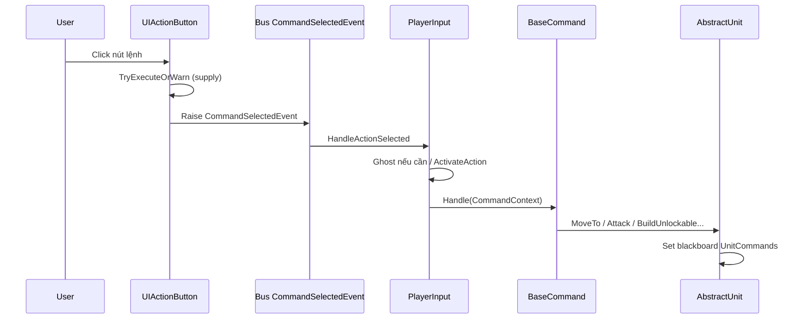
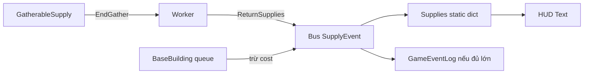

# Tài liệu kỹ thuật đầy đủ — UTS RTS

> **Phiên bản:** theo codebase `Assets/Scripts` (198 file C#).  
> **Mục đích:** Mô tả **từng chức năng** (kể cả nhỏ) — file, luồng, dữ liệu, sự kiện.  
> **Tài liệu liên quan:** `RTS_TECHNICAL_REFERENCE.md` (tra cứu nhanh), `urts-architecture-map.md` (class/method), `survey-summary.md` (tổng quan điều hành).

---

## Mục lục

1. [Tổng quan dự án](#1-tổng-quan-dự-án)
2. [Bản đồ chức năng (A–Z)](#2-bản-đồ-chức-năng-az)
3. [Kiến trúc & luồng chính](#3-kiến-trúc--luồng-chính)
4. [Hệ thống chi tiết](#4-hệ-thống-chi-tiết)
5. [Danh mục script (198 file)](#5-danh-mục-script-198-file)
6. [Dữ liệu ScriptableObject](#6-dữ-liệu-scriptableobject)
7. [Scene, Prefab, UI](#7-scene-prefab-ui)
8. [Third-party & Multiplayer](#8-third-party--multiplayer)
9. [Công cụ Editor](#9-công-cụ-editor)
10. [Phụ lục: Quy tắc mở rộng](#10-phụ-lục-quy-tắc-mở-rộng)

---

## 1. Tổng quan dự án

| Hạng mục | Giá trị |
|----------|---------|
| Engine | Unity 6 / URP |
| Thể loại | RTS (Age of Empires–style) |
| Namespace chính | `GameDevTV.RTS.*` |
| Giọng nói | `ProjectRTS.SpeechRecognition.*` + Vosk |
| AI unit | **Unity Behavior** (`BehaviorGraphAgent`) |
| Input | **Input System** + Cinemachine |
| Điều hướng | NavMesh |
| Sự kiện nội bộ | `Bus<T>` theo `Owner` |
| Dữ liệu game | `Assets/Data_Re/` (ưu tiên), `Assets/Data/` (legacy) |

### 1.1 Các phe (`Owner`)

Định nghĩa: `Assets/Scripts/Units/Owner.cs`

- `Player1` — người chơi local (HUD, fog reveal, event log, input).
- `AI1` … `AI7` — phe AI / động vật (ví dụ wildlife thường dùng `AI1`).
- `Unowned`, `Invalid` — trung tính / lỗi.

Mọi `Bus<T>.Raise` **phải** dùng đúng `Owner` của entity phát sự kiện.

---

## 2. Bản đồ chức năng (A–Z)

| Chức năng | Mô tả ngắn | File / hệ thống chính |
|-----------|------------|------------------------|
| **Attack (unit)** | Ra lệnh tấn công, behavior tấn công, projectile | `AttackCommand`, `AttackTargetAction`, `Archer`, `Grenadier` |
| **Attack (tower)** | Tháp tự bắn khi operational | `BuildingAutoAttack`, `TowerDownwardProjectileFlight` |
| **Attack range ring** | Vòng tầm đánh khi chọn unit | `UnitAttackRangeDisplay`, `AttackRangeDisplayInstaller` |
| **Auto-scroll chat** | Cuộn log sự kiện xuống dưới | `GameEventLogScrollController`, `GameEventLogUI` |
| **Box selection** | Kéo chọn nhiều unit | `PlayerInput.HandleDragSelect` |
| **Build building** | Ghost đặt nhà, worker xây | `BuildBuildingCommand`, `Worker.Build`, `BuildBuildingAction` |
| **Build queue UI** | Nút hàng đợi sản xuất/nghiên cứu | `UIBuildQueueButton`, `BuildingBuildingUI` |
| **Build unit** | Train unit từ building | `BuildUnitCommand`, `BaseBuilding.DoBuildUnits` |
| **Building ghost** | Placeholder khi đặt nhà | `Placeholder`, `PlaceholderSpawnEvent` |
| **Building placement rules** | NavMesh, khoảng cách supply | `BuildingRestrictionSO` |
| **Building progress** | % xây, pause/resume | `BuildingProgress`, `Worker.ResumeBuilding` |
| **Camera pan/zoom/rotate** | Điều khiển camera RTS | `PlayerInput`, `CameraConfig`, Cinemachine |
| **Cancel building** | Worker hủy xây dở | `CancelBuildingCommand`, `Worker.CancelBuilding` |
| **Command palette** | Lưới nút lệnh theo selection | `ActionsUI`, `UIActionButton` |
| **Command override** | Menu phụ (vd. danh sách nhà) | `OverrideCommandsCommand`, `AvailableCommandsResolver` |
| **Corpse food** | Xác động vật → supply thức ăn | `SpawnCorpseFoodSupplyAction`, `WildAnimal` |
| **Damage sensor** | Phát hiện địch trong tầm | `DamageableSensor` |
| **Death sequence** | Animation chết, sink, destroy | `UnitDeathController`, `Behavior/Death/*` |
| **Deposit supplies** | Worker mang tài nguyên về nhà | `FindClosestCommandPostAction`, `SupplyDepositLocator` |
| **Event log (chat)** | Nhật ký sự kiện tiếng Việt | `GameEventLog`, `PlayerGameEventLogListener` |
| **Fog of war** | Ẩn renderer ngoài tầm nhìn | `FogVisibilityManager`, `IHideable` |
| **Formation move** | Di chuyển vòng tròn đa unit | `MoveCommand` |
| **Gather** | Thu đá/gỗ/thức ăn trên map | `GatherCommand`, `GatherSuppliesAction`, `GatherableSupply` |
| **Gather upgrades** | Bonus gather amount/time | `UpgradeSO` → `GatherAmountBonus`, `GatherTimeMultiplier` |
| **Health bar (world)** | Thanh máu trên unit | `UnitWorldHealthBar` |
| **Health bar style** | Màu theo phe | `OwnerHealthBarStyleSO` |
| **Homing arrow** | Mũi tên Archer | `HomingArrowFlight`, `ProjectileArcMath` |
| **Hover cursor** | Con trỏ OS khi hover unit | `UnitSelectionHoverCursor`, `SystemCursorTextureBaker` |
| **Insufficient resource warning** | Cảnh báo thiếu tài nguyên | `SupplyAffordability`, `CommandSupplyCostUtility` |
| **Load / unload transport** | Load unit vào máy bay | `LoadUnitCommand`, `AirTransport`, `UnitTransportUI` |
| **Minimap** | Bản đồ thu nhỏ, click pan camera | `MinimapController`, `MinimapInputHandler` |
| **Minimap fog overlay** | Sương mù đã khám phá trên minimap | `MinimapExploredFogOverlay` |
| **Minimap icons** | Icon unit/supply | `MinimapUnitIconsController`, `MinimapSupplyIconsController` |
| **Movement cursor** | Marker đích di chuyển | `MovementCursor`, `AbstractUnit` (prefab cursor) |
| **Multi-unit selection UI** | Panel chọn nhiều unit | `MultiUnitSelectionUI` |
| **Passive food (corral)** | Nhà sinh food theo tick | `PassiveFoodGeneratorBuilding` |
| **Population HUD** | Đếm unit sống Player1 | `Supplies.RefreshPlayer1PopulationHud` |
| **Research upgrade** | Nghiên cứu trong queue | `ResearchUpgradeCommand`, `UpgradeSO` |
| **Resume construction** | Click nhà dở để worker tiếp tục | `BuildBuildingCommand.TryGetResumeTarget` |
| **Right-click command** | Lệnh ngữ cảnh theo raycast | `PlayerInput.HandleRightClick` |
| **Selection decal** | Vòng chọn dưới chân unit | `AbstractCommandable.decalProjector` |
| **Single-unit stats** | Damage, tốc đánh, tốc chạy, tầm | `UnitStatsPanelUI`, `UnitStatSlotUI` |
| **Speech commands (VN)** | STT → lệnh game | `VoiceCommandRouter`, Vosk |
| **Stat upgrades** | Damage, health, move, attack delay | `AdditiveIntModifierSO`, `AdditiveFloatModifierSO` |
| **Stop command** | Dừng unit | `StopCommand` → `UnitCommands.Stop` |
| **Supply HUD** | Đá, gỗ, lương thực trên UI | `Supplies` |
| **Supply nodes** | Node trên map có lượng hữu hạn | `GatherableSupply` |
| **Tech tree unlock** | Mở khóa unit/building/upgrade | `TechTreeSO` |
| **Tooltip command** | Chi phí, yêu cầu tech | `UIActionButton.GetTooltipText` |
| **Unit icon strip** | Icon unit đang chọn | `UnitIconUI` |
| **Vision radius** | Scale collider/decal tầm nhìn | `SightConfigSO`, `RefreshVisionFromSightConfig` |
| **Voice fuzzy match** | Khớp mờ câu nói | `FuzzyVoiceCommandResolver` |
| **Wild animal AI** | Ăn, đi lang thang, command eval | `Animal Graph`, `WildAnimal`, `AnimalAIConfigSO` |
| **Worker return supplies** | Mang tài nguyên về kho | Behavior graph + `SupplyDepositLocator` |

---

## 3. Kiến trúc & luồng chính

### 3.1 Luồng một lệnh người chơi (UI)

### 3.2 Luồng tài nguyên

### 3.3 Luồng fog

`FogVisibilityManager` (LateUpdate) → đọc texture camera fog → `IHideable.SetVisible` cho mọi object đăng ký (unit, building, supply, placeholder).

---

## 4. Hệ thống chi tiết

### 4.1 Event Bus (`EventBus/Bus.cs`)

**Mục tiêu:** Decouple gameplay và UI qua sự kiện theo phe.

| API | Mô tả |
|-----|--------|
| `Bus<T>.OnEvent[owner]` | Delegate multicast cho từng `Owner` |
| `Bus<T>.Raise(owner, evt)` | Phát sự kiện |
| `RegisterForAll(handler)` | Đăng ký mọi phe (fog, supplies init) |
| `UnregisterForAll(handler)` | Hủy đăng ký |

**Ràng buộc:** `T : IEvent` (marker `IEvent`).

#### 4.1.1 Bảng sự kiện (`Events/`)

| Event | Payload chính | Nơi Raise (gợi ý) | Subscriber (gợi ý) |
|-------|-----------------|-------------------|---------------------|
| `UnitSelectedEvent` | `ISelectable Unit` | `AbstractCommandable.Select` | `RuntimeUI`, `UnitSelectionHoverCursor` |
| `UnitDeselectedEvent` | `ISelectable Unit` | `Deselect` | `RuntimeUI` |
| `UnitSpawnEvent` | `AbstractUnit Unit` | `AbstractUnit` notify spawn | `Supplies`, minimap |
| `UnitDeathEvent` | `AbstractUnit Unit` | Death flow | `RuntimeUI`, `BaseBuilding`, fog |
| `UnitLoadEvent` / `UnitUnloadEvent` | transport | `AirTransport` | `RuntimeUI` |
| `BuildingSpawnEvent` | `BaseBuilding` | `BaseBuilding.Start` | `TechTreeSO`, UI |
| `BuildingDeathEvent` | `BaseBuilding` | Destroy | `TechTreeSO`, fog |
| `BuildingConstructStartedEvent` | building | Construction start | `PlayerGameEventLogListener` |
| `SupplyEvent` | amount, `SupplySO` | Gather, build cost, passive food | `Supplies`, log (nếu lớn) |
| `SupplySpawnEvent` / `SupplyDepletedEvent` | supply node | `GatherableSupply` | Fog, minimap |
| `CommandSelectedEvent` | `BaseCommand` | `ActionsUI` | `PlayerInput` |
| `UpgradeResearchedEvent` | `UpgradeSO` | `BaseBuilding` queue xong | `TechTreeSO`, units, UI, log |
| `PlaceholderSpawnEvent` / `Destroy` | placeholder | Ghost build | `FogVisibilityManager` |

---

### 4.2 Hệ lệnh (`Commands/`)

#### 4.2.1 `BaseCommand` (abstract ScriptableObject)

| Thuộc tính / API | Ý nghĩa |
|------------------|---------|
| `Slot` (-1…8) | Vị trí trên `ActionsUI` |
| `RequiresClickToActivate` | `false` → kích hoạt ngay khi chọn nút |
| `IsSingleUnitCommand` | Chỉ 1 unit thực thi (formation index) |
| `GhostPrefab` | Prefab ghost (đặt nhà) |
| `Restrictions[]` | `BuildingRestrictionSO` kiểm tra vị trí |
| `CanHandle(ctx)` | Có xử lý được context không |
| `Handle(ctx)` | Thực thi lệnh |
| `IsLocked(ctx)` | Nút xám (thiếu tài nguyên, tech, queue…) |
| `IsAvailable(ctx)` | Có hiện trên UI không |
| `AllRestrictionsPass(point)` | Vị trí đặt hợp lệ |
| `IsHitColliderVisible` | Mục tiêu không bị fog che |

#### 4.2.2 Từng lệnh

| Lệnh | Kích hoạt | Handle làm gì | Khóa khi |
|------|-----------|---------------|----------|
| **MoveCommand** | Click map / UI | `MoveTo` + formation vòng | Không khóa |
| **StopCommand** | UI | `Stop()` | Không khóa |
| **AttackCommand** | Click địch visible | `Attack(target)` | — |
| **GatherCommand** | Click supply | Set gather blackboard | — |
| **BuildBuildingCommand** | Ghost + click | `Worker.Build` hoặc `ResumeBuilding` | Thiếu tài nguyên, chưa unlock; **cảnh báo** khi thiếu |
| **BuildUnitCommand** | UI (nhà) | `BuildUnlockable(UnitSO)` | Thiếu tài nguyên, tech; **cảnh báo** |
| **ResearchUpgradeCommand** | UI (nhà) | Queue `UpgradeSO` | Thiếu tài nguyên, đã research, đã trong queue; **cảnh báo** |
| **CancelBuildingCommand** | UI (worker đang xây) | Hủy construction | — |
| **LoadUnitCommand** | Click unit | Load vào transport | Transport đầy |
| **LoadIntoCommand** | — | Load selection | — |
| **UnloadAllUnitsCommand** | UI | Unload all | Không có cargo |
| **OverrideCommandsCommand** | UI | Thay palette tạm | — |

#### 4.2.3 `CommandContext`

- `Commandable`, `Hit` (raycast), `UnitIndex` (formation), `MouseButton`, `Owner`.

#### 4.2.4 `AvailableCommandsResolver`

Gom lệnh: override commands trước, sau đó `AvailableCommands` (bỏ nested override). Dùng chung cho **click phải** và tránh lệch thứ tự UI.

#### 4.2.5 `CommandSupplyCostUtility` + `SupplyAffordability`

- **`SupplyAffordability.HasEnough`:** so sánh Stone/Wood/Food với `Supplies` static.
- **`WarnPlayerIfInsufficient`:** ghi `GameEventLog` (category `Warning`), throttle 1.5s.
- Tích hợp: `BuildUnitCommand`, `BuildBuildingCommand`, `ResearchUpgradeCommand`, `UIActionButton`, `PlayerInput` (đặt nhà thất bại).

#### 4.2.6 `BuildingRestrictionSO`

Kiểm tra đặt nhà: overlap, NavMesh, khoảng cách supply (đọc file asset trong `Data_Re/Commands/`).

---

### 4.3 Player (`Player/`)

| File | Chi tiết chức năng |
|------|-------------------|
| **PlayerInput** | Box select; click chọn; **trái** activate command; **phải** context command; ghost building + material valid/invalid; NavMeshObstacle probe; Cinemachine pan/zoom/xoay; implement `IMinimapCameraNavigator`; layer mask selectable/floor/interactable |
| **Supplies** | Static `Stone/Wood/Food/Population` per Owner; HUD TMP; subscribe `SupplyEvent`; đếm population Player1 qua `UnitSpawn/Death` |
| **SupplyAffordability** | Kiểm tra + cảnh báo thiếu tài nguyên (xem 4.2.5) |
| **FogVisibilityManager** | Sample fog RT → `SetVisible` trên `IHideable` |
| **Placeholder** | Ghost building; `IHideable`; events spawn/destroy |
| **CameraConfig** | Min/max zoom, tốc độ pan/rotate |
| **IHideable** | `IsVisible`, `SetVisible`, event đổi visibility |
| **UnitSelectionHoverCursor** | Mirror selection; đổi cursor OS khi hover unit có thể chọn |

---

### 4.4 Units — lớp & interface

#### 4.4.1 `AbstractCommandable`

- Clone `UnitSO` mỗi instance (`Awake`).
- `Select`/`Deselect` → decal + `UnitSelected/DeselectedEvent`.
- `TakeDamage` / `Heal` / `Die`.
- `SetCommandOverrides` — palette tạm (đang build).
- `RefreshVisionFromSightConfig` — scale `VisionTransform`.
- Subscribe `UpgradeResearchedEvent` → `upgrade.Apply(UnitSO)` + sync health.

#### 4.4.2 `AbstractUnit`

- `NavMeshAgent`, `BehaviorGraphAgent`, `DamageableSensor`.
- Blackboard: `Command`, `AttackConfig`, targets, gather, build…
- `MoveTo`, `Attack`, `Stop` → set `UnitCommands` + biến graph.
- `MovementDestinationCursor` prefab khi move.
- `UnitDeathController` + `EnsureAttackRangeDisplay` (unit có attack).
- `OnUpgradeAppliedToRuntime` — sync move speed, sensor.

#### 4.4.3 Các loại unit cụ thể

| Class | Vai trò |
|-------|---------|
| **Worker** | `IBuildingBuilder`, `ITransportable`; gather, build, resume, cancel, load; trừ tài nguyên khi `Build()`; `SupplyDepositLocator` cho return |
| **BaseMilitaryUnit** | Quân cơ bản + `ITransportable` |
| **Archer** | `IProjectileAttacker`, `HomingArrowFlight` |
| **Grenadier** | AoE + projectile |
| **AirTransport** | `ITransporter`, load/unload/warp NavMesh |
| **WildAnimal** | AI động vật; không auto-attack player; corpse food |

#### 4.4.4 Interface nhỏ

`ISelectable`, `IDamageable`, `IMoveable`, `IAttacker`, `IBuildingBuilder`, `ITransporter`, `ITransportable`, `IProjectileAttacker`, `IBuildingPassiveEffect` — tách contract theo ISP.

#### 4.4.5 ScriptableObject unit

| SO | Fields quan trọng |
|----|------------------|
| **UnitSO** | Prefab, AttackConfig, MoveSpeed, Gather bonuses, DeathConfig, Upgrades |
| **BuildingSO** | Prefab, queue production, Upgrades |
| **AttackConfigSO** | Range, Delay, Damage, projectile, AoE, layers |
| **SightConfigSO** | SightRadius |
| **SupplyCostSO** | Stone, Wood, Food |
| **UnitDeathConfigSO** | Animator, sink, timing |
| **AnimalAIConfigSO** | Roam, eat, sensor range |

#### 4.4.6 `UnitCommands` (enum)

`Stop`, `Move`, `Gather`, `ReturnSupplies`, `BuildBuilding`, `Attack`, `LoadUnits` — **phải khớp** Unity Behavior Graph.

#### 4.4.7 Combat phụ trợ

| File | Chức năng |
|------|-----------|
| **DamageableSensor** | Sphere trigger; list enemy; setup từ AttackConfig |
| **HostileTargetLocator** | Tìm hostile gần nhất (tower, AI) |
| **HomingArrowFlight** | Bay mũi tên tới mục tiêu |
| **ProjectileArcMath** | Quỹ đạo parabolic |
| **DamageableSensorAimUtility** | Điểm ngắm trên sensor |

---

### 4.5 Buildings (`BaseBuilding` + `Units/Buildings/`)

#### 4.5.1 `BaseBuilding`

| Chức năng | Chi tiết |
|-----------|----------|
| Queue | `List<UnlockableSO>`, max 5, coroutine `DoBuildUnits` |
| Enqueue | Trừ Stone/Wood/Food qua `SupplyEvent`; `CanEnqueueUpgrade` chống trùng upgrade |
| Cancel queue | Hoàn tài nguyên |
| Spawn unit | `Instantiate` prefab tại `unitSpawnPoint` |
| Research | `UpgradeSO` → `UpgradeResearchedEvent` |
| Construction | `BuildingProgress`: Building / Paused / Completed / Destroyed |
| Passive effects | `IBuildingPassiveEffect[]` — bật khi operational |
| Apply upgrades on Start | Giống unit |

#### 4.5.2 Passive & combat building

| Component | Chức năng |
|-----------|-----------|
| **BuildingAutoAttack** | Tìm hostile trong range; projectile rơi từ `attackOrigin`; `IBuildingPassiveEffect` |
| **TowerDownwardProjectileFlight** | Đạn rơi thẳng |
| **PassiveFoodGeneratorBuilding** | Tick food → `SupplyEvent` |
| **BuildingEffectUtility** | `IsOperational` = completed + alive + enabled |

---

### 4.6 Unity Behavior — từng node (`Behavior/`)

> Gắn trên graph asset trong `Assets/Data_Re/Behavior Graph/`. Code là `partial class` kế `Action` / `Condition`.

#### 4.6.1 Di chuyển & NavMesh

| Node | Hành vi |
|------|---------|
| `MoveToTargetLocationAction` | NavMesh tới `Vector3`, arrival slack, animation Speed |
| `MoveToTargetGameObjectAction` | NavMesh theo transform đích |
| `MoveToGatherableSupplyAction` | Tới supply; có thể tìm supply cùng loại trong bán kính |
| `StopAgentAction` | Dừng agent + animation |
| `SetNavMeshAgentEnabledAction` | Bật/tắt NavMeshAgent |
| `SetAgentAvoidanceAction` | Đổi avoidance priority |
| `SamplePositionAction` | Sample điểm NavMesh hợp lệ |
| `TranslatePositionAction` | Dịch transform (animation) |

#### 4.6.2 Gather & economy

| Node | Hành vi |
|------|---------|
| `GatherSuppliesAction` | `BeginGather` → chờ theo `BaseGatherTime * GatherTimeMultiplier` → `EndGather(bonus)` |
| `FindClosestCommandPostAction` | Tìm Store House / Civil Central (`SupplyDepositLocator`) |
| `GatherSuppliesEventChannel` | Event khi gather xong (graph wiring) |

#### 4.6.3 Build

| Node | Hành vi |
|------|---------|
| `BuildBuildingAction` | Worker xây theo progress; blackboard BuildingSO, TargetLocation |
| `BuildingIsInProgressCondition` | Đang xây? |
| `BuildingEventChannel` | Event lifecycle build |

#### 4.6.4 Combat

| Node | Hành vi |
|------|---------|
| `AttackTargetAction` | Trong tầm → đợi AttackDelay → damage / projectile / AoE |

#### 4.6.5 Utility blackboard

| Node | Hành vi |
|------|---------|
| `PickClosestPointOnColliderAction` | Điểm gần nhất trên collider |
| `PickClosestPointOnTargetColliderAction` | Điểm trên collider mục tiêu |
| `PickRandomLocationWithinRendererBoundsAction` | Điểm random trong bounds (animal roam) |
| `SetTargetFromFirstObjectInListAction` | Lấy target từ list |
| `GameObjectListSizeCondition` | So sánh size list |

#### 4.6.6 Animal (`Behavior/Animal/`)

| Node | Hành vi |
|------|---------|
| `AnimalIdleAnimationAction` | Idle/wander anim |
| `AnimalEatAnimationAction` | Ăn |
| `EvaluateAnimalAICommandAction` | Set `UnitCommands` từ `AnimalAIConfigSO` |
| `SpawnCorpseFoodSupplyAction` | Spawn `GatherableSupply` thức ăn tại xác |

#### 4.6.7 Death (`Behavior/Death/`)

| Node | Hành vi |
|------|---------|
| `SetUnitDeathAnimatorAction` | Trigger death anim |
| `WaitUnitDeathAnimationAction` | Chờ anim |
| `HoldUnitDeathPoseAction` | Giữ pose |
| `FreezeUnitDeathPoseAction` | Freeze animator |
| `SinkUnitDownAction` | Chìm xuống đất |
| `DisableUnitDeathGameplayAction` | Tắt gameplay (agent, sensor) |
| `DeathBehaviorNodeUtility` | Helper lấy `UnitDeathController` |

#### 4.6.8 Graph asset chính

| Asset | Dùng cho |
|-------|----------|
| `Worker BT.asset` | Worker |
| `Gather Sub Graph`, `Building Sub Graph` | Subgraph worker |
| `Military Unit Graph`, `Attacking Graph`, `Move Graph` | Quân |
| `Animal Graph` | Deer, Goat, Carrier |
| `Die Sub Graph` | Chết chung |

---

### 4.7 Tech Tree (`TechTree/`)

| Type | Chức năng |
|------|-----------|
| **TechTreeSO** | Graph phụ thuộc mỗi Owner; `IsUnlocked`, `IsResearched`, `GetUnmetDependencies` |
| **UnlockableSO** | Name, Cost, BuildTime, Icon, TechTree, unlockRequirements |
| **UpgradeSO** | PropertyPath (vd. `AttackConfig/Damage`), `Apply` qua reflection |
| **AdditiveIntModifierSO** / **AdditiveFloatModifierSO** | Cộng stat; `SetPropertyValue` hỗ trợ private set |
| **IModifier** | Contract apply lên `AbstractUnitSO` |

**Sự kiện:** `BuildingSpawnEvent` mở khóa dependency; `BuildingDeathEvent` có thể mất (trừ one-time); `UpgradeResearchedEvent` đánh dấu researched.

**Lưu ý PropertyPath:** phải khớp code (vd. `GatherAmountBonus` không phải `GatherAmount`).

---

### 4.8 UI (`UI/`)

#### 4.8.1 Hub

| File | Chức năng |
|------|-----------|
| **RuntimeUI** | Subscribe bus; route selection → đúng panel |

**Logic chọn 1 unit:** `UnitIconUI` + (`BaseBuilding` → `BuildingSelectedUI` | `ITransporter` có hàng → `UnitTransportUI` | else `SingleUnitSelectedUI`).

**Chọn nhiều:** `MultiUnitSelectionUI`.

#### 4.8.2 Containers

| Panel | Khi hiện | Chức năng |
|-------|----------|-----------|
| **ActionsUI** | Có selection | Lưới `UIActionButton`; refresh khi queue đổi |
| **SingleUnitSelectedUI** | 1 unit thường | Tên + `UnitStatsPanelUI` |
| **UnitStatsPanelUI** | Stats | Damage, attack speed, range, move; đếm upgrade level theo PropertyPath |
| **BuildingSelectedUI** | 1 building xong | Queue rỗng → stats; có queue → `BuildingBuildingUI` |
| **BuildingBuildingUI** | Đang queue | `UIBuildQueueButton` từng slot |
| **BuildingUnderConstructionUI** | Đang xây | Progress bar |
| **UnitIconUI** | Luôn khi 1 unit | Icon + health text |
| **UnitTransportUI** | Transport có cargo | `UIUnitButton` từng slot |
| **MultiUnitSelectionUI** | Nhiều unit | Nhóm theo loại, `MultiUnitTypeSlotUI` |

#### 4.8.3 Components

| Widget | Chức năng |
|--------|-----------|
| **UIActionButton** | Icon, tooltip cost, "Không đủ tài nguyên!", tech requirements; click → warn hoặc `CommandSelectedEvent` |
| **UIBuildQueueButton** | 1 ô queue; progress |
| **UIUnitButton** | 1 unit trong transport |
| **UnitStatSlotUI** | Giá trị stat + level upgrade + tooltip |
| **UnitWorldHealthBar** | World-space HP |
| **ProgressBar** | Fill 0–1 |
| **Tooltip** | Hover delay, position |
| **OwnerHealthBarStyleSO** | Màu HP theo Owner |

---

### 4.9 Game Event Log (`UI/GameEventLog/`)

| File | Chức năng |
|------|-----------|
| **GameEventLog** | Static buffer, max 50 dòng, `Post`, `LineAdded` |
| **GameEventLogCategory** | Info, Resource, Build, Combat, Warning |
| **GameEventLogLine** | message, category, time |
| **GameEventLogUI** | Append TMP text + ScrollRect; auto scroll bottom |
| **GameEventLogScrollController** | Hỗ trợ scroll |
| **GameEventLogPanelDragHandle** | Kéo panel |
| **GameEventLogLineView** | Prefab từng dòng (legacy/alternate) |
| **GameEventLogMessageFormatter** | Format supply/build/death/upgrade tiếng Việt |
| **PlayerGameEventLogListener** | Player1 subscribe bus → Post |

**Sự kiện được log (gợi ý):** supply ± lớn, build xong, mất building/unit, upgrade xong, bắt đầu xây, **cảnh báo thiếu tài nguyên**.

---

### 4.10 Minimap (`Minimap/`)

| File | Chức năng |
|------|-----------|
| **MinimapController** | Orchestrate render + icons + fog + input |
| **MinimapRenderCamera** | Camera ortho → RenderTexture |
| **MinimapMapBoundsSO** | World XZ bounds |
| **MinimapIconStyleSO** | Style icon theo loại/owner |
| **MinimapUnitIconsController** | Track units/buildings |
| **MinimapSupplyIconsController** | Track supplies |
| **MinimapIconView** | 1 icon UI |
| **MinimapInputHandler** | Click → pan camera (`IMinimapCameraNavigator`) |
| **MinimapExploredFogOverlay** | Overlay fog đã explore |
| **MinimapFogSystemReference** | Ref tới fog system |

---

### 4.11 Environment (`Environment/`)

| File | Chức năng |
|------|-----------|
| **GatherableSupply** | Lượng còn lại, gather time, `IHideable`, spawn/deplete events |
| **IGatherable** | Contract cho Worker/behavior |

---

### 4.12 Visualization (`Units/Visualization/`)

| File | Chức năng |
|------|-----------|
| **UnitAttackRangeDisplay** | LineRenderer vòng tròn + Gizmo; **chỉ unit** (không building) |
| **AttackRangeDisplayInstaller** | AddComponent khi có AttackRange > 0 |
| **AttackRangeCircleUtility** | Sinh điểm vòng tròn XZ |

---

### 4.13 Utilities (`Utilities/`)

| File | Chức năng |
|------|-----------|
| **SupplyDepositLocator** | Tìm Store House / Civil Central gần nhất để nộp tài nguyên |
| **HostileTargetLocator** | Hostile gần nhất trong range + layers |
| **ProjectileArcMath** | Toán học cung projectile |
| **DamageableSensorAimUtility** | Điểm ngắm |
| **AnimationConstants** | Hash animator: Speed, IsGathering, Attack |
| **ClosestGameObjectComparer** | Sort theo khoảng cách |
| **ClosestCommandPostComparer** | Sort command post |
| **ClosestColliderComparer** | Sort collider |
| **SystemCursorTextureBaker** | Bake texture cho custom cursor |

---

### 4.14 Movement (`Movement/`)

| File | Chức năng |
|------|-----------|
| **MovementCursor** | Prefab hiệu ứng điểm đích di chuyển (spawn từ `AbstractUnit`) |

---

### 4.15 Speech Recognition (`SpeechRecognition/`)

**Pipeline:** Microphone → `UnityMicrophoneSpeechDriver` → `VoskSpeechRecognitionBackend` → JSON text → `FuzzyVoiceCommandResolver` → `VoiceCommandRouter` → UnityEvent (nối tay tới gameplay).

| File | Chức năng |
|------|-----------|
| **VoiceCommandProfile** | SO: phrases, mappings |
| **VoiceCommandDatasetFile** | Load JSON dataset |
| **VietnameseSpeechDefaults** | Hằng số mặc định |
| **StringSimilarity** / **FuzzyVoiceCommandResolver** | Khớp mờ |
| **LinearMonoResampler** | Resample audio |
| **VoskJsonTextExtractor** | Parse JSON Vosk |
| **SpeechRecognitionDebugLogger** | Debug |

Dataset mẫu: `docs/voice-command-dataset.vi.json`, Resources `VoiceCommands/rts_voice_commands_standard_vi`.

---

### 4.16 Unit Death (`UnitDeathController` + graph)

- API từng bước: trigger anim, wait, hold, freeze, sink, disable gameplay.
- `AbstractUnit` fallback nếu không có graph.
- Graph: `Die Sub Graph.asset`.

---

## 5. Danh mục script (198 file)

> Đường dẫn gốc: `Assets/Scripts/`. Bảng đầy đủ theo thư mục — dùng Ctrl+F tên file khi tra cứu.

### `Behavior/` (27 files)

`AttackTargetAction`, `BuildBuildingAction`, `BuildingEventChannel`, `BuildingIsInProgressCondition`, `FindClosestCommandPostAction`, `GameObjectListSizeCondition`, `GatherSuppliesAction`, `GatherSuppliesEventChannel`, `LoadUnitEventChannel`, `MoveToGatherableSupplyAction`, `MoveToTargetGameObjectAction`, `MoveToTargetLocationAction`, `PickClosestPointOnColliderAction`, `PickClosestPointOnTargetColliderAction`, `PickRandomLocationWithinRendererBoundsAction`, `SamplePositionAction`, `SetAgentAvoidanceAction`, `SetNavMeshAgentEnabledAction`, `SetTargetFromFirstObjectInListAction`, `StopAgentAction`, `TranslatePositionAction`

### `Behavior/Animal/` (4)

`AnimalEatAnimationAction`, `AnimalIdleAnimationAction`, `EvaluateAnimalAICommandAction`, `SpawnCorpseFoodSupplyAction`

### `Behavior/Death/` (7)

`DeathBehaviorNodeUtility`, `DisableUnitDeathGameplayAction`, `FreezeUnitDeathPoseAction`, `HoldUnitDeathPoseAction`, `SetUnitDeathAnimatorAction`, `SinkUnitDownAction`, `WaitUnitDeathAnimationAction`

### `Commands/` (20)

`AttackCommand`, `AvailableCommandsResolver`, `BaseCommand`, `BuildBuildingCommand`, `BuildingRestrictionSO`, `BuildUnitCommand`, `CancelBuildingCommand`, `CommandContext`, `CommandSupplyCostUtility`, `GatherCommand`, `ICommand`, `IUnlockableCommand`, `LoadIntoCommand`, `LoadUnitCommand`, `MoveCommand`, `OverrideCommandsCommand`, `ResearchUpgradeCommand`, `StopCommand`, `UnloadAllUnitsCommand`

### `Environment/` (2)

`GatherableSupply`, `IGatherable`

### `EventBus/` (3)

`Bus`, `IEvent`, `SupplySO`

### `Events/` (16)

`BuildingConstructStartedEvent`, `BuildingDeathEvent`, `BuildingSpawnEvent`, `CommandSelectedEvent`, `PlaceholderDestroyEvent`, `PlaceholderSpawnEvent`, `SupplyDepletedEvent`, `SupplyEvent`, `SupplySpawnEvent`, `UnitDeathEvent`, `UnitDeselectedEvent`, `UnitLoadEvent`, `UnitSelectedEvent`, `UnitSpawnEvent`, `UnitUnloadEvent`, `UpgradeResearchedEvent`

### `MapTools/Editor/` (1)

`QuickPrefabScatterWindow`

### `Minimap/` (12)

`IMinimapCameraNavigator`, `MinimapController`, `MinimapExploredFogOverlay`, `MinimapFogSystemReference`, `MinimapIconStyleSO`, `MinimapIconView`, `MinimapInputHandler`, `MinimapMapBoundsSO`, `MinimapMarkerPresentation`, `MinimapRenderCamera`, `MinimapSupplyIconsController`, `MinimapUnitIconsController`

### `Movement/` (1)

`MovementCursor`

### `Player/` (8)

`CameraConfig`, `FogVisibilityManager`, `IHideable`, `Placeholder`, `PlayerInput`, `Supplies`, `SupplyAffordability`, `UnitSelectionHoverCursor`

### `SpeechRecognition/Core/` (13) + `Vosk/` (1)

`FuzzyVoiceCommandResolver`, `ISpeechRecognitionBackend`, `IVoiceCommandResolver`, `LinearMonoResampler`, `SpeechRecognitionBackendBehaviour`, `SpeechRecognitionDebugLogger`, `StringSimilarity`, `UnityMicrophoneSpeechDriver`, `VietnameseSpeechDefaults`, `VoiceCommandDatasetFile`, `VoiceCommandProfile`, `VoiceCommandRouter`, `VoskJsonTextExtractor`, `VoskSpeechRecognitionBackend`

### `TechTree/` (7)

`AdditiveFloatModifierSO`, `AdditiveIntModifierSO`, `IModifier`, `InvalidPathSpecifiedException`, `TechTreeSO`, `UnlockableSO`, `UpgradeSO`

### `UI/` + subfolders (29)

`IUIElement`, `OwnerHealthBarStyleSO`, `RuntimeUI`; Components (7); Containers (9); GameEventLog (10)

### `Units/` + `Buildings/` + `Visualization/` (51)

Xem mục 4.4–4.6 và bảng explore agent — gồm toàn bộ entity, SO, combat, transport, building passives, range display.

### `Utilities/` (9)

`AnimationConstants`, `ClosestColliderComparer`, `ClosestCommandPostComparer`, `ClosestGameObjectComparer`, `DamageableSensorAimUtility`, `HostileTargetLocator`, `ProjectileArcMath`, `SupplyDepositLocator`, `SystemCursorTextureBaker`

---

## 6. Dữ liệu ScriptableObject

### 6.1 Thư mục `Assets/Data_Re/` (chính)

| Thư mục | Nội dung |
|---------|---------|
| `Animal/` | Deer, Goat, Carrier + configs |
| `Behavior Graph/` | Toàn bộ graph `.asset` |
| `Buildings/` | Building SO, tower/corral attack, lệnh build/research |
| `Commands/` | Move, Attack, Gather, restrictions, Show Buildings… |
| `Cost/` | Preset `SupplyCostSO` (5S, 50S, 50S50W50F…) |
| `Minimap/` | Map bounds, icon style |
| `SightConfigs/` | Bán kính vision unit/building |
| `Supply/` | Stone, Wood, Food |
| `UI/` | Health bar style, minimap style |
| `Unit/` | Worker, Archer, Knight, Mage, Warrior + attack/death |
| `Upgrades/` | Damage, Health, Move, Gather, Attack Delay (tier 1–3) |

### 6.2 Legacy `Assets/Data/`

Song song `Data_Re` — ưu tiên chỉnh `Data_Re` khi thêm nội dung mới.

### 6.3 Ánh xạ SO → Type C#

| Menu CreateAsset | Class |
|------------------|-------|
| Units/Unit | `UnitSO` |
| Buildings/… | `BuildingSO` |
| Supply Cost | `SupplyCostSO` |
| Units/Attack Config | `AttackConfigSO` |
| Tech Tree/… | `TechTreeSO`, `UpgradeSO`, modifiers |
| Buildings/Building Auto Attack Config | `BuildingAutoAttackConfigSO` |

---

## 7. Scene, Prefab, UI

### 7.1 Scene

| Scene | Path | Ghi chú |
|-------|------|---------|
| Game | `Assets/Scenes/Game.unity` | Scene chính |
| Game 1 | `Assets/Scenes/Game 1.unity` | Biến thể (Chat Bar, UI mở rộng) |
| SampleScene | `Assets/Scenes/SampleScene.unity` | Test |
| RtsNet_Lobby / Game | `Assets/3rdParty/RTS_Multiplayer/Scenes/` | Multiplayer Mirror |

### 7.2 Prefab gameplay quan trọng

| Nhóm | Path |
|------|------|
| Fog | `Assets/Prefab/Fog of War 1.prefab`, `Vision.prefab` |
| UI runtime | `Assets/UI/Runtime UI UGUI.prefab` |
| Buildings | `Assets/Prefab/Buildings/*` (barrack, defense_tower, corral, …) |
| Units | `Assets/Prefab/Unit/*` |
| Animals | `Assets/Prefab/Animal/*` |
| Movement | `Assets/Prefab/MovementCursor.prefab` |

### 7.3 Wiring Inspector (không đọc được từ code)

- `AbstractCommandable.AvailableCommands` — palette lệnh.
- `BehaviorGraphAgent` — graph asset per prefab.
- `PlayerInput` — layers, Cinemachine, ghost materials.
- `RuntimeUI` — reference các panel.
- `GameEventLogUI` — Chat Bar trên scene.

---

## 8. Third-party & Multiplayer

| Package | Path | Vai trò |
|---------|------|---------|
| **Mirror** | `Assets/3rdParty/Mirror/` | Networking |
| **RTS_Multiplayer** | `Assets/3rdParty/RTS_Multiplayer/` | Lobby + game 2 người; economy riêng `RtsPlayerEconomy` |
| **RtsFaunaImport_All** | Fauna meshes/animations |
| **Vosk** | `Assets/3rdParty/Plugins/` | Native STT |

Scripts multiplayer: `RtsNetworkManager`, `RtsLobbyUI`, `RtsGameCommander`, `RtsUnit`, … — **tách** khỏi `Supplies` single-player chính.

---

## 9. Công cụ Editor

| Tool | File | Chức năng |
|------|------|-----------|
| Quick Prefab Scatter | `MapTools/Editor/QuickPrefabScatterWindow.cs` | Scatter prefab lên terrain trong Editor |

Thư mục trống (dự phòng): `Scripts/Debugging/`, `Scripts/TechTree/Editor/`.

---

## 10. Phụ lục: Quy tắc mở rộng

### 10.1 Thêm lệnh mới

1. Tạo class kế `BaseCommand` + `[CreateAssetMenu]`.
2. Tạo asset trong `Data_Re/Commands/` hoặc `Buildings/Commands/`.
3. Gán vào `AvailableCommands` trên prefab building/unit.
4. Nếu cần click map: `RequiresClickToActivate = true`, xử lý trong `PlayerInput.ActivateAction`.
5. Nếu có cost: dùng `SupplyAffordability` trong `Handle` và/hoặc `CommandSupplyCostUtility` cho UI.

### 10.2 Thêm event mới

1. Struct trong `Events/` implement `IEvent`.
2. `Raise` tại điểm gameplay.
3. Subscribe trong `OnEnable`, unsubscribe `OnDestroy`.
4. (Tuỳ chọn) Format trong `GameEventLogMessageFormatter` + `PlayerGameEventLogListener`.

### 10.3 Thêm upgrade stat

1. `UpgradeSO` với `PropertyPath` khớp property C# (vd. `AttackConfig/Damage`).
2. Thêm vào `UnitSO.Upgrades` hoặc `BuildingSO.Upgrades`.
3. Đăng ký trong `TechTreeSO.allUnlockables`.
4. `UnitStatsPanelUI` — thêm slot + path nếu hiển thị UI.

### 10.4 Thêm behavior node

1. Script mới trong `Behavior/` kế `Action` hoặc `Condition`.
2. Recompile → node xuất hiện trong Behavior Graph editor.
3. Nối vào graph asset trên prefab.

### 10.5 SOLID trong project

| Nguyên tắc | Ví dụ trong UTS |
|------------|-----------------|
| **SRP** | Tách UI panel, `SupplyAffordability`, `HostileTargetLocator`, death nodes |
| **OCP** | Thêm unit/building qua SO + graph, không sửa `AbstractUnit` |
| **LSP** | `AbstractUnit` thay thế qua `IMoveable`/`IAttacker` |
| **ISP** | `ITransporter`, `IGatherable`, `IBuildingPassiveEffect` nhỏ |
| **DIP** | Commands/UI phụ thuộc `Bus`, interface; SO inject qua Inspector |

---

## Cập nhật tài liệu

Khi thêm hệ thống mới, cập nhật:

1. Mục **2. Bản đồ chức năng** (1 dòng).
2. Mục **4. Hệ thống chi tiết** (subsection).
3. Mục **5. Danh mục script** (nếu thêm file).
4. `docs/README.md` (link nếu cần).

*Tài liệu sinh từ inventory codebase — bổ sung wiring Inspector trên scene/prefab khi triển khai thực tế.*
