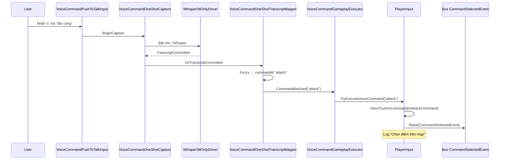

# Trả lời phản biện — Phần III. Kiến trúc & thiết kế (Chương 2)

Bổ sung cho [`Luyen-Phan-Bien-Do-An.md`](./Luyen-Phan-Bien-Do-An.md) — **Phần III hoàn chỉnh** (câu 12–17).

**Phần I:** [`Tra-Loi-Phan-Bien.md`](./Tra-Loi-Phan-Bien.md) · **Phần II:** [`Tra-Loi-Phan-Bien-II-Cong-Nghe.md`](./Tra-Loi-Phan-Bien-II-Cong-Nghe.md)

---

## Mục lục

- [Câu 12 — Pipeline 7 bước](#cau-12)
- [Câu 13 — SOLID & 6 phân hệ](#cau-13)
- [Câu 14 — Command Pattern + Event Bus](#cau-14)
- [Câu 15 — Ma trận trách nhiệm & thêm lệnh voice](#cau-15)
- [Câu 16 — ScriptableObject vs JSON](#cau-16)
- [Câu 17 — Sequence “tấn công” vs code](#cau-17)

---

<a id="cau-12"></a>

## Câu 12 — Pipeline 7 bước: mic → ASR → chuẩn hóa → map → xác thực server → thực thi → sync

**Hỏi:** Vẽ lại pipeline 7 bước. Bước nào **client-only**, bước nào **bắt buộc server**?

### Trả lời ngắn (phân loại)

| Bước | Nội dung | Client-only hay bắt buộc server? |
|------|----------|------------------------------------|
| 1 | Mic/thu âm + điều khiển PTT | **Client-only** |
| 2 | ASR (Whisper) | **Client-only** |
| 3 | Chuẩn hóa text (bỏ dấu, lowercase, bỏ punctuation) | **Client-only** |
| 4 | Map transcript → `commandId` → yêu cầu lệnh | **Client-only** (map để tạo “yêu cầu”) |
| 5 | **Xác thực server** (quyền điều khiển/owner, tính hợp lệ lệnh, kiểm tra ngữ cảnh tài nguyên & mục tiêu khi cần) | **Bắt buộc server** |
| 6 | **Thực thi lệnh** (chạy `BaseCommand.Handle`/xử lý logic RTS) | **Bắt buộc server** |
| 7 | Sync trạng thái sang các client khác (owner/fog, hiệu ứng gather/target, biến đổi networked) | **Server → clients** (sync bắt buộc server) |

### Code minh họa theo từng cụm bước

1) **Mic + PTT (client-only)**
- `Assets/Scripts/SpeechRecognition/VoiceCommandPushToTalkInput.cs`
- `Assets/Scripts/SpeechRecognition/VoiceCommandOneShotCapture.cs`

2) **ASR Whisper (client-only)**
- `Assets/Scripts/SpeechRecognition/Whisper/WhisperSttOnlyDriver.cs`

3) **Chuẩn hóa (client-only)**
- `Assets/Scripts/SpeechRecognition/Core/RecognizedSpeechPhraseNormalizer.cs`
- `Assets/Scripts/SpeechRecognition/Core/VietnameseTextNormalizer.cs`

4) **Map → commandId → yêu cầu lệnh (client-only)**
- `Assets/Scripts/SpeechRecognition/Core/VoiceCommandOneShotTranscriptMapper.cs`
- `Assets/Scripts/SpeechRecognition/Core/FuzzyVoiceCommandResolver.cs`
- `Assets/Scripts/SpeechRecognition/Core/RecognizedSpeechPhraseMapper.cs`
- `Assets/Scripts/SpeechRecognition/VoiceCommandGameplayExecutor.cs` (gọi `PlayerInput.TryExecuteVoiceCommand`)
- `Assets/Scripts/Player/PlayerInput.Voice.cs` (selection / arm command / stop / gather...)

5–6) **Xác thực server + thực thi (bắt buộc server)**
- Relay client request: `Assets/Scripts/Netplay/PlayerInputNetworkBridge.cs`, `Assets/Scripts/Netplay/RtsUtsClientCommandRelay.cs`
- Server handler + verify quyền: `Assets/Scripts/Netplay/RtsUtsPlayerCommands.cs`
  - `TryResolveCommandable(...)`
  - `networkEntity.ServerCanAcceptOrdersFrom(connectionToClient.connectionId)`
- Nguồn sự thật owner: `Assets/Scripts/Netplay/RtsUtsNetworkEntity.cs`

7) **Sync (server → clients)**
- `[SyncVar] owner` + hook áp owner lên commandable: `RtsUtsNetworkEntity.cs`
- Presentation cho client: `RpcMirrorGatherPresentation`, `RpcMirrorAttackTarget` (trong `RtsUtsNetworkEntity.cs`)

### Một câu nhớ (khi hội đồng hỏi “tại sao bắt buộc server?”)

> Vì RTS trong LAN em theo server-authoritative: client chỉ “map” voice thành yêu cầu, còn server mới kiểm tra quyền/owner và thực thi `BaseCommand.Handle`, sau đó sync trạng thái qua SyncVar/ClientRpc để tránh desync và cheat.

---

<a id="cau-13"></a>

## Câu 13 — SOLID & 6 phân hệ

**Hỏi:** Tuân SOLID và 6 phân hệ — chỉ ra **một interface** và **một class** minh họa **SRP** và **DIP** (không nói chung chung).

### Trả lời ngắn

**6 phân hệ trong báo cáo ↔ code:**

| Phân hệ | Trách nhiệm | File ví dụ |
|---------|-------------|------------|
| Voice (ASR) | Thu âm, Whisper STT | `WhisperSttOnlyDriver.cs`, `VoiceCommandOneShotCapture.cs` |
| Command | Chuẩn hóa, fuzzy, map `commandId` | `FuzzyVoiceCommandResolver.cs`, `VoiceCommandIdActionRules.cs` |
| RTS Core | Gameplay, unit, lệnh | `Commands/BaseCommand.cs`, `PlayerInput.Voice.cs` |
| AI | Bot PvE | `AI/Core/AIController.cs` |
| Network | LAN, sync, authority | `Netplay/RtsUtsPlayerCommands.cs` |
| UI/UX | HUD, log phản hồi | `UI/GameEventLog/`, `PregameMpLobbyCoordinator.cs` |

**SRP — một class cụ thể:**

`FuzzyVoiceCommandResolver` — **chỉ** so khớp chuỗi STT với dataset (Levenshtein), trả `commandId`. Không thu âm, không chạy Whisper, không điều khiển unit.

**DIP — một interface cụ thể:**

`ISpeechRecognitionBackend` — gameplay/voice router phụ thuộc **abstraction**, không phụ thuộc Whisper hay Vosk. Implementation: `WhisperSpeechRecognitionBackend` (kế thừa `SpeechRecognitionBackendBehaviour`).

### Code minh họa khi trả lời

| Nguyên tắc | Thành phần | File |
|------------|------------|------|
| **SRP** | Chỉ fuzzy map | `Assets/Scripts/SpeechRecognition/Core/FuzzyVoiceCommandResolver.cs` |
| **SRP** (bổ sung) | Chỉ tính Levenshtein | `Assets/Scripts/SpeechRecognition/Core/StringSimilarity.cs` |
| **DIP** | Interface STT | `Assets/Scripts/SpeechRecognition/Core/ISpeechRecognitionBackend.cs` |
| **DIP** | Implement Whisper | `Assets/Scripts/SpeechRecognition/Whisper/WhisperSpeechRecognitionBackend.cs` |
| **DIP** | Consumer không biết backend | `Assets/Scripts/SpeechRecognition/Core/VoiceCommandRouter.cs` (field `_backend`) |
| **DIP** (network) | `PlayerInput` không gọi Mirror trực tiếp | `Assets/Scripts/Netplay/PlayerInputNetworkBridge.cs` |

### Một câu nhớ

> SRP: `FuzzyVoiceCommandResolver` làm một việc — fuzzy matching. DIP: `VoiceCommandRouter` gọi `ISpeechRecognitionBackend`, đổi Whisper/Vosk không sửa router.

### Mẫu miệng (~ 40 giây)

> Em chia 6 phân hệ: Voice, Command, RTS Core, AI, Network, UI — mỗi phân hệ có folder/class riêng. SRP em minh họa bằng `FuzzyVoiceCommandResolver`: class này chỉ so khớp transcript với dataset, không xử lý mic hay gameplay. DIP em minh họa bằng `ISpeechRecognitionBackend`: `VoiceCommandRouter` và `WhisperSpeechRecognitionBackend` tách abstraction và implementation — đổi engine STT không phải sửa toàn bộ pipeline. Tương tự `PlayerInputNetworkBridge` tách `PlayerInput` khỏi Mirror.

---

<a id="cau-14"></a>

## Câu 14 — Command Pattern + Event Bus theo phe

**Hỏi:** **Command Pattern** + **Event Bus theo phe** — tại sao tách hai lớp? Một lệnh `MoveCommand` đi qua những class nào từ input đến unit?

### Trả lời ngắn — tại sao tách hai lớp?

| Lớp | Vai trò | Không làm gì |
|-----|---------|--------------|
| **Event Bus theo phe** (`Bus<T>` keyed `Owner`) | Pub/sub: chọn/bỏ chọn unit, arm lệnh, spawn/chết, UI sync | **Không** thực thi gameplay |
| **Command Pattern** (`BaseCommand` / `MoveCommand`) | Đóng gói hành động RTS: `CanHandle` → `Handle` | **Không** quản lý selection/UI |

**Lý do tách:**

1. **Trách nhiệm khác nhau (SRP):** Bus báo *“đã chọn unit / đã arm Move”*; `MoveCommand` mới *“di chuyển unit tới điểm”*.
2. **Đa phe:** `Bus<T>.OnEvent[Owner.Player1]` tách kênh Player1 / AI2 / AI3… — UI và `PlayerInput` subscribe theo phe local, không lẫn sự kiện đối thủ.
3. **Tái sử dụng lệnh:** Cùng `MoveCommand.Handle` cho người chơi (`PlayerInput`), bot (`AICommandDispatcher`), server MP (`RtsUtsPlayerCommands`) — AI **không** đi qua Event Bus lệnh.

### Luồng `MoveCommand` — right-click (mặc định)

| # | Class | Việc làm |
|---|-------|----------|
| 1 | `AbstractCommandable` | Chọn unit → `Bus<UnitSelectedEvent>.Raise(Owner, …)` |
| 2 | `PlayerInput` | `HandleUnitSelected` → cập nhật `selectedUnits` |
| 3 | `PlayerInput.HandleRightClick` | Raycast map |
| 4 | `AvailableCommandsResolver` | Chọn lệnh phù hợp (thường `MoveCommand`) |
| 5 | `PlayerInput.TryDispatchCommandsToUnits` | Tạo `CommandContext`, kiểm tra owner |
| 5b | *(MP client)* `RtsUtsClientCommandRelay` | `RequestUtsMove` → `[Command] CmdUtsMoveUnit` |
| 6 | `MoveCommand.Handle` | `unit.MoveTo(hit.point)` hoặc `MoveTo(target)` |
| 7 | `AbstractUnit` | Gán BT: `TargetLocation`, `Command = Move` → NavMesh/Behavior Graph chạy |

**Nhánh action bar:** `ActionsUI` → `Bus<CommandSelectedEvent>` → `PlayerInput.HandleActionSelected` → `SetActiveCommand` (+ `ActiveCommandChangedEvent` cho UI) → click map → bước 3–7.

**Nhánh multi-select:** `GroupFormationMoveUtility.TryApplyMove` gọi thẳng `unit.MoveTo` từng ô formation (bỏ qua `MoveCommand.Handle` từng unit).

### Code minh họa

| Thành phần | File |
|------------|------|
| Event Bus theo phe | `Assets/Scripts/EventBus/Bus.cs` |
| Sự kiện chọn / arm lệnh | `Assets/Scripts/Events/UnitSelectedEvent.cs`, `CommandSelectedEvent.cs`, `ActiveCommandChangedEvent.cs` |
| Command Pattern | `Assets/Scripts/Commands/BaseCommand.cs`, `MoveCommand.cs`, `CommandContext.cs` |
| Input → dispatch | `Assets/Scripts/Player/PlayerInput.cs` (`HandleRightClick`, `TryDispatchCommandsToUnits`) |
| UI raise event | `Assets/Scripts/UI/Containers/ActionsUI.cs` |
| AI (không Event Bus) | `Assets/Scripts/AI/Core/AICommandDispatcher.cs` |
| MP relay + server Handle | `Assets/Scripts/Netplay/RtsUtsClientCommandRelay.cs`, `RtsUtsPlayerCommands.cs` |
| Unit thực thi | `Assets/Scripts/Units/AbstractUnit.cs` (`MoveTo`) |

### Một câu nhớ

> Event Bus = *thông báo theo phe* (chọn unit, arm lệnh). Command Pattern = *hành động gameplay* (`Handle`). `MoveCommand` là điểm chung; Bus không thay thế được `Handle`.

### Mẫu miệng (~ 45 giây)

> Em tách hai lớp vì trách nhiệm khác nhau. Event Bus `Bus<T>` theo `Owner` chỉ pub/sub — ví dụ chọn unit, arm Move, cập nhật UI — mỗi phe một kênh riêng. Command Pattern qua `BaseCommand`/`MoveCommand` mới thực thi gameplay: `CanHandle` rồi `Handle`. Luồng Move: chọn unit → `UnitSelectedEvent` → `PlayerInput` → right-click → `AvailableCommandsResolver` chọn Move → tạo `CommandContext` → MP thì relay `CmdUtsMoveUnit` trên server, single-player/host gọi `MoveCommand.Handle` → `AbstractUnit.MoveTo` set biến Behavior Tree. AI dùng chung `MoveCommand` qua `AICommandDispatcher` mà không đi Event Bus.

---

<a id="cau-15"></a>

## Câu 15 — Ma trận trách nhiệm (Bảng 2.2): thêm lệnh giọng nói mới

**Hỏi:** Theo **ma trận trách nhiệm** (Bảng 2.2), thêm lệnh giọng nói mới — sửa file/module nào *tối thiểu*?

### Trả lời ngắn — ánh xạ Bảng 2.2 ↔ code thực tế

| Bảng 2.2 (báo cáo) | Code UTS | Anti-responsibility = *không sửa khi thêm voice* |
|--------------------|----------|--------------------------------------------------|
| VoiceProcessor | `WhisperSttOnlyDriver`, `ISpeechRecognitionBackend` | Không map nghĩa lệnh |
| CommandParser | `FuzzyVoiceCommandResolver`, `VietnameseTextNormalizer` | Không gameplay, không mạng |
| IGameCommand | `BaseCommand`, `VoiceCommandIdActionRules` | Không sync LAN trực tiếp |
| UnitController | `AbstractUnit` | Không quản lý tài nguyên |
| ResourceManager | `Supplies`, faction economy | Không xử lý STT |
| BuildingManager | `BuildBuildingCommand`, placement | Không fuzzy text |
| AIBotController | `AIController`, `AICommandDispatcher` | Không can thiệp voice |

### Sửa tối thiểu — theo loại lệnh mới

| Trường hợp | File *bắt buộc* | File *thường không cần* |
|------------|-----------------|-------------------------|
| **A. Alias mới** cho lệnh đã có (`stop`, `move`…) | `Assets/Resources/VoiceCommands/rts_voice_commands_uts_units_vi.json` | Mọi file `.cs` |
| **B. Lệnh chọn unit** `select_N_archetype` | Chỉ JSON (parser tự nhận `select_` + số + archetype) | `VoiceCommandIdActionRules.cs` |
| **C. Lệnh gameplay đã có trên UI** (build/train/research/gather/stop/move…) | JSON + **1 dòng** `VoiceCommandIdActionRules.BuildActions()` | Whisper, Fuzzy, Netplay, `BaseCommand` |
| **D. Hành vi voice hoàn toàn mới** | JSON + `VoiceCommandIdActionRules` (+ có thể thêm `VoiceGameplayActionKind`) + `PlayerInput.Voice.cs` | STT, Event Bus, AI |
| **E. Lệnh gameplay chưa tồn tại** | Thêm `BaseCommand` mới + case C hoặc D | — |

**Luồng sau khi sửa (không đổi):** JSON → `VoiceCommandOneShotTranscriptMapper` nạp Resources → `FuzzyVoiceCommandResolver` → `commandId` → `VoiceCommandGameplayExecutor` → `PlayerInput.TryExecuteVoiceCommand` → `BaseCommand` / selection (MP đi sẵn qua `PlayerInputNetworkBridge`).

### Ví dụ cụ thể

**Thêm “thu đá”** (đã có `gather_stone` + `GatherCommand`):
1. JSON: `CommandId: "gather_stone"`, thêm alias tiếng Việt.
2. *(Nếu id mới)* `VoiceCommandIdActionRules`: `["gather_stone"] = GatherNearestSupply(Stone)`.

**Thêm “chọn 3 cung thủ”:**
1. Chỉ JSON: `"CommandId": "select_3_archer"` — `TryParseSelectCommand` tự parse.

**Thêm “tuần tra”** (chưa có `BaseCommand` tương ứng): JSON + rules + `PlayerInput.Voice` + tạo command gameplay — **không** sửa Whisper/Netplay.

### Code minh họa

| Vai trò | File |
|---------|------|
| Dataset (OCP — mở rộng bằng data) | `Assets/Resources/VoiceCommands/rts_voice_commands_uts_units_vi.json` |
| Nạp JSON runtime | `Assets/Scripts/SpeechRecognition/Core/VoiceCommandOneShotTranscriptMapper.cs` |
| Map `commandId` → hành động | `Assets/Scripts/SpeechRecognition/Core/VoiceCommandIdActionRules.cs` |
| Thực thi voice | `Assets/Scripts/Player/PlayerInput.Voice.cs` |
| Lệnh gameplay dùng chung | `Assets/Scripts/Commands/*.cs` |

### Một câu nhớ

> Thêm voice **không phải** sửa Whisper hay Netplay. Tối thiểu: **JSON + `VoiceCommandIdActionRules`**; chỉ chạm `PlayerInput.Voice` khi cần **loại hành động mới**.

### Mẫu miệng (~ 40 giây)

> Theo ma trận Bảng 2.2, mỗi lớp có anti-responsibility — ví dụ VoiceProcessor chỉ xuất text, không map gameplay. Khi thêm lệnh voice, em sửa tối thiểu ở tầng dữ liệu và ánh xạ: file JSON trong Resources và một dòng trong `VoiceCommandIdActionRules` nếu lệnh map vào hành động đã có như stop, gather, build. Lệnh `select_N_worker` chỉ cần JSON vì rules tự parse. Không sửa Whisper, Fuzzy resolver, Mirror — vì voice sau khi có `commandId` đi chung pipeline `TryExecuteVoiceCommand` và `BaseCommand` như chuột. Chỉ khi cần hành vi hoàn toàn mới mới thêm case trong `PlayerInput.Voice` hoặc `BaseCommand` mới.

---

<a id="cau-16"></a>

## Câu 16 — ScriptableObject vs JSON cho lệnh thoại

**Hỏi:** **ScriptableObject** vs **JSON** cho lệnh thoại — khi nào dùng SO, khi nào JSON, ai là “source of truth” lúc runtime?

### Trả lời ngắn

| | **JSON** (`Resources/VoiceCommands/*.json`) | **ScriptableObject** (`VoiceCommandProfile`) |
|---|---------------------------------------------|-----------------------------------------------|
| **Vai trò** | **Authoring** — soạn dataset, alias, phụ lục báo cáo | **Runtime container** Unity hiểu — fuzzy, prompt, Inspector |
| **Khi dùng** | Thêm/sửa nhiều lệnh + alias; diff git; không cần mở Editor | Gắn Inspector, chỉnh `minSimilarity`, sandbox Vosk/Whisper streaming |
| **Ưu điểm** | OCP — mở rộng bằng data, không build lại code | SerializeField, `CreateAssetMenu`, dùng chung nhiều component |
| **Nhược điểm** | Không chỉnh trực quan ngưỡng fuzzy trong Inspector | Khó diff khi nhét hàng chục entry trực tiếp vào asset |

**Source of truth lúc runtime (trận chính):**

1. **Authoring / version control:** `rts_voice_commands_uts_units_vi.json`
2. **Awake:** `VoiceCommandOneShotTranscriptMapper` → `LoadFromResources` → `VoiceCommandProfile.ImportFromDatasetFile`
3. **Fuzzy thực sự đọc:** object `VoiceCommandProfile` **in-memory** sau import — tức **JSON được nạp vào SO**, SO là bộ nhớ chạy, JSON là nguồn ghi.

Mặc định `_loadDatasetFromResourcesOnAwake = true` → **JSON ghi đè** nội dung profile mỗi lần vào scene; không phụ thuộc asset `.asset` trên disk lúc chơi.

**Không nhầm với `BaseCommand` SO** (`MoveCommand`, `BuildBuildingCommand`…): đó là lệnh **gameplay** trên unit; JSON voice chỉ có `commandId` → `VoiceCommandIdActionRules` tìm `BaseCommand` tương ứng.

### Luồng runtime (one-shot production)

```
JSON (Resources)
  → VoiceCommandDatasetFile.LoadFromResources
  → VoiceCommandProfile.ImportFromDatasetFile
  → FuzzyVoiceCommandResolver(_profile)
  → commandId → PlayerInput.TryExecuteVoiceCommand
```

### Khi nào SO “thắng” JSON?

- Tắt `_loadDatasetFromResourcesOnAwake` và gán sẵn `VoiceCommandProfile` asset trong Inspector (sandbox / thử nhanh).
- `WhisperSpeechRecognitionBackend` dùng `_commandProfileForPrompt` → `WhisperVoicePromptBuilder.BuildFromProfile` (luồng streaming sandbox, không phải one-shot chính).

### Code minh họa

| Việc | File |
|------|------|
| JSON authoring | `Assets/Resources/VoiceCommands/rts_voice_commands_uts_units_vi.json` |
| Parse JSON | `Assets/Scripts/SpeechRecognition/Core/VoiceCommandDatasetFile.cs` |
| SO + import | `Assets/Scripts/SpeechRecognition/Core/VoiceCommandProfile.cs` → `ImportFromDatasetFile` |
| Nạp JSON → SO lúc Awake | `Assets/Scripts/SpeechRecognition/Core/VoiceCommandOneShotTranscriptMapper.cs` |
| Fuzzy đọc SO | `Assets/Scripts/SpeechRecognition/Core/FuzzyVoiceCommandResolver.cs` |
| SO asset sandbox | `Assets/Data_Re/Speech/VoiceCommandProfile_SpeechSandbox.asset` |
| Prompt Whisper từ SO | `Assets/Scripts/SpeechRecognition/Core/WhisperVoicePromptBuilder.cs` |
| Lệnh gameplay (SO khác) | `Assets/Scripts/Commands/BaseCommand.cs`, `MoveCommand.cs` |

### Một câu nhớ

> **JSON = soạn & git**; **SO = chạy trong Unity**. Runtime: JSON nạp vào `VoiceCommandProfile` — fuzzy đọc SO in-memory, không đọc file JSON trực tiếp mỗi lần match.

### Mẫu miệng (~ 40 giây)

> Em tách JSON và ScriptableObject theo vai trò. JSON trong Resources là nguồn soạn dataset — nhiều alias, dễ diff, phụ lục báo cáo. `VoiceCommandProfile` là container Unity: fuzzy resolver và Whisper prompt cần kiểu này. Lúc runtime trận chính, `VoiceCommandOneShotTranscriptMapper` Awake đọc JSON rồi `ImportFromDatasetFile` vào profile in-memory — source of truth thực thi là SO sau import, còn source of truth authoring là JSON. SO asset chỉ dùng sandbox hoặc khi tắt auto-load. `MoveCommand` SO là tầng gameplay khác — JSON voice chỉ trả `commandId`, rules mới tìm `BaseCommand`.

---

<a id="cau-17"></a>

## Câu 17 — Sequence “nói *tấn công* → unit đánh”

**Hỏi:** Một luồng “nói *tấn công* → unit đánh” trên Sequence diagram — có khớp `PlayerInput` / `RtsUtsPlayerCommands` không?

### Trả lời ngắn

**Khớp phần lõi** (server-authoritative, `AttackCommand`, `PlayerInput`, `RtsUtsPlayerCommands`) nhưng **không khớp 1:1** với Hình 2.11 / kịch bản 2.3.12 trong PDF:

| PDF (Sequence / kịch bản mẫu) | Code UTS thực tế |
|-------------------------------|------------------|
| Vosk STT | **Whisper** (`WhisperSttOnlyDriver`) |
| Parser bóc **Chủ thể + Hành động + Mục tiêu** trong một câu | Fuzzy → `commandId = "attack"` — **không** parse “nhà chính địch” từ giọng |
| Một utterance → unit đánh ngay | Voice **chỉ arm** `AttackCommand` → **bắt buộc click** mục tiêu trên map |
| Client gửi object `AttackCommand` qua RPC | Client gửi **`CmdUtsAttack(netId, hitPoint, index)`** — server mới `Handle` |
| `UnitController.SetTarget` | `IAttacker.Attack` / `AttackCommand.Handle` → BT `Command = Attack` |

**Điều kiện tiên quyết:** đã có unit quân **đang chọn** (chuột hoặc lệnh voice `select_*` trước). Nói “tấn công” **một mình** không đủ nếu chưa chọn lính.

### Sequence thực tế (2 pha) — khớp code

**Pha 1 — Voice arm lệnh (client-only):**



**Pha 2 — Click mục tiêu → đánh (SP/host local | MP client→server):**

```mermaid
sequenceDiagram
    participant User
    participant PI as PlayerInput
    participant AC as AttackCommand
    participant Relay as RtsUtsClientCommandRelay
    participant Cmd as RtsUtsPlayerCommands
    participant Srv as Server
    participant Unit as AbstractUnit IAttacker
    participant Net as RtsUtsNetworkEntity

    User->>PI: Right-click địch trên map
    PI->>PI: HandleRightClick / TryDispatchCommandsToUnits
    alt Single-player hoặc host
        PI->>AC: CanHandle + Handle(CommandContext)
        AC->>Unit: Attack(IDamageable)
    else MP client (không phải host)
        PI->>Relay: TryRelayUnitCommand(AttackCommand)
        Relay->>Cmd: RequestUtsAttack(netId, hitPoint, index)
        Cmd->>Srv: [Command] CmdUtsAttack
        Srv->>Srv: TryResolveCommandable + owner check
        Srv->>AC: TryExecuteAttackCommand → Handle
        AC->>Unit: Attack(damageable)
        Srv->>Net: RpcMirrorAttackTarget(targetNetId)
    end
```



### Bảng class theo từng bước

| Bước | Class / file |
|------|----------------|
| Thu âm + STT | `VoiceCommandPushToTalkInput.cs`, `VoiceCommandOneShotCapture.cs`, `WhisperSttOnlyDriver.cs` |
| Map → `attack` | `VoiceCommandOneShotTranscriptMapper.cs`, `FuzzyVoiceCommandResolver.cs` |
| `attack` → arm | `VoiceCommandIdActionRules.cs`, `PlayerInput.Voice.cs` → `VoiceTryArmCommand` |
| Click → dispatch | `PlayerInput.cs` → `HandleRightClick`, `TryDispatchCommandsToUnits` |
| Thực thi attack | `AttackCommand.cs` → `AbstractUnit.Attack` |
| MP relay | `RtsUtsClientCommandRelay.cs` → `RtsUtsPlayerCommands.CmdUtsAttack` |
| Sync presentation | `RtsUtsNetworkEntity.RpcMirrorAttackTarget` |

### Một câu nhớ

> PDF mô tả **một câu → đánh luôn**; code là **voice arm + click đích**, MP qua **`CmdUtsAttack`** chứ không serialize `AttackCommand`. Khung server-authoritative **khớp** `RtsUtsPlayerCommands`.

### Mẫu miệng (~ 45 giây)

> Sequence trong báo cáo đúng hướng client-server và dùng AttackCommand, nhưng code chi tiết hơn. STT là Whisper, không Vosk. Nói "tấn công" chỉ fuzzy ra commandId attack rồi PlayerInput arm AttackCommand qua CommandSelectedEvent — unit chưa đánh cho đến khi người chơi click địch. Single-player gọi AttackCommand.Handle trực tiếp; multiplayer client relay qua RtsUtsClientCommandRelay, server CmdUtsAttack kiểm tra owner rồi TryExecuteAttackCommand, sync RpcMirrorAttackTarget. Không có parser Chủ thể-Mục tiêu trong một câu như kịch bản "chọn lính hai tấn công nhà chính" — em tách thành select voice + attack voice + click map.

