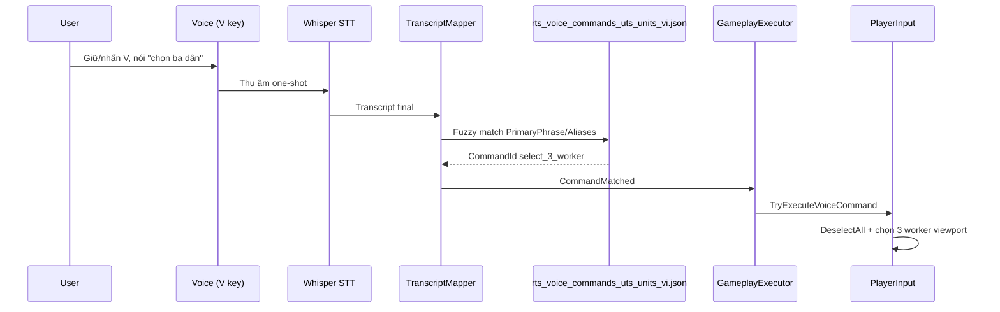

# Bộ lệnh thoại UTS — tập đóng (closed set)

Tài liệu mô tả **chỉ các câu lệnh được phép** trong chế độ điều khiển giọng nói RTS, và **cách mỗi lệnh hoạt động** sau khi nhận diện.

**Dataset:** `Assets/Resources/VoiceCommands/rts_voice_commands_uts_units_vi.json`  
**Luồng:** Nhấn **V** → Whisper STT → chuẩn hóa câu → fuzzy-match (ngưỡng ≥ 0,72) → `CommandId` → hành động game (`PlayerInput.TryExecuteVoiceCommand`).

---

## 1. Nguyên tắc nhận lệnh

### Tập đóng (closed vocabulary)

Hệ thống **chỉ** cố gắng khớp câu nói với danh sách `PrimaryPhrase` + `Aliases` trong JSON. Câu ngoài tập (ví dụ *"đi lên núi"*, *"mở bản đồ"*) → log `[VoiceCmd] Không khớp lệnh`.

Whisper được gợi ý qua prompt build từ profile lệnh; resolver fuzzy so với **toàn bộ** cụm trong dataset, không parse ngữ pháp tự do.

### Cách nói chuẩn

| Quy tắc | Ví dụ |
|---------|--------|
| Một câu ngắn, một ý | *"chọn ba dân"*, *"thu gỗ"* |
| Có hoặc không dấu tiếng Việt đều được | *"dung lai"* ≈ *"dừng lại"* |
| Chọn **n** unit: n = 1…10 (số hoặc chữ) | *"chọn 3 bộ binh"*, *"chọn ba cung thủ"* |
| Chọn **một** loại không nói số → coi là **1** | *"chọn bộ binh"* → `select_1_warrior` |

### Điều kiện chung trước khi lệnh có hiệu lực

- Đang ở scene gameplay (`Game*`, `RtsNet_Game`, …) và `GameplayStartupGate` đã mở.
- Lệnh cần **selection** hoặc **nhà/unit đúng loại** — nếu không đủ điều kiện, game báo *"Lệnh không khả dụng"* trên `GameEventLog`.

---

## 2. Bảng lệnh — câu nói & hành động

### 2.1 Điều khiển tác chiến

| Câu lệnh chuẩn | CommandId | Cách hoạt động |
|----------------|-----------|----------------|
| **dừng lại** | `stop` | Mọi **unit đang chọn** nhận lệnh `Stop()` — dừng di chuyển, gather, combat path. Tương đương phím **H**. |
| **di chuyển** | `move` | Cần unit đang chọn → bấm **lệnh 1** trên action bar (Move). **Bước tiếp:** click map để chỉ đích. |
| **tấn công** | `attack` | Cần quân đang chọn → quét **địch trên màn hình** (viewport); chọn địch gần selection nhất mà **AttackCommand** cho phép → gửi lệnh tấn công. Không cần click thêm nếu tìm được mục tiêu. |

> **Lưu ý:** *di chuyển* vẫn là lệnh **hai bước** (voice + click map). *tấn công* tự tìm mục tiêu gần nếu có địch trong vùng quét.

---

### 2.2 Chọn unit (trên màn hình, phe local)

| Câu lệnh chuẩn | CommandId | Cách hoạt động |
|----------------|-----------|----------------|
| **chọn toàn bộ quân** | `select_all_military` | Bỏ chọn cũ → chọn **tất cả** unit trên viewport: **dân + bộ binh + cung thủ + đá binh** (cùng phe bạn). |
| **chọn dân** | `select_1_worker` | Bỏ chọn cũ → chọn **1** worker (dân / nông dân) trên màn hình. |
| **chọn n dân** (n = 1…10) | `select_n_worker` | Bỏ chọn cũ → chọn tối đa **n** worker cùng loại trên màn hình (thiếu thì chọn hết số có). |

**Ví dụ n:** *"chọn hai dân"*, *"chọn 5 dân"*, *"chọn mười dân"*.

| Câu lệnh chuẩn | CommandId | Cách hoạt động |
|----------------|-----------|----------------|
| **chọn bộ binh** | `select_1_warrior` | Chọn **1** bộ binh (warrior) trên màn hình. |
| **chọn n bộ binh** | `select_n_warrior` | Chọn tối đa **n** bộ binh (n = 1…10). |
| **chọn cung thủ** | `select_1_archer` | Chọn **1** cung thủ trên màn hình. |
| **chọn n cung thủ** | `select_n_archer` | Chọn tối đa **n** cung thủ. |
| **chọn đá binh** | `select_1_rockwarrior` | Chọn **1** đá binh (rock warrior) trên màn hình. |
| **chọn n đá binh** | `select_n_rockwarrior` | Chọn tối đa **n** đá binh. |

**Ví dụ n:** *"chọn ba bộ binh"*, *"chọn 4 cung thủ"*, *"chọn hai đá binh"*.

---

### 2.3 Thu thập tài nguyên

| Câu lệnh chuẩn | CommandId | Cách hoạt động |
|----------------|-----------|----------------|
| **thu gỗ** | `gather_wood` | Tự chọn dân bằng **logic AI** (`TryPickGatherWorker`): ưu tiên dân rảnh → redirect dân đang thu gần CC → bất kỳ dân có lệnh Gather. Ngắt gather cũ nếu cần → tìm mỏ gần camera → gather. |
| **thu đá** | `gather_stone` | Giống *thu gỗ* với mỏ **đá**. |
| **thu thịt** | `gather_food` | Giống *thu gỗ* với nguồn **thịt / food**. |

> Quét **toàn bộ dân phe bạn** (không chỉ trên màn hình), giống AI đối thủ.  
> Chỉ thất bại khi **không còn dân nào** hoặc **tất cả đang xây / không có GatherCommand**.  
> Nếu không có mỏ phù hợp gần → *"Không tìm mỏ phù hợp gần camera"*.

---

### 2.4 Xây dựng (worker + slot action bar)

| Câu lệnh chuẩn | CommandId | Slot UI (1-based) | Cách hoạt động |
|----------------|-----------|-------------------|----------------|
| **xây nhà kho** | `build_storehouse` | **7** → **2** | Tự chọn dân qua **TryPickBuilderWorker** (AI): rảnh → redirect gather → dân khả dụng. Stop gather nếu redirect → **7** → **2** → click map. |
| **xây lò rèn** | `build_forge` | **7** → **5** | Giống nhà kho; slot **5** = lò rèn. |
| **xây nhà lính** | `build_barracks` | **7** → **4** | Đảm bảo có dân → mở menu Build (**7**) → **lệnh 4** → ghost đặt nhà. |
| **xây chuồng** | `build_corral` | **7** → **3** | Đảm bảo có dân → **7** → **lệnh 3**. |
| **xây tháp canh** | `build_defense_tower` | **7** → **6** | Đảm bảo có dân → **7** → **lệnh 6**. |

> Cần đủ tài nguyên và tech; vị trí phải pass `BuildingRestrictionSO`.

---

### 2.5 Sản xuất unit (tự chọn tòa nhà + slot)

| Câu lệnh chuẩn | CommandId | Slot | Cách hoạt động |
|----------------|-----------|------|----------------|
| **tạo dân** | `train_worker` | **1** | Tự chọn **Civil Central** gần camera → **lệnh 1** (train worker). |
| **tạo bộ binh** | `train_warrior` | **1** | Tự chọn **Barracks** gần camera → **lệnh 1**. |
| **tạo cung thủ** | `train_archer` | **2** | Chọn Barracks → **lệnh 2**. |
| **tạo đá binh** | `train_rockwarrior` | **3** | Chọn Barracks → **lệnh 3**. |

---

### 2.6 Nghiên cứu (tự chọn Forge + slot)

| Câu lệnh chuẩn | CommandId | Slot | Cách hoạt động |
|----------------|-----------|------|----------------|
| **nâng cấp sát thương** | `research_damage` | **1** | Tự chọn **Forge** gần camera → **lệnh 1**. |
| **nâng cấp tốc đánh** | `research_attack_delay` | **2** | Forge → **lệnh 2**. |
| **nâng cấp thu thập** | `research_gather_amount` | **3** | Forge → **lệnh 3**. |
| **nâng cấp thời gian thu thập** | `research_gather_time` | **4** | Forge → **lệnh 4**. |
| **nâng cấp máu** | `research_health` | **5** | Forge → **lệnh 5**. |
| **nâng cấp tốc độ** | `research_move_speed` | **6** | Forge → **lệnh 6**. |

---

## 3. Sơ đồ luồng một lệnh

---

## 4. Mẫu câu theo nhóm (tham chiếu JSON)

Dưới đây là **câu chuẩn** (PrimaryPhrase) và vài alias tiêu biểu — đầy đủ nằm trong JSON.

> **Trong game:** nội dung mục này cũng có trong **Hướng dẫn** (Main Menu → Dialog Hướng Dẫn / `Assets/Resources/UI/game_manual_vi.json`). Người chơi **chỉ** nên dùng các câu liệt kê ở đó — hệ thống không nhận câu tự do.

### Chiến đấu & di chuyển

| Chuẩn | Alias ví dụ |
|-------|-------------|
| dừng lại | dừng lại, đứng yên, hủy lệnh |
| di chuyển | di chuyển, đi đến đó |
| tấn công | tấn công, đánh, khai hỏa |

### Chọn quân / dân

| Chuẩn | Alias ví dụ |
|-------|-------------|
| chọn toàn bộ quân | chọn hết quân, chọn toàn bộ quân |
| chọn 1 dân / chọn n dân | chọn một dân, chọn ba dân, chọn mười dân |
| chọn 1 / n bộ binh | chọn bộ binh, chọn hai bộ binh |
| chọn 1 / n cung thủ | chọn cung thủ, chọn 5 cung thủ |
| chọn 1 / n đá binh | chọn đá binh, chọn mười đá binh |

### Kinh tế

| Chuẩn | Alias ví dụ |
|-------|-------------|
| thu gỗ | thu gỗ, chặt cây |
| thu đá | thu đá, đào đá |
| thu thịt | thu thịt |
| xây nhà kho | xây dựng nhà kho, xây nhà kho, xây kho |
| xây lò rèn | xây dựng lò rèn, xây lò rèn, lò rèn |
| xây nhà lính | xây dựng nhà lính, xây nhà lính, doanh trại |
| xây chuồng | xây dựng chuồng, xây chuồng |
| xây tháp canh | xây dựng tháp canh, xây tháp canh |

### Sản xuất & nghiên cứu

| Chuẩn | Alias ví dụ |
|-------|-------------|
| tạo dân | tạo dân, tuyển dân, huấn luyện dân |
| tạo bộ binh | tạo bộ binh, tuyển bộ binh |
| tạo cung thủ | tạo cung thủ |
| tạo đá binh | tạo đá binh |
| nâng cấp sát thương | nâng cấp sát thương |
| nâng cấp máu | nâng cấp máu |
| nâng cấp tốc độ | nâng cấp tốc độ |
| nâng cấp tốc đánh | nâng cấp tốc độ đánh |
| nâng cấp thu thập | nâng cấp thu thập |
| nâng cấp thời gian thu thập | nâng cấp tốc độ thu thập |

---

## 5. Lệnh **không** nằm trong tập đóng này

Các `CommandId` sau **có trong JSON** nhưng **không** thuộc danh sách bạn yêu cầu — hệ thống vẫn có thể nhận nếu nói đúng alias, nhưng **không** nằm trong spec tập đóng:

- `attack_move`, `hold_position`
- `select_idle_workers` (*chọn dân rảnh*)
- `cancel_research`, `cancel_production`, `cancel_building`

Để **chỉ** nhận đúng 30 nhóm lệnh trên, giữ JSON/sync prompt Whisper **không** thêm alias ngoài bảng mục 2, hoặc tách file dataset riêng cho demo/bảo vệ đồ án.

---

## 6. Kịch bản sử dụng gợi ý

| Mục tiêu | Thứ tự lệnh thoại |
|----------|-------------------|
| Thu đá không chọn dân | *"thu đá"* (tự chọn 1 dân rảnh) |
| Train quân | *"tạo bộ binh"* (tự chọn Barracks + lệnh 1) |
| Tấn công địch gần | *"chọn toàn bộ quân"* → *"tấn công"* |
| Xây kho | *"xây nhà kho"* (dân rảnh + lệnh 7→2) → click map |
| Nâng cấp Forge | *"nâng cấp sát thương"* (tự chọn Forge + lệnh 1) |

---

## 7. File mã nguồn liên quan

| File | Vai trò |
|------|---------|
| `Assets/Resources/VoiceCommands/rts_voice_commands_uts_units_vi.json` | Bảng câu nói ↔ CommandId |
| `VoiceCommandOneShotTranscriptMapper.cs` | STT → CommandId |
| `VoiceCommandExecutionPlan.cs` | CommandId → kế hoạch thực thi (slot UI, gather, attack…) |
| `AIPlayerWorkerSnapshotUtility.cs` | Snapshot phe player cho chọn dân (dùng chung logic AI) |
| `AIInfraBuildUtility.cs` | `TryPickGatherWorker` / `TryPickBuilderWorker` |
| `PlayerInput.Voice.cs` | Thực thi selection / slot / gather / attack |
| `VoiceCommandGameplayExecutor.cs` | Nối mapper → PlayerInput |

---

*Tập lệnh đóng phục vụ demo điều khiển RTS bằng giọng nói tiếng Việt — UTS.*
