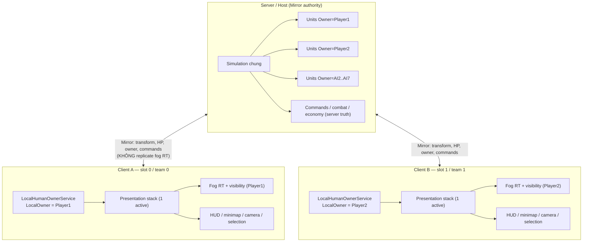
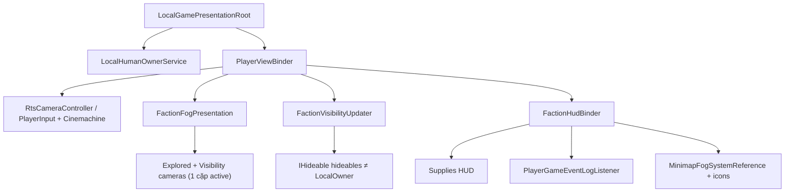
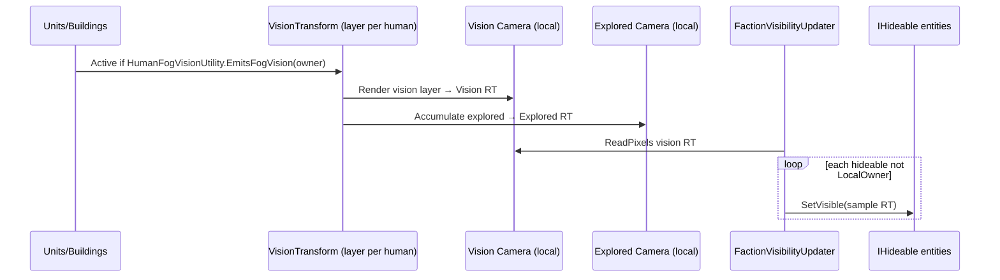

# Kế hoạch: Fog + UI + Camera theo Local Human Player (2 client Mirror)

**Phiên bản:** Plan only — chưa implement mass code  
**Ngày:** 2026-05-24  
**Phạm vi:** Multiplayer 2 người (host + client), mỗi client chỉ presentation của **một** human owner (`Player1` hoặc `Player2`). Không split-screen, không sync fog RT qua mạng, không fog UI cho AI trên client human (phase 1).

---

## Trả lời nhanh các câu hỏi mở (từ khảo sát codebase)

| Câu hỏi | Kết luận / giả định |
|----------|---------------------|
| `RtsNet_Game` đã spawn unit UTS (`AbstractUnit`) chưa? | **Chưa.** `RtsNetworkManager.OnServerSceneChanged` spawn prefab `RtsNet_Unit` — capsule + `RtsUnit` + `NetworkTransformUnreliable` (namespace `ProjectRTS.Netplay`). **Không** tham chiếu `GameDevTV.RTS.Units.AbstractUnit` / `AbstractCommandable`. |
| Trận MP dùng scene nào? | Hiện tại flow Mirror: `RtsNet_Lobby` → `RtsNet_Game` (scene tối giản: ground plane, spawn, camera, HUD vàng MVP). Gameplay đầy đủ nằm ở **`Game 1.unity`**. **Giả định phase 1:** mở rộng **`RtsNet_Game`** để chứa (hoặc copy) hierarchy gameplay từ `Game 1`, **không** load additive `Game 1` (tránh lệch reference fog/minimap/spawn và timing `OnServerSceneChanged`). |
| Phase 1 có cần bot AI trong MP không? | **Không bắt buộc.** Khuyến nghị: **tắt `AIController`** trên build MP phase 1, hoặc chạy AI trên server với **technical debt** (planner dùng fog host — xem mục 6). Milestone AI fog server-side = sau khi 2 human ổn định. |

---

## 1. Kiến trúc tổng quan

### 1.1 Phân tách Simulation vs Presentation



- **Simulation (authoritative):** vị trí unit, máu, owner, lệnh được server xử lý và replicate qua Mirror (mở rộng từ MVP `RtsUnit` sang `AbstractCommandable` + `NetworkIdentity` theo milestone).
- **Presentation (local only):** fog explored/vision RT, ẩn/hiện model địch, minimap overlay, HUD S/W/F, camera pan, selection box — **mỗi client chỉ bind theo `ILocalHumanOwner.LocalOwner`**.

### 1.2 Vì sao không sync fog texture qua network

| Lý do | Giải thích |
|-------|------------|
| Băng thông | Fog RT (explored + visibility) thường 512²–2048², cập nhật mỗi frame → sync texture = tốn kém và lag. |
| Determinism RTS chuẩn | Cùng map + cùng vị trí unit/building + cùng sight radius → mỗi client **tự render** vision layer và sample RT giống single-player. |
| Asymmetric information | Client A không được “nhìn” fog đã explore của Client B qua net; chỉ thấy **kết quả gameplay** (unit lộ khi vào tầm nhìn địch) qua simulation replicate. |
| Tách trách nhiệm (SRP) | Server không sở hữu “màn hình” của từng người; server sở hữu trạng thái game, client sở hữu presentation. |

**Lưu ý:** `IHideable.IsVisible` trên client là **trạng thái presentation local**, không phải SyncVar. Unit địch replicate vị trí nhưng mesh có thể ẩn cho đến khi local fog updater thấy trong vision RT.

---

## 2. Mapping Owner & lobby

### 2.1 Bảng mapping Mirror ↔ UTS

| Mirror | UTS `Owner` | Ghi chú |
|--------|-------------|---------|
| `playerTeamIndex` / slot **0** | `Owner.Player1` (`0x001`) | Client kết nối đầu tiên (`RtsLobbyPlayer.ServerInitSlot`) |
| `playerTeamIndex` / slot **1** | `Owner.Player2` (`0x002`, đổi tên từ `AI1`) | Client thứ hai |
| AI trên map (server spawn) | `AI2` … `AI7` | Không có fog presentation trên client human phase 1 |
| Neutral / mỏ | `Unowned` | Hideable trong fog (giữ logic hiện tại) |

**Luồng gán owner khi vào game:**

1. `RtsLobbyPlayer.OnStartLocalPlayer` → đọc `PlayerTeamIndex` → `LocalHumanOwnerService.SetLocalOwner(...)`.
2. Server spawn Civil Central / unit ban đầu với `Owner` = `Player1` hoặc `Player2` theo team (sau khi tích hợp UTS spawn, thay capsule MVP).
3. `RtsGameInput` / `PlayerInput` chỉ phát lệnh khi `commandable.Owner == LocalOwner` (hoặc `IsLocalOwner`).

### 2.2 Enum `Owner` — `Player2` thay `AI1` (đã áp dụng)

**Giá trị** (`Assets/Scripts/Units/Owner.cs`):

```
Invalid = 0
Player1 = 1      (0x001)
Player2 = 2      (0x002)   ← trước đây là AI1
AI2     = 4      (0x004)
AI3     = 8
...
AI7     = 128
Unowned = 256    (0x100)
```

- **Không** thêm `Player2 = 512` — dùng lại bit `2` của human player 2.
- Phe AI còn lại: `AI2` … `AI7` (bot mặc định trong `AIController` vẫn `AI2`).
- `Bus<T>.OnEvent`: key `Owner.Player2` thay `Owner.AI1`.
- **Động vật hoang:** `WildAnimal.wildlifeOwner` mặc định `AI2` (prefab deer/goat đã dùng `4`).
- **Prefab/scene** có `Owner = 2` serialized: giờ là **Player2** (ví dụ `Worrior.prefab`) — unit AI cũ cần đổi sang `AI2`+ trong Inspector nếu vẫn là bot.
- Layer Unity `Fog Vision AI1` (TagManager): đổi tên thủ công → `Fog Vision Player2` khi làm fog MP (M2).

### 2.3 Service: `ILocalHumanOwner` / `LocalHumanOwnerService`

```csharp
// Trách nhiệm SRP: một nguồn sự thật cho "human đang ngồi máy này"
public interface ILocalHumanOwner
{
    Owner LocalOwner { get; }
    bool IsLocalOwner(Owner o);
    bool IsInitialized { get; }
}
```

| Thuộc tính | Mô tả |
|------------|-------|
| `LocalOwner` | Set **một lần** khi local player sẵn sàng (lobby → game scene). |
| `IsLocalOwner(Owner o)` | `o == LocalOwner` (human); dùng cho input, HUD, fog bind. |

**DIP — nơi resolve:**

- `LocalHumanOwnerService` : `MonoBehaviour` singleton nhẹ **hoặc** component trên `RtsNet_Player` / `LocalGamePresentationRoot`.
- Offline / `Game 1` không Mirror: bootstrap set `LocalOwner = Player1` trong `Awake` (M5).
- MP: `RtsLobbyPlayer` (local) gọi service khi `OnStartLocalPlayer` + hook vào scene game loaded.

**Không** hardcode `Owner.Player1` trong `PlayerInput`, `Supplies`, `FogVisibilityManager` sau refactor — inject qua `ILocalHumanOwner`.

---

## 3. Presentation stack mỗi client (chỉ 1 active)

### 3.1 Component tree (mục tiêu)



### 3.2 `PlayerViewBinder` (SRP: orchestration, không logic fog)

**Mục tiêu:** Khi `LocalOwner` đã biết, enable/disable đúng nhánh presentation.  
**Cách hoạt động:** Serialize reference tới 2 nhánh `Player1Presentation` / `Player2Presentation` (fog cameras, minimap fog ref, HUD roots); gọi `SetActive` + gán interface `IFogMapQuery` cho consumer.

**Ràng buộc phase 1:**

- **Không** tạo second view / split screen trên cùng client.
- Client team 0: disable toàn bộ reference UI/fog gắn Player2 (và ngược lại).
- AI fog objects **không** nằm dưới `LocalGamePresentationRoot` trên client human.

### 3.3 Hiện trạng codebase cần thay

| File | Hardcode hiện tại |
|------|-------------------|
| `FogVisibilityManager` | Hideables ≠ `Player1`; camera Player1 |
| `AbstractCommandable` | `VisionTransform` active chỉ `Owner == Player1` |
| `PlayerInput` | `const Owner LocalPlayerOwner = Owner.Player1` |
| `Supplies` | HUD đọc `Owner.Player1` |
| `MinimapUnitIconsController` | `trackPlayerUnitsOnly` → `Owner.Player1` |
| `PlayerGameEventLogListener` | `listenOwner = Player1` (SerializeField, cần bind runtime) |
| `FactionFogQuery` | Comment MP; hiện pass-through `IHideable.IsVisible` |
| `CommandContext` ctor mặc định | `Owner = Player1` |

---

## 4. Fog pipeline (per local human owner)

### 4.1 Luồng frame



### 4.2 Chi tiết từng bước

#### Bước 1 — Vision emitters

**`HumanFogVisionUtility`** (static, SRP):

```csharp
public static bool EmitsFogVision(Owner o) =>
    o == Owner.Player1 || o == Owner.Player2;
```

- AI units: **không** bật `VisionTransform` trên client human (server có thể bật riêng nếu sau này có server fog sim).

#### Bước 2 — Layer `VisionTransform`

| Owner | Layer (hiện có / đề xuất) |
|-------|---------------------------|
| `Player1` | `Fog of War Vision` — **layer 14** (theo `MinimapRenderCamera` tooltip) |
| `Player2` | **`Fog Vision Player2`** — layer mới (ví dụ **15**), thêm trong *Edit → Project Settings → Tags and Layers* |

`AbstractCommandable.RefreshVisionFromSightConfig()`:

- Thay `Owner == Player1` bằng `HumanFogVisionUtility.EmitsFogVision(Owner)`.
- Gán layer qua `OwnerFogVisionLayers.GetLayer(Owner)` (map `Player1`/`Player2` → layer index).

#### Bước 3 — Hai bộ camera fog trên scene (một bộ enabled)

Pattern từ prefab **`Assets/Prefab/Fog of War 1.prefab`**:

- Cặp **Explored** + **Visibility** camera → RT riêng.
- Scene chứa **2 cặp** (Player1 / Player2); `FactionFogPresentation` enable đúng cặp theo `LocalOwner`, disable cặp còn lại (tiết kiệm GPU — chỉ 1 cặp render/frame).

**WIP trong working tree (nếu đã có):** `FactionFogSystemReference`, `FactionFogSystemsRegistry`, `FactionFogSystemsBootstrap` — dùng làm registry `Owner → cameras/RT`, tránh `FindObjectsByType` mỗi frame.

#### Bước 4 — `FactionVisibilityUpdater` (refactor `FogVisibilityManager`)

| Thay đổi | Mô tả |
|----------|-------|
| Tham số | `Owner localHumanOwner` inject từ `ILocalHumanOwner` |
| Hideables | Thêm entity có `owner != localHumanOwner` (giữ supply/placeholder unowned) |
| Camera | Reference visibility camera **của local owner**, không `GetComponent` trên cùng GO cố định Player1 |
| Đổi tên class | `FogVisibilityManager` → `FactionVisibilityUpdater` (alias deprecated 1 milestone nếu cần) |

#### Bước 5 — Minimap

- `MinimapFogSystemReference`: mỗi nhánh Player1/Player2 có instance riêng trỏ đúng RT; binder chọn instance active.
- `MinimapUnitIconsController`: filter `commandable.Owner == LocalOwner` khi `trackPlayerUnitsOnly`.
- `MinimapRenderCamera`: `excludeFogVisionLayer` phải loại **cả** layer 14 và 15 khỏi minimap ortho.

#### Bước 6 — `FactionFogQuery`

API mục tiêu:

```csharp
bool IsVisibleTo(Owner viewer, IHideable hideable);
bool IsWorldExploredFor(Owner viewer, Vector3 worldPosition);
```

| `viewer` | Hành vi |
|----------|---------|
| `LocalHumanOwner` (client) | `hideable.IsVisible` sau `FactionVisibilityUpdater`, hoặc sample vision RT qua `IFogMapQuery` |
| `AI2..AI7` (server) | Milestone sau — xem mục 6 |
| Offline không MP | `viewer` bỏ qua → coi như Player1 (M5) |

---

## 5. Camera & input

### 5.1 Client local input

| Hệ thống | Phase 1 hành vi |
|----------|-----------------|
| `PlayerInput` | Selection / move / build chỉ unit `Owner == LocalOwner`; `Bus<>.Raise(LocalOwner, ...)` |
| `RtsGameInput` (MVP net) | Thay `FindObjectsByType<RtsUnit>` bằng bridge UTS hoặc gọi chung dispatcher với owner check |
| `RtsGameCommander` | `Cmd*` kiểm tra connection + **Owner** unit khớp team |
| Camera | `PlayerInput.CameraTargetTransform` follow spawn Civil Central của **LocalOwner**; giữ `CameraConfig` |

### 5.2 Spawn & commander

- `RtsGameSceneSetup.teamSpawnPoints[0|1]` → map team 0 → base `Player1`, team 1 → base `Player2`.
- Civil Central prefab: set `Owner` trên server khi spawn (không để mặc định Player1 cho cả hai).
- `CommandContext`: luôn dùng ctor `(Owner owner, ...)` với `LocalOwner`; deprecate ctor default `Player1`.

### 5.3 File cần sửa (camera & input)

| File | Trách nhiệm sau sửa |
|------|---------------------|
| `PlayerInput.cs` | Đọc `ILocalHumanOwner`; filter aliveUnits/selection |
| `RtsGameInput.cs` | Gate `isLocalPlayer`; lệnh đúng owner |
| `RtsGameCommander.cs` | Validate owner team |
| `CommandContext.cs` | Owner từ local service |
| `UnitSelectionHoverCursor.cs` | Chỉ mirror selection LocalOwner |
| `Bus.cs` | Thêm `Owner.Player2` vào `OnEvent` |

---

## 6. AI trên multiplayer (server authority)

### 6.1 Vị trí `AIController`

- **Hiện tại:** `MonoBehaviour` local, **không** Mirror; chạy trên máy có scene (single-player / host).
- **MP mục tiêu:** tick **chỉ `NetworkServer.active`** (host dedicated hoặc host-as-server).

### 6.2 Planner visibility — các lựa chọn

| Option | Mô tả | Phase 1 |
|--------|-------|---------|
| **A — Union fog 2 human** | AI thấy mọi thứ P1 hoặc P2 đã explore | Không khuyến nghị (AI quá mạnh, không fair) |
| **B — Server fog per `aiOwner`** | `FactionFogQuery` + fog sim nhẹ trên server (vision từ unit AI) | Milestone 3+, không block 2 human |
| **C — Technical debt** | AI dùng `IHideable` / minimap fog của **host `LocalOwner`** | Cho phép tạm nếu bật AI trên host-only test |

**Khuyến nghị phase 1 MP:** **Tắt** `AIController` trong scene `RtsNet_Game` / build MP; PvAI regression trên `Game 1` vẫn bật AI như cũ (M5).

**PvAI single-player (`Game 1`):** `FactionFogQuery` + `AIController` tiếp tục dùng fog Player1; `LocalOwner = Player1` mặc định.

---

## 7. Tích hợp Mirror (milestones)

### M1 — Owner & local service

- [x] `Owner.Player2 = 2` (đổi tên từ `AI1`).
- [ ] `ILocalHumanOwner` + `LocalHumanOwnerService`.
- [ ] `RtsLobbyPlayer.OnStartLocalPlayer` → map `PlayerTeamIndex` → `Player1`/`Player2`.
- [ ] `Bus.cs` thêm `Player2`.
- [ ] Server spawn: gán `Owner` đúng team (khi đã có UTS unit thay MVP).

**PR/commit:** `feat(mp): Owner.Player2 + LocalHumanOwnerService`

### M2 — Fog + visibility local

- [ ] `HumanFogVisionUtility`, `OwnerFogVisionLayers`.
- [ ] Refactor `FogVisibilityManager` → `FactionVisibilityUpdater`.
- [ ] `FactionFogPresentation` + 2 cặp camera; enable theo `LocalOwner`.
- [ ] `AbstractCommandable` vision layer Player2.
- [ ] Test ParrelSync: cùng mỏ — explored khác nhau.

**PR/commit:** `feat(mp): per-local-owner fog presentation`

### M3 — UI & minimap local

- [ ] `FactionHudBinder` → `Supplies`, `PlayerGameEventLogListener`, minimap icons/fog ref.
- [ ] Disable HUD nhánh địch.

**PR/commit:** `feat(mp): local HUD and minimap`

### M4 — Network game loop (UTS + Mirror)

- [ ] Thay / bổ sung `RtsNet_Unit` MVP bằng prefab UTS có `NetworkIdentity` + owner SyncVar hoặc server-set `Owner`.
- [ ] `RtsNetworkManager` spawn Civil Central / workers đúng team.
- [ ] `RtsGameInput` tích hợp `PlayerInput` hoặc shared command dispatcher.
- [ ] **Không** replicate fog RT.

**PR/commit:** `feat(mp): UTS units in RtsNet_Game`

### M5 — PvAI regression

- [ ] `Game 1` offline: `LocalOwner = Player1` auto.
- [ ] AI gather/scout với `FactionFogQuery` như hiện tại.
- [ ] Document nếu đổi hành vi khi có Player2 trong scene sandbox.

**PR/commit:** `fix(sp): default LocalOwner Player1 offline`

---

## 8. Scene & Inspector checklist (không sửa YAML trong plan)

### 8.1 Project Settings

- [ ] Thêm layer **`Fog Vision Player2`** (ví dụ index **15**).
- [ ] Đảm bảo layer **13** = Fog of War, **14** = Fog of War Vision (khớp `MinimapRenderCamera`).

### 8.2 `RtsNet_Game` (MP)

- [ ] Copy hoặc rebuild nội dung gameplay từ `Game 1` (terrain, NavMesh, fog prefab, UI canvas, minimap).
- [ ] Hai spawn Civil Central: team0 → `Owner.Player1`, team1 → `Owner.Player2`.
- [ ] Fog prefab: **2 cặp** Explored/Visibility; mặc định P2 disabled — `PlayerViewBinder` bật theo script.
- [ ] `NetworkManager` / `RtsNetworkManager`: `gameScene = RtsNet_Game`, unit prefab UTS.
- [ ] `LocalGamePresentationRoot` + `LocalHumanOwnerService` trên player prefab hoặc scene root.
- [ ] Không đặt `AIController` (phase 1) hoặc disable component.

### 8.3 `Game 1` (single-player / PvAI)

- [ ] Một cặp fog (Player1) như hiện tại.
- [ ] Empty / disabled nhánh Player2 presentation.
- [ ] Bootstrap: `LocalHumanOwnerService` → `Player1` khi không có Mirror client.

### 8.4 Prefab thủ công (Inspector)

- [ ] `Fog of War 1` duplicate → `Fog of War Player2` (camera culling mask layer 15).
- [ ] Unit prefab: `VisionTransform` child trên layer đúng khi spawn (script set layer theo Owner).

---

## 9. Test plan

| # | Kịch bản | Kỳ vọng |
|---|----------|---------|
| 1 | 1 client offline (`Game 1`) | Giống hiện tại; `LocalOwner = Player1`; fog/UI không đổi hành vi |
| 2 | Host + Client (ParrelSync / 2 build) | Client0 fog/UI P1; Client1 fog/UI P2; không thấy HUD đối phương |
| 3 | Client1 scout mỏ | Client2 chưa explore/visible mỏ cho đến khi unit P2 scout |
| 4 | HUD | Mỗi client chỉ S/W/F và population của phe mình |
| 5 | Hierarchy | Không có object fog presentation cho AI2+ trên client human |
| 6 | Selection | Client0 không select được unit P2; lệnh move chỉ local owner |
| 7 | Disconnect / reconnect | `LocalOwner` set lại đúng slot; không leak enabled P2 cameras trên client 0 |

---

## 10. Rủi ro & out of scope

### 10.1 Rủi ro

| Rủi ro | Mitigation |
|--------|------------|
| Prefab `Owner = 2` giờ là Player2 nhưng unit vẫn là bot | Rà soát prefab/scene; đổi bot sang `AI2`+ trong Inspector |
| Spawn sai `Owner` → fog/UI lệch phe | Server assert team ↔ owner; log spawn |
| 2 RT trên scene nhưng 1 máy test editor | Chỉ 1 cặp enabled — OK |
| MVP `RtsUnit` vs UTS lệch timeline | M4 rõ ràng; không trộn capsule với worker BT trong cùng trận production |
| `MinimapFogSystemReference.EnsureReferences` scan tên camera | Binder gán explicit; giảm auto-find |

### 10.2 Out of scope phase 1

- Spectate AI / replay fog
- Split-screen 2 view một máy
- Sync fog texture / explored qua Mirror
- Sửa hàng loạt `.prefab` / `.unity` / `.asset` bằng AI (chỉ hướng dẫn Inspector)
- Server-side fog đầy đủ cho AI planner (Option B đầy đủ)
- Tạo file `.meta` thủ công

---

## 11. Ước lượng file C# (dự kiến)

### 11.1 File mới

| Path | SRP / trách nhiệm |
|------|-------------------|
| `Assets/Scripts/Player/ILocalHumanOwner.cs` | ISP: contract local human owner |
| `Assets/Scripts/Player/LocalHumanOwnerService.cs` | SRP: lưu & expose `LocalOwner` |
| `Assets/Scripts/Player/HumanFogVisionUtility.cs` | SRP: rule ai nào emit vision |
| `Assets/Scripts/Player/OwnerFogVisionLayers.cs` | SRP: map Owner → Unity layer |
| `Assets/Scripts/Player/FactionFogPresentation.cs` | SRP: enable/disable camera pair + RT |
| `Assets/Scripts/Player/FactionVisibilityUpdater.cs` | SRP: sample RT → `IHideable` (thay FogVisibilityManager) |
| `Assets/Scripts/Player/PlayerViewBinder.cs` | SRP: wire presentation theo LocalOwner |
| `Assets/Scripts/Player/FactionHudBinder.cs` | SRP: bind Supplies, event log, minimap HUD |
| `Assets/Scripts/Player/IFogMapQuery.cs` | ISP: explored/visible query (nếu chưa commit WIP) |
| `Assets/Scripts/Player/FactionFogSystemReference.cs` | SRP: holder RT + cameras cho một Owner |
| `Assets/Scripts/Player/FactionFogSystemsRegistry.cs` | SRP: registry Owner → IFogMapQuery |
| `Assets/Scripts/Player/FactionFogSystemsBootstrap.cs` | SRP: đăng ký registry lúc scene load |
| `Assets/Scripts/Netplay/OwnerTeamMapping.cs` (optional) | SRP: `teamIndex` ↔ `Owner` tách khỏi lobby |

### 11.2 File sửa

| Path | Thay đổi chính |
|------|----------------|
| `Owner.cs` | `Player2 = 2` (đã đổi tên từ `AI1`) |
| `Bus.cs` | Key `Player2` |
| `AbstractCommandable.cs` | Vision layer + human check |
| `FactionFogQuery.cs` | `viewer` + `IFogMapQuery` |
| `FogVisibilityManager.cs` | Deprecate → delegate hoặc xóa sau migrate |
| `MinimapFogSystemReference.cs` | Multi-instance / owner tag |
| `MinimapUnitIconsController.cs` | `LocalOwner` filter |
| `MinimapRenderCamera.cs` | Exclude layer 15 |
| `Supplies.cs` | HUD theo `LocalOwner` |
| `PlayerInput.cs` | Bỏ const Player1 |
| `PlayerGameEventLogListener.cs` | `listenOwner` từ binder |
| `CommandContext.cs` | Owner từ context |
| `RtsLobbyPlayer.cs` | Notify `LocalHumanOwnerService` |
| `RtsNetworkManager.cs` | Spawn UTS + owner |
| `RtsUnit.cs` hoặc replacement | Map team → `Owner` |
| `RtsGameInput.cs` / `RtsGameCommander.cs` | Owner-aware commands |
| `AIController.cs` | `#if` hoặc enable chỉ server; fog query viewer |
| `CombatTargetPriorityUtility.cs` | Nếu dùng fog — viewer = aiOwner |

---

## 12. SOLID mapping (bắt buộc)

| Class / Interface | SRP | OCP | LSP | ISP | DIP |
|-------------------|-----|-----|-----|-----|-----|
| `ILocalHumanOwner` | — | — | — | Một contract nhỏ: local owner | Abstraction cho UI/fog/input |
| `LocalHumanOwnerService` | Chỉ lưu local human owner | Mở rộng nguồn set (lobby/offline) qua method, không sửa consumer | — | — | UI/fog phụ thuộc interface |
| `HumanFogVisionUtility` | Rule vision emitter | Thêm human mới (co-op) = thêm điều kiện | — | — | — |
| `OwnerFogVisionLayers` | Map owner → layer | Layer mới trong SO/config | — | — | — |
| `FactionFogPresentation` | Bật/tắt camera/RT | Thêm Owner = thêm entry registry | — | — | Nhận `ILocalHumanOwner` |
| `FactionVisibilityUpdater` | RT → visibility | Đổi thuật toán sample qua `IFogMapQuery` | — | — | Inject camera + local owner |
| `FactionFogQuery` | API truy vấn fog | Viewer khác nhau (human/AI) | — | Tách `IFogMapQuery` | Phụ thuộc abstraction, không concrete manager |
| `PlayerViewBinder` | Orchestrate presentation | Thêm HUD module mới qua serialized slots | — | — | Không chứa logic fog |
| `FactionHudBinder` | Wire HUD | Thêm listener mới | — | — | `ILocalHumanOwner` |
| `FactionFogSystemsRegistry` | Lookup fog system by owner | Đăng ký thêm owner | — | — | Consumers dùng registry |
| `RtsNetworkManager` | Session/scene/spawn | Spawn strategy interface sau | — | — | Không gọi fog |

---

## Phụ lục A — Trạng thái Mirror MVP (tham chiếu code)

- `RtsNetworkManager.gameScene = "RtsNet_Game"`.
- Spawn unit trong `OnServerSceneChanged` — **không** trong lobby.
- `RtsLobbyPlayer.ServerInitSlot(slotIndex)` → `playerTeamIndex = 0|1`.
- Chưa có bridge `playerTeamIndex` → `GameDevTV.RTS.Units.Owner`.

## Phụ lục B — Sandbox test đề xuất (sau M2)

1. Scene copy `Game 1` → `MP_Fog_Sandbox`: 2 Civil Central (P1/P2), không AI.
2. ParrelSync: verify mỏ trạng thái khác nhau khi chỉ 1 phe scout.
3. Không cần Mirror cho bước fog thuần — có thể mock `LocalHumanOwnerService.SetLocalOwner` bằng hotkey debug.

---

*Tài liệu này chỉ là PLAN. Bắt đầu implement khi user yêu cầu: **"bắt đầu M1"**.*
